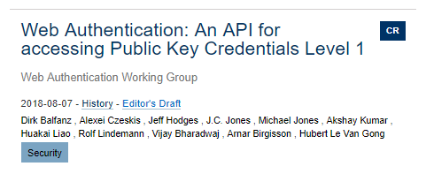
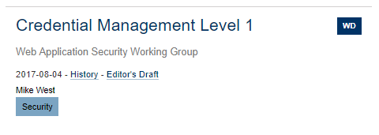
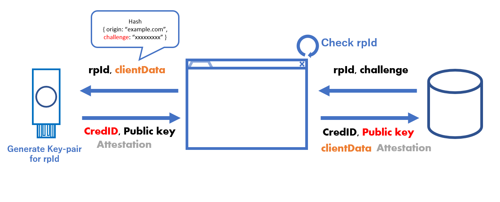
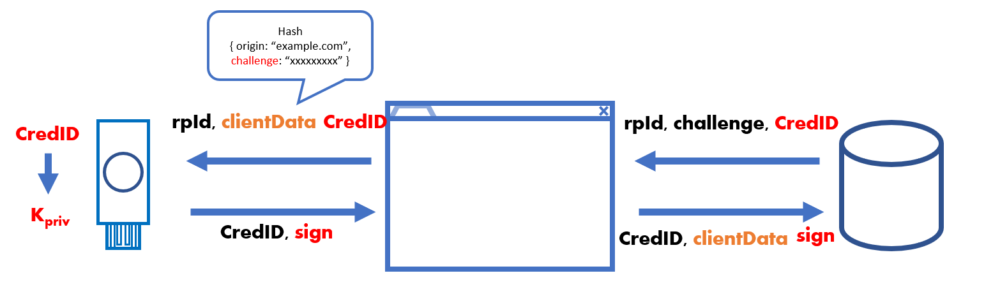
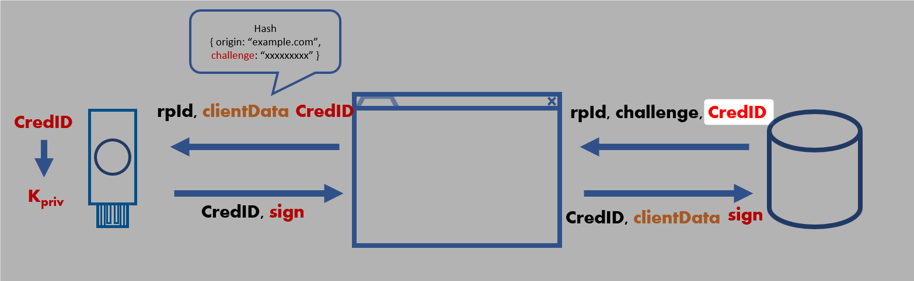
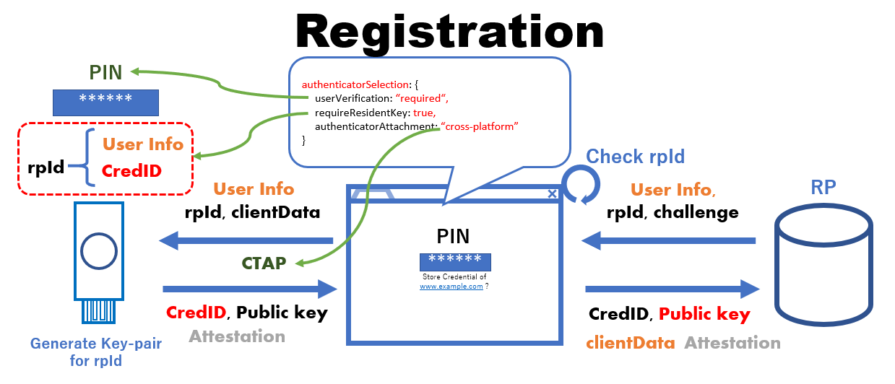
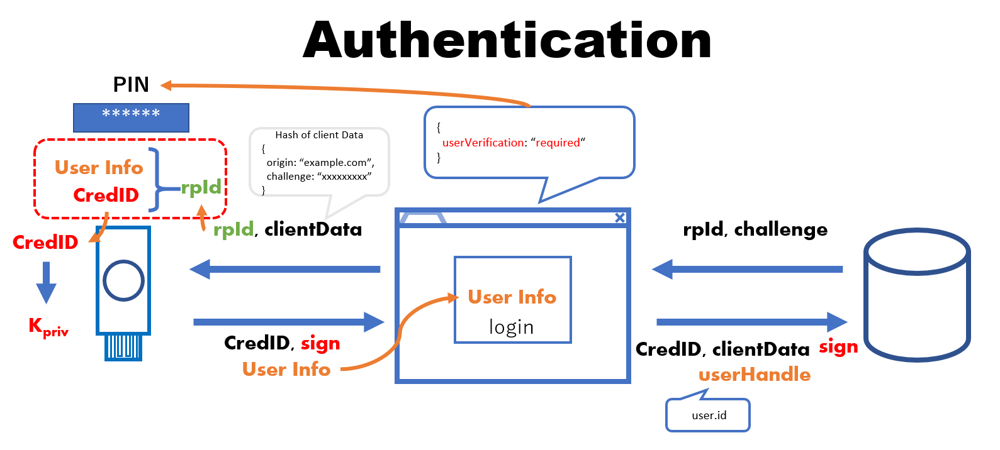

---
presentation:
  width: 1280
  height: 980
  enableSpeakerNotes: true
---
https://signin.aws.amazon.com/saml
https://aws.amazon.com/SAML/Attributes/RoleSessionName*

https://aws.amazon.com/SAML/Attributes/Role*

https://aws.amazon.com/SAML/Attributes/SessionD

<link rel="stylesheet" href="css/theme/black.css" id="theme"/>

<!-- slide -->

# Technical Overdrive

- WebAuthentication API <!-- .element: class="fragment" data-fragment-index="1" -->
- CTAP2 <!-- .element: class="fragment" data-fragment-index="2" -->

<!-- slide -->

### WebAuthnentication API

Working draft: https://w3c.github.io/webauthn/



- 最終草案（Last Call Working Draft）<!-- .element: class="fragment" data-fragment-index="1" -->
- 勧告候補（Candidate Recommendation）<!-- .element: class="fragment emphasis" data-fragment-index="2"  -->
- 勧告案（Proposed Recommendation）<!-- .element: class="fragment" data-fragment-index="3" -->
- W3C勧告（Recommendation）<!-- .element: class="fragment" data-fragment-index="4" -->

<!-- slide data-notes="ワーキングドラフト" -->

### Credential Management API

Latest Version: https://www.w3.org/TR/credential-management-1/



- 最終草案（Last Call Working Draft）<!-- .element: class="fragment emphasis" data-fragment-index="1" -->
- 勧告候補（Candidate Recommendation）<!-- .element: class="fragment" data-fragment-index="1"  -->
- 勧告案（Proposed Recommendation）<!-- .element: class="fragment" data-fragment-index="1" -->
- W3C勧告（Recommendation）<!-- .element: class="fragment" data-fragment-index="1" -->

<!-- slide
data-background-image=./img/publickey-crypto.png
data-transition="flow"
data-background-size="auto"
-->

<div style="height:1180px;">
<p style="position: absolute;top:0; font-size:0.6em">
<a href="https://www.w3.org/Consortium/Hosts/Keio/20180629-fido-seminar/slides/JP_W3C-FIDO_Seminar_FIDO_Technical_Deep_Dive_V1.pdf">https://www.w3.org/Consortium/Hosts/Keio/20180629-fido-seminar/slides/JP_W3C-FIDO_Seminar_FIDO_Technical_Deep_Dive_V1.pdf</a>
</p>
</div>

<!-- slide data-background-image=./img//2018-08-18_10h32_43.png data-background-size="auto"-->
<div style="height:1180px;">
<p style="position: absolute;top:0; font-size:0.6em">
<a href="https://www.w3.org/Consortium/Hosts/Keio/20180629-fido-seminar/slides/JP_W3C-FIDO_Seminar_FIDO_Technical_Deep_Dive_V1.pdf">https://www.w3.org/Consortium/Hosts/Keio/20180629-fido-seminar/slides/JP_W3C-FIDO_Seminar_FIDO_Technical_Deep_Dive_V1.pdf</a>
</p>
</div>


<!-- slide -->

## 今日は 0 から WebAuthn を作ります（！？）

<!-- slide -->

## 今日の流れ

- 公開鍵暗号認証<!-- .element: class="fragment" data-fragment-index="2" -->
- U2F<!-- .element: class="fragment" data-fragment-index="3" -->
- FIDO2<!-- .element: class="fragment" data-fragment-index="4" -->

<!-- slide -->

## 公開鍵暗号認証

<!-- slide vertical=True-->

## 僕が考えた最強の公開鍵暗号認証

```plantuml
Title: 登録
scale 1.5
hide footbox

participant User
participant RP
Note left of User: キーペアの生成
Note left of User: privateKey
User->RP: publicKey
Note right of RP: publicKey
```

```plantuml
Title: 認証
scale 1.5
hide footbox

participant User
participant RP

RP->User: challenge
Note left of User: privateKey
User->RP: sign
Note right of RP: publicKey
RP -> RP: verify
```

公開鍵認証で必要な最もシンプルな登録フェーズ


<!-- slide vertical=True-->

## 問題


```plantuml
Title: 登録
scale 1.3
hide footbox

participant User
participant RP
Note left of User: キーペアの生成
Note left of User: privateKey
User->RP: publicKey
Note right of RP: publicKey
```


```plantuml
Title: 認証
scale 1.3
hide footbox

participant User
participant RP

RP->User: challenge
Note left of User: privateKey
User->RP: sign
Note right of RP: publicKey
RP -> RP: verify
```

- 秘密鍵が守られていない<!-- .element: class="fragment" data-fragment-index="1" -->
- どのサービスに対しても同じキーペア使う<!-- .element: class="fragment" data-fragment-index="2" -->
- どっからかくる challenge にサインし放題<!-- .element: class="fragment" data-fragment-index="3" -->

<!-- slide -->

## 対策していきます

<!-- slide -->

## Authenticator

- 秘密鍵の保護

<!-- slide vertical=True-->

## Authenticator で秘密鍵を保護

```plantuml
Title: 登録
scale 1.7
hide footbox

participant User
participant Authenticator
participant RP

Note over Authenticator: privateKey
Authenticator->RP: publicKey
```

```plantuml
Title: 認証

scale 1.7
hide footbox

participant User
participant Authenticator
participant RP
RP->Authenticator: challenge
Note over Authenticator: privateKey
Authenticator->RP: signature
```

PrivateKey は Authenticator 内で保護

- 秘密鍵が守られている<!-- .element: class="emphasis" -->

<!-- slide -->

## User Presence

- リモートアタックへの対策

<!-- slide vertical=True-->

## UP(ユーザーの存在)オプション


```plantuml
Title: 登録
scale 1.5
hide footbox

participant User
participant Authenticator
participant RP
User->Authenticator: UP Action
Note over Authenticator: K<size:10>priv</size>
Authenticator->RP: publicKey
```

```plantuml
Title: 認証

scale 1.5
hide footbox

participant User
participant Authenticator
participant RP
RP->Authenticator: challenge
User->Authenticator: UP Action
Note over Authenticator: K<size:10>priv</size>
Authenticator->RP: signature
```

UP: YubiKey であればボタンをタッチ(物理的な操作が必要)

- リモートから悪用を防ぐ<!-- .element: class="emphasis" -->

<!-- slide -->

## RPごとのキーペア

- 認証情報は使いまわさない

<!-- slide vertical=True-->

## 各RPごとにキーペアを生成

```plantuml
scale 1.5
hide footbox
participant User
participant Authenticator
participant RP1
participant RP2

User->Authenticator: UP Action
Note over Authenticator: CredID1: K<size:10>priv1</size>
Authenticator->RP1: CredID1,K<size:10>pub1</size>
User->Authenticator: UP Action
Note over Authenticator: CredID2: K<size:10>priv2</size>
Authenticator->RP2: CredID2,K<size:10>pub2</size>
```

```plantuml
scale 1.5
hide footbox
participant User
participant Authenticator
participant RP1

RP1->Authenticator: CredID1,challenge
User->Authenticator: UP Action
Note over Authenticator: CredID1 ==> K<size:10>priv1</size>
Authenticator->RP1: CredID1,K<size:10>pub1</size>
```

Credential ID と Application Key Pair を紐づけて管理することで
各RPごとのキーペアを生成できるように。

- 認証情報を使いまわさない<!-- .element: class="emphasis" -->

<!-- slide vertical=True-->

## RPとCredIDの紐づけ

```plantuml
scale 1.7
hide footbox
participant User
participant Authenticator
participant RP

RP->Authenticator:rpId
User->Authenticator: UP Action
Note over Authenticator: (CredID) => (rpId, K<size:10>priv</size>)
Authenticator->RP: CredID,K<size:10>pub</size>
```

rpId と CredentialID を紐づける

- Authenticator は CredentialID と key pair の組み合わせに加え、**どの rpId に対して生成したキーペアか** も覚えておく。

- キーペアが別サービスとシェアされない（RPに紐づけて管理）<!-- .element: class="emphasis" -->
<!-- slide vertical=True-->

## RPとCredIDの紐づけ


```plantuml
title: 認証
scale 1.7
hide footbox
participant User
participant Authenticator
participant RP

RP->Authenticator:rpId, challenge, CredID
User->Authenticator: UP Action
Note over Authenticator: CredID が 認証先の rpId 用の\nクレデンシャルかチェック
Authenticator->RP: signature
```

- 認証の際に、CredentialID が認証先 rpID ように発行されたものかをチェック
- 要求された RP 以外の要求なら署名しない

<!-- slide -->

## rpID と origin の紐づけ

- origin binding な認証

<!-- slide vertical=True-->

## Client で rpID のチェック

```plantuml
scale 1.7
hide footbox
participant User
participant Authenticator
participant Client
participant RP

RP->Client:rpId
Note over Client : rpIDの正当性\nをチェック
Client->Authenticator: rpId
User->Authenticator: UP Action
Authenticator->RP: CredID,K<size:10>pub</size>
```

- RP と origin の整合性をチェック<!-- .element: class="emphasis" -->

<p> </p>

|rpId|origin|result|
|---|---|---|
|yubico.com|yubico.com|<span style="color:blue;">OK</span>|
|yubico.com|developers.yubico.com|<span style="color:blue;">OK</span>|
|api.yubico.com|yubico.com|<span style="color:red;">NG</span>|
|co.jp|-|<span style="color:red;">NG</span>|

<!-- slide -->

## キーペアの信頼性担保

- Attestation Statement

<!-- slide vertical=True-->

## Attestation

キーペアの信頼性を保証する

```plantuml
title: 登録
scale 1.7
hide footbox
participant User
participant Authenticator
participant Client
participant RP

RP->Client:rpId,challenge
Client->Authenticator: rpId,clientData
User->Authenticator: UP Action
Authenticator->RP: CredID, K<size:10>pub</size>, Attestation
```

- キーペアの信頼性は Attestation signature で保証

**後ほど…**

<!-- slide vertical=True-->


## まとめ

### 登録時



- 秘密鍵は Authenticator 内に保存<!-- .element: class="fragment" data-fragment-index="1" -->
- キーペアは RP ごとに一意の CredentialID を毎回新しく生成<!-- .element: class="fragment" data-fragment-index="2" -->
- Clientが RPID の正当性を検証<!-- .element: class="fragment" data-fragment-index="3" -->
- キーペアは Attestation によって信頼性を保証<!-- .element: class="fragment" data-fragment-index="4" -->


<!-- slide vertical=True-->

## まとめ

### 登録時


```js
{
  rp: {
    id: 'example.com',
    name: 'my example app'
  },
  user: {
    id: 'xxxxxxxxxxxxxxxxxx',
    displayName: 'Hoge Fuga',
    user: 'hoge'
  },
  challenge : 'xxxxxxxxxxxxxxxxxxxxx',
  pubKeyCredParams: [
    {
        type: "public-key",
        alg: -7 // "ES256" IANA COSE Algorithms registry
    }
  ]
}

```
<!-- slide vertical=True-->

## まとめ

### 認証時



- サーバーはチャレンジとともに CredentialID を送る
- Client は rpId の正当性をチェック
- ユーザの存在確認（キーをタッチ）
- Authenticator は Credential ID をもとにキーペアを復元
- 認証対象の rpId に対して作成されたキーペアであるかを検証
- RPは sign を登録済みの publicKey で検証

※事前にUserID等からCredentialIDを特定する

<!-- slide vertical=True-->

## まとめ

### 認証時

```js
publicKey = {
  rpId: 'example.com',
  challenge : 'xxxxxxxxxxxxxxxxxxxxx',
  allowCredentials: [
    type: "public-key",
    id: "key_for_example_dot_com_this_id_generated_by_authenticator"
  ],
}

credentials.get({publicKey})
```

<!-- slide -->

## DEMO

<!-- slide -->

## ここまでがU2F認証ベースの WebAuthn

<!-- slide vertical=true-->

## U2F と FIDO2

なにが違うのか？

<!-- slide vertical=true-->

### U2F

- あくまで **2nd** Factor <!-- .element: class="fragment" data-fragment-index="1" -->
- ただし WebAuthentication API 上で（ほぼ）そのまま使える<!-- .element: class="fragment" data-fragment-index="2" -->

<!-- slide vertical=True-->

### FIDO2

- 2nd Factor Authentication<!-- .element: class="fragment" data-fragment-index="3" -->
- Authenticator のみでの認証<!-- .element: class="fragment" data-fragment-index="2" -->
- **Multi Factor Authentication**<!-- .element: class="fragment" data-fragment-index="4" -->

<!-- slide vertical=True-->

## FIDO2 (WebAuthn API)


```js
publicKey = {
  rp: {
    id: 'example.com',
    name: 'my example app'
  },
  challenge : 'xxxxxxxxxxxxxxxxxxxxx',
  authenticatorSelection: {
     userVerification: “required“,//PIN 生体認証
     requireResidentKey: true, //ユーザ情報の保存
     authenticatorAttachment: “cross-platform” //CTAP
  }
}

credentials.get({publicKey})
```

- PIN,もしくは生体認証の要求<!-- .element: class="fragment" data-fragment-index="2" -->
- キーに認証情報を保存<!-- .element: class="fragment" data-fragment-index="3" -->

<!-- slide vertical=True-->

## User Verification

```js
  authenticatorSelection: {
     userVerification: “required“,//default preferred
  }
```

- required: UVを要求する
- preferred: Authenticator が対応していれば要求する
- discouraged: Authenticator が対応していても要求しない

<!-- slide vertical=True-->

## User Verification

```js
  authenticatorSelection: {
     userVerification: “required“,//default preferred
  }
```

|AuthenticatorSelection<br/>.userVerification|Authenticator<br/>Capability|Authenticator's<br/>PIN is set?|User <br/> verification|
|:---:|:---:|:---:|:---:|
|"required"| true |any| required|
|"required"| false |-| ConstraintError|
|"preferred"|true|any| required|
|"preferred"|false|-| not required|
|"discouraged"|true|set| required※ |
|"discouraged"|true|not set| not required |
|"discouraged"|false|-|not required |

※スペック上はよくわからない

<!-- slide vertical=True-->

## ResidentKey

Authenticator は 以下のような情報を保存できる

```js
{
  //※疑似コードです
  //rpId をキーとした認証情報リスト
  "example.com": [
    {
      user: {
        id: "1234567890abcdef", //specific id of RP user
        displayName: "hani", //optional
        icon: "https://example.com/icons/hani.png" //optional
      },
      credentialId: "xxxxxxxxxxxxxxxxxxxx"//specific id to determine key pair
    }
  ]
}
```

- rpId に対する
  - user情報 (id は必須)
  - credentialId

<!-- slide vertical=True-->

## ResidentKey

保存できると何が嬉しいのか

```js
{
  //rpId をキーとした認証情報リストの疑似コード
  "example.com": [
    {
      user: {
        id: "1234567890abcdef", //specific id of RP user
        displayName: "hani", //optional
        icon: "https://example.com/icons/hani.png" //optional
      },
      credentialId: "xxxxxxxxxxxxxxxxxxxx"//specific id to determine key pair
    }
  ]
}
```

- 認証の際に
  - user情報と CredentialID をRPを送らなくてもよい
  - つまりユーザID入力なしで認証可能

<!-- slide vertical=True-->

## ResidentKey

保存できると何が嬉しいのか



- 認証の際に
  - user情報と CredentialID をRPを送らなくてもよい
  - つまりユーザID入力なしで認証可能

<!-- slide vertical=True-->



<!-- slide vertical=True-->




<!-- slide vertical=True-->

### まとめ

- Authenticator のみでの認証<!-- .element: class="fragment" data-fragment-index="2" -->
- 2nd Factor Authentication<!-- .element: class="fragment" data-fragment-index="3" -->
- **Multi Factor Authentication**<!-- .element: class="fragment" data-fragment-index="4" -->