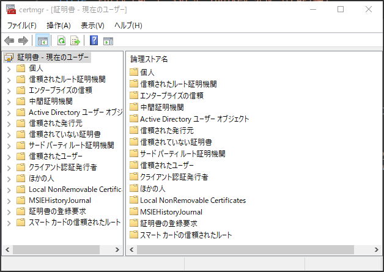
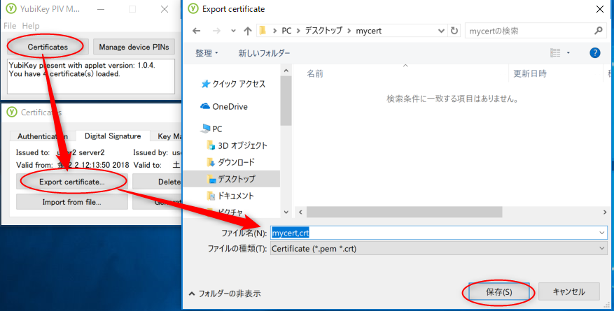
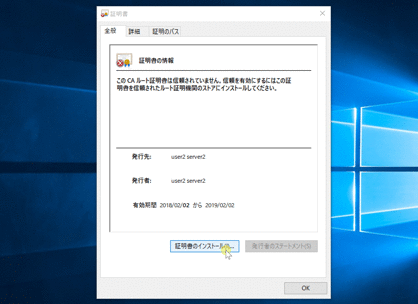
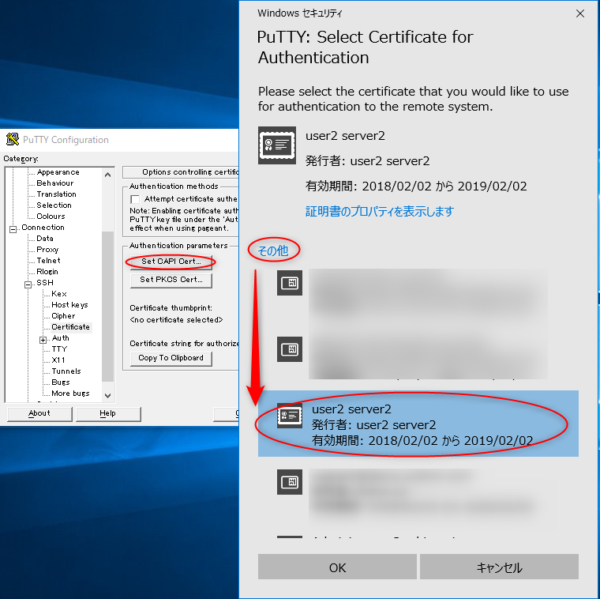

# はじめに

まず私は CAPI に関してイマイチわかっていないのだが、 Windows Certificate Manager が利用しているAPIだろう、Certificate Manager が利用できる証明書・秘密鍵を使えるものだという理解をしている。

[前回](https://blog.haniyama.com/2018/02/02/yubikey-ssh-opensc/) の記事で証明書の生成は終わっているとする。
あるいは YubiKey PIV minidriver などを利用した環境で、 Windowsの Client 証明書を入れていてもかまわない。

## お品書き

* 証明書のインポート
* CAPI経由で SSH 接続

### 証明書のインポート

前回作成した証明書を CAPI 経由で使えるように Windows の 証明書サービス(`Win` + `R` で `certmgr.msc` と入れると起動する奴)に登録する。



これ↑

まず PIV Manager を起動し、証明書を Export する。
この際拡張子を crt とすると、Windows の Certificate Manager が読める。
（PEMで出力された証明書の拡張子を crt に変えてもよい）



出力された crt ファイルをダブルクリックして証明書のインストールを選択する。
証明書に利用目的などが書いていないので、手動で個人証明書に登録する。



### CAPI経由で SSH 接続

あとは前回同様 putty を起動して前回 Connection > SSH > Certificate を開き、今回は CAPI を選択。
Windowsの証明書ストアに保存された証明書がずらーっと出てくるが、今回作成した証明書を選択する。



前回登録していれば不要だが、 Copy To Clipboad で公開鍵を取得し、 authorized_keys にでも追加しておく。

今回はこんな感じの Vagrantfile を作成してテストした。

```rb
# -*- mode: ruby -*-
# vi: set ft=ruby :

Vagrant.configure("2") do |config|
  config.vm.box = "centos/7"
  config.vm.box_check_update = false
  if Vagrant.has_plugin?("vagrant-proxyconf") && ENV['http_proxy']
    config.proxy.http = ENV['http_proxy']
    config.proxy.https = ENV['http_proxy']
    config.proxy.no_proxy = "localhost,127.0.0.1"
  end
  config.vm.provision "shell", inline: <<-SHELL
    echo "ecdsa-sha2-nistp256 AAAAE2VjZHNhLXNoYTItbmlzdHAyNTYAAAAIbmlzdHAyNTYAAABBBCQwpK871k+4j2jph1lVFLFEOt3PG8ZTy0eKWaXE1wrPuJNI1iNQlGnUZc8KwjjGp7271UdvPUlay802eAAn0hA= PKCS:2a9fdfe8f519746b4f9f3ac75af9d4e0affd2ee8=C:\Windows\System32\opensc-pkcs11.dll2a9fdfe8f519746b4f9f3ac75af9d4e0affd2ee8 CN=user2 server2" >> /home/vagrant/.ssh/authorized_keys
    ecdsa-sha2-nistp256 AAAAE2VjZHNhLXNoYTItbmlzdHAyNTYAAAAIbmlzdHAyNTYAAABBBCQwpK871k+4j2jph1lVFLFEOt3PG8ZTy0eKWaXE1wrPuJNI1iNQlGnUZc8KwjjGp7271UdvPUlay802eAAn0hA= CAPI:2a9fdfe8f519746b4f9f3ac75af9d4e0affd2ee82a9fdfe8f519746b4f9f3ac75af9d4e0affd2ee8 CN=user2 server2
  SHELL
end
```

`vagrant up` とすれば、通常はVMの SSHポートが ホストの 2222 ポートにフォワーディングされるので `localhost:2222` に接続できるかを試す。

