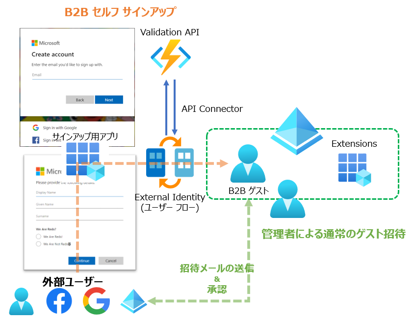
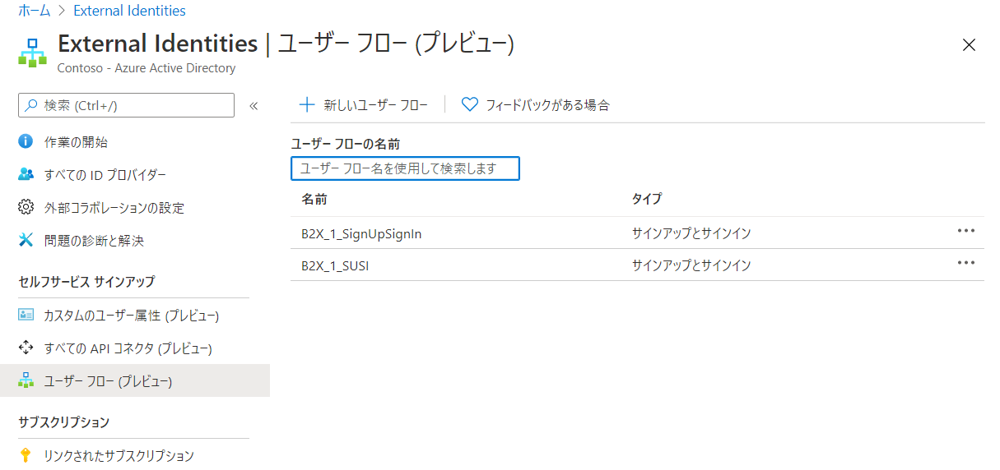
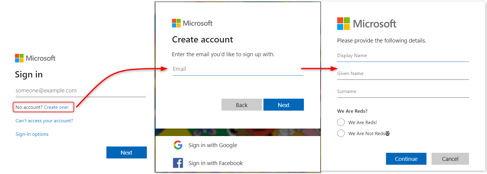
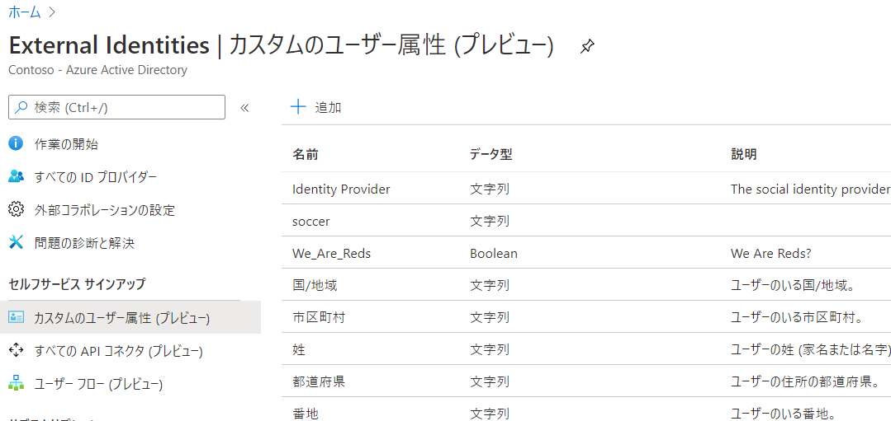
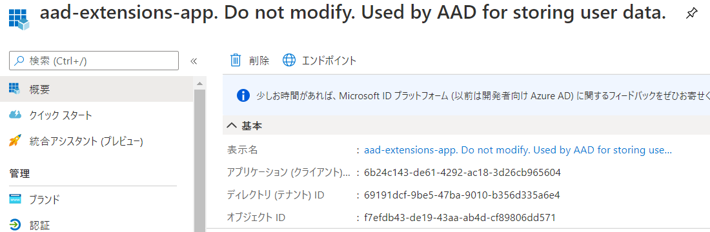
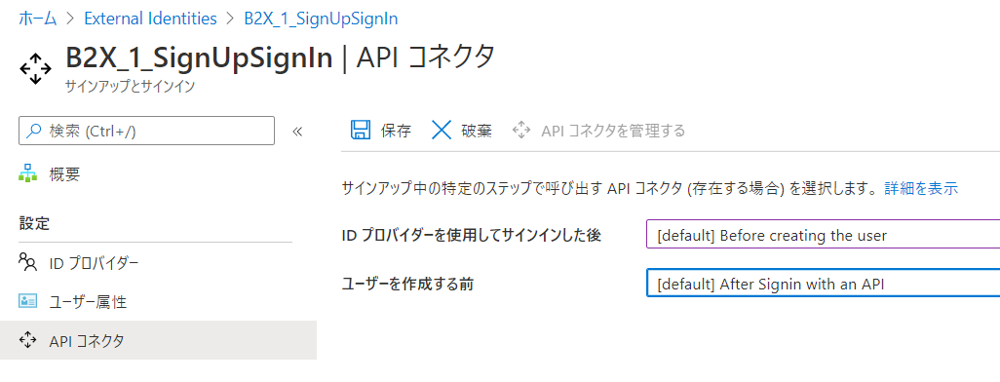
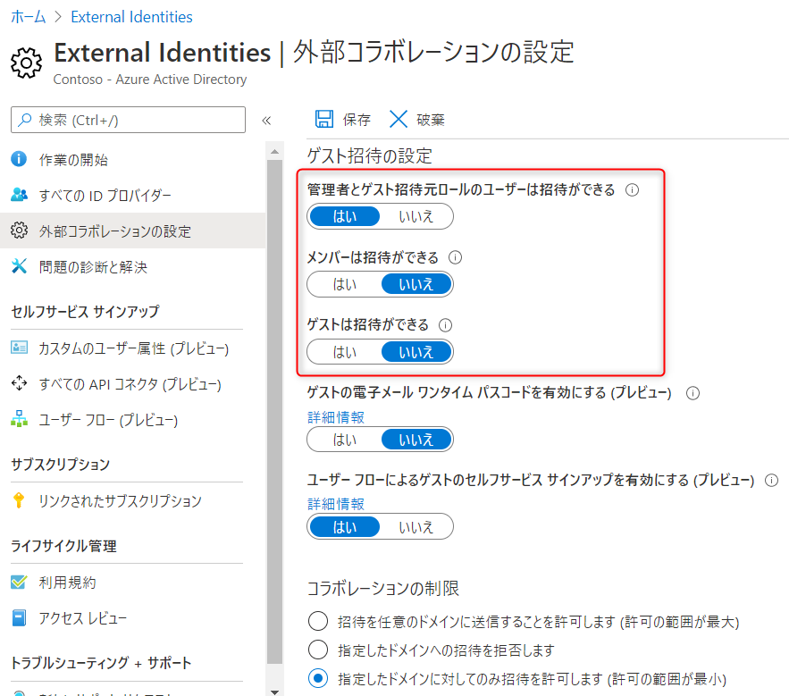
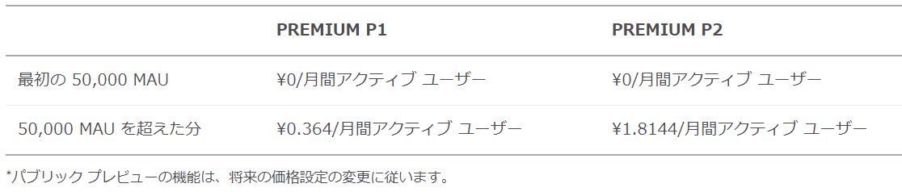

Azure AD の B2B 機能、つまり、社外ユーザーとのコラボレーション機能がどんどん Azure AD B2C っぽくなっている。ということで、今回は Azure AD External Identity のセルフ サインアップ と API コネクターを触ってみたのでそのメモ。

<!-- more  -->

## セルフサービス サインアップ

とりあえずどういう機能かというと、その名の通り会社のテナントにゲスト ユーザーが自分でサインアップできる機能で、ユーザーがサインアップするためのユーザーフローと、検証の為の API コネクターを組み合わせて構成されている。

同じ名前で呼ばれる Azure AD の機能で、Azure AD に未登録なドメインで Power BI などにサインアップすると自動で作成される ["セルフサービス サインアップ テナント" と呼ばれる、一部のユーザーからは諸悪の根源のごとく嫌われるやつ](https://qiita.com/Shinya-Yamaguchi/items/cb1942c51eda2dba31ff)がいるが、それとは全く違う機能なので気を付けて欲しい。

大まかな流れはこんな感じ。通常は緑のフロー (メール招待) でゲストを招待するが、オレンジのフローがセルフ サインアップ フロー。

### そもそも B2B って？

まず、Azure AD のゲストユーザー機能を知らない人のために、少しだけ説明する。そもそも Azure AD では外部テナントユーザー、Microsoft Account (MSA いわゆる個人アカウント) を "ゲスト ユーザー" として招待できる。
例えば協力会社のエンジニアをゲスト ユーザーとして招待させて作業をさせるだとか、外部ユーザーに Office 365 のリソースやら SharePoint やら連携アプリやらを使わせるために使える。

### B2B のしくみ

実際企業がどのように使っているか、ってことは正直よくわからないが、要は外部の IdP とフェデレーションを構成する機能である。招待されたユーザーが、どのような形でフェデレーションを構成するかは少しややこしいが、基本は外部テナント、もしくは MSA との連携になる。Google, Facebook, Direct Federation はテナントで追加の設定が必要になってくるためだ。
ちなみに外部テナントや MSA, Google, Facebook は OIDC/OAuth で、直接フェデレーション (Direct Federation) は SAML で連携する。

あ、OTP ユーザーのことを忘れてた。いずれのフェデレーション アカウントにも紐づいていないユーザーについては [B2B ゲスト ユーザーのワンタイム パスコード認証 - Azure AD | Microsoft Docs](https://docs.microsoft.com/ja-jp/azure/active-directory/external-identities/one-time-passcode) が有効になっていれば、OTP でテナントにサインインすることになる。詳しい流れについては、以下のドキュメントに記載がある。

[B2B コラボレーションの招待の利用 - Azure AD | Microsoft Docs](https://docs.microsoft.com/ja-jp/azure/active-directory/external-identities/redemption-experience)

>最近ゲストユーザーの既定の権限に[新しい権限が追加](https://docs.microsoft.com/en-us/azure/active-directory/users-groups-roles/users-restrict-guest-permissions)されて、招待ユーザーがテナント内部のユーザー情報を見れないようにする、といったプレビュー機能が追加されたが、今日はゲストユーザーのセルフサインアップに関するお話。実際に触ったのは 7 月だけど、忙しすぎてブログ書かずにいたらもう 3 カ月がたってた…。

ということで、早速本題のセルフ サインアップの話。さっきも言った通り、ざっくりユーザー フロー、API コネクターで構成されている。あと追加のカスタム属性についてチラッと解説する。

### ユーザー フロー

ユーザー フロー…、はい、そうです Azure AD B2C のユーザー フローと全く同じ見た目してますね。

設定内容も大体同じなので、Azure AD B2C を触っていれば困ることは無いでしょう。

ユーザー フローには、サインアップ時に要求する属性を構成できる。例えば、氏名や住所を追加で入力させたり、カスタム属性を追加で入力させたりできる。ユーザー フローを作成したら、Azure AD に登録したアプリを紐づける。

なぜアプリを紐づけるのか、という話なのだが、実際にアプリを紐づけてそのアプリに未サインインの状態出紐づけたアプリとして Authorize リクエストを送ると、以下のようにユーザーの作成ボタンが追加される。

> 埼玉県民に媚びるために作ったフローなので、なんか変な属性の収集が追加されている

ここで紐づけていないアプリには、このセルフ サインアップのためのボタンは表示されない。
現状こんな感じでちっちゃいボタンをクリックしないとセルフサインアップが出来ない。招待されていないユーザーのメールアドレスを Sign in 画面に入れると、ユーザーは見つかりませんと怒られる。

出来れば、クエリーパラメータを追加することで、サインアップに直接行けるほうが混乱が少なくて良いと思うけど、現状こんな動作。

### Custom User Attributes

Create one! ボタンをクリックすることで、ゲスト ユーザーとしてのサインアップが行えるが、サインアップ時に属性を収集することが出来る。そこで組み込みの属性以外を集めたい場合は、カスタム属性を利用する。

カスタム属性は、カスタムのユーザー属性で事前に作成する。

ここで属性を追加すると、`aad-extensions-app. Do not modify...` というアプリが出来上がり、属性はこのサービス プリンシパルに保存される。 

実際に保存された属性は `extension_<appid>_<extension_name>` でアクセスできる。
このあたりも B2C と大体同じなので、まあ違和感ないでしょう。

### API Connector

ユーザーのサインアップ時に、属性情報の Validation や、変換などを API 経由で行える。

例えば、メールアドレスのドメインをチェックする、外部システムと連携し、追加のクレームを入力するなど。
公式でもいくつかのサンプルが用意されており、メール ドメインの検証、承認システム、[IDology](https://github.com/Azure-Samples/active-directory-dotnet-external-identities-idology-identity-verification) や [Experian](https://github.com/Azure-Samples/active-directory-dotnet-external-identities-experian-identity-verification) といった外部 SaaS のユーザーの検証システムとつないで検証するといったサンプルもある。

[API connector code samples for user flows - Azure AD | Microsoft Docs](https://docs.microsoft.com/en-us/azure/active-directory/external-identities/code-samples-self-service-sign-up)

Azure Function のサンプルもあるので、サクッとためしたいならデプロイしてみれば良いと思う。自分も 3 カ月ぐらい前に [サンプル](https://github.com/watahani/azure-ad-external-identity-api) 作ったけど、解説作る前に公式サンプルが出来てしまった。

パッと考えただけでも、ゲスト ユーザーの名前に prefix を追加して見やすくするとか、追加の構成は必要だが、サインアップ日時を保存して特定日時がたったらユーザーを無効化させるといったフローなど、色々考えられていい機能だと思う。

## ざっくりまとめ

企業間で B2B コラボレーションを行う際には、特に制限は行わず一般ユーザーが招待可能にする、あるいは招待を制限し、管理者のみが招待権限を持つよう構成する、というどちらかの方法しかなかった。しかしセルフ サインアップ機能を利用することで、より柔軟な招待方法の構成ができるようになった。

たとえば、外部 ID の設定としては、こんな感じで招待を禁止しておいて、特定のサインアップページから API の検証の結果 OK ならセルフ サインアップできるのような構成も取れる。

API Connector も B2C と違って、カスタム ポリシーを弄ったりせずに簡単に構成できる。B2C にも早く逆輸入されて欲しい。というか、B2X があれば、今まで B2C で構成していたいくつかのユース ケースはこちらで対応できる可能性もある。
Azure AD Premium の条件付きアクセスポリシーと組み合わせれば、招待時に利用規約への同意なんかも行える。

ところで、外部 ID については、もう一つ大きなアップデートがあり、[ライセンスがサブスクリプションで払えるように](https://azure.microsoft.com/ja-jp/pricing/details/active-directory/external-identities/) なってる。
今までは Azure AD Premium のライセンスは、テナントで有効なライセンスの 5 倍までのゲスト ユーザーが利用できるとか、ある意味曖昧な料金体系だったが、サブスクリプション形式に切り替えれば 50,000 ユーザーまでは無料 (!?) になるので、多くの企業では切り替えたほうがオトクになりそう。

https://azure.microsoft.com/ja-jp/pricing/details/active-directory/external-identities/

とはいえ、パブリック プレビューなので、実際に GA されるときどんな動作になるかは分からないので悪しからず。

今日はこの辺で。
