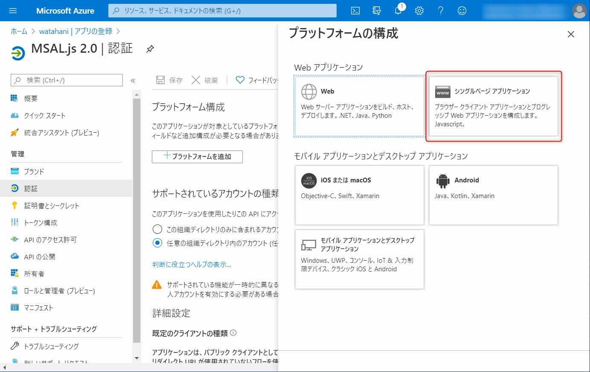
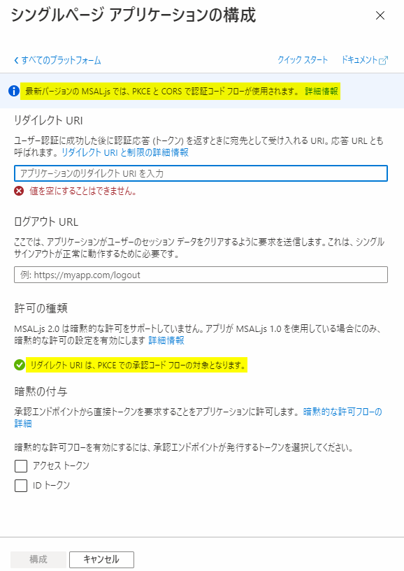
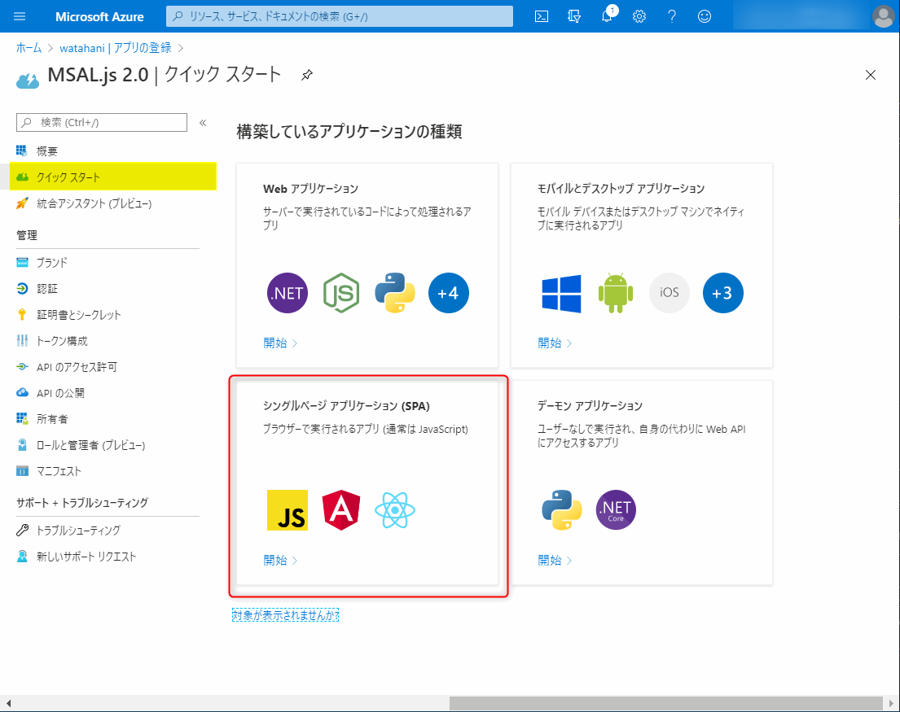
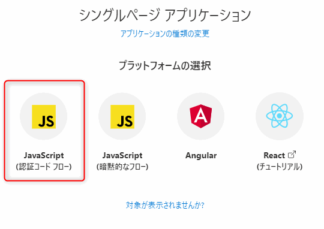
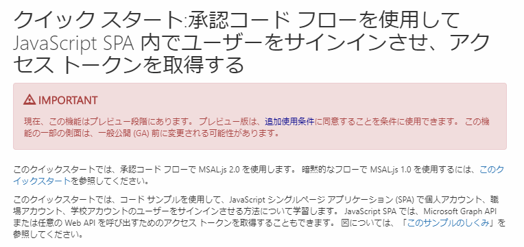
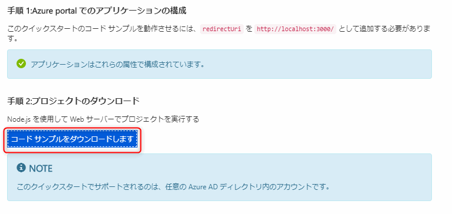
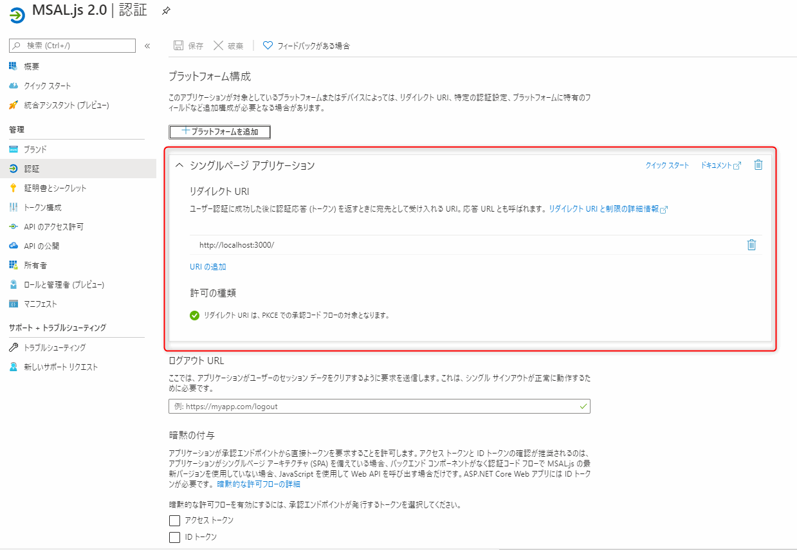
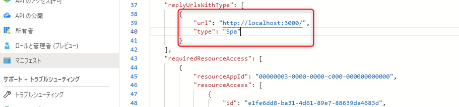
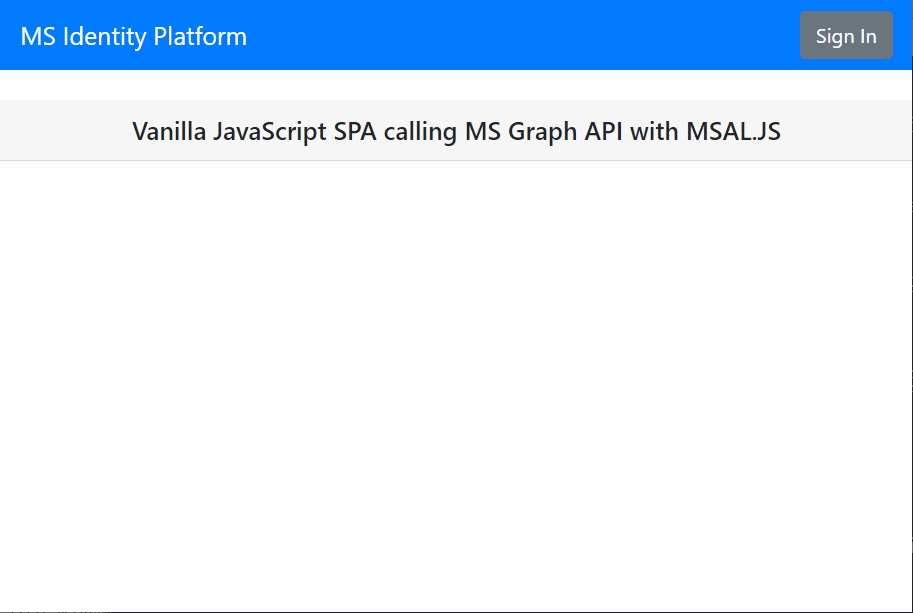
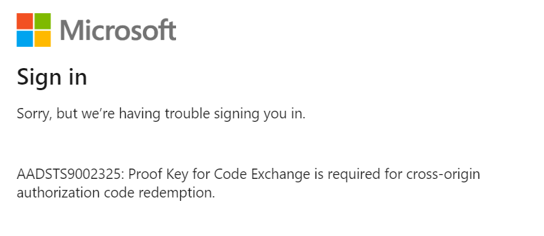

Authorize Code Flow with PKCE に対応した MSAL.js 2.x がプレビューでリリースされていたので、触ってみたメモ。

## Azure ポータルのアプリの登録画面

Azure AD のアプリ登録の画面がアップデートしており、リダイレクト URI の登録に SPA が追加されていた。

<!-- more -->



クリックするとこんな表示が。



> 最新バージョンの MSAL.js では、PKCE と CORS で認証コード フローが使用されます。

> リダイレクト URI は、PKCE での承認コード フローの対象となります。


少しわかり辛いが、既定では MSAL.js 2.0 を利用した承認コード フロー (Authorize Code Flow) with [PKCE](https://tools.ietf.org/html/rfc7636) を利用する設定になったとのことらしい。

もちろん暗黙の付与にチェックを入れることで、引き続き Implicit Flow も利用できる。

## MSAL.js 2.0

Microsoft が SPA 向けに提供している JavaScript 向けの認証ライブラリとしては以下の 3 つがある。なお ADAL は、古いエンドポイントを利用しているため、新規で開発する場合には選択肢から外そう。

- Authorize Code Grant を利用する [MSAL.js 2.x](https://github.com/AzureAD/microsoft-authentication-library-for-js/tree/dev/lib/msal-browser)
- Implicit Flow を利用する [MSAL.js 1.x](https://github.com/AzureAD/microsoft-authentication-library-for-js/tree/dev/lib/msal-core)  
- Implicit Flow (v1 エンドポイント) を利用する ADAL.js

今出ている MSAL.js 関連の記事は 1.x 系のものがほとんどだが、今後は 1.x 系なのか、2.x 系なのかしっかり見極めて読む必要がある。

## サンプルを動かす

アプリ登録画面が更新され、サンプル コードを自動生成してくれるようになった。めっちゃ楽に動く。すごい便利。

クイックスタートからサンプルを作る。



> シングルページ アプリケーション (SPA) > JavaScript (認証コード フロー) を選択



> 既定で Code Grant を推してはいるけど、あくまで MSAL.js 2.x はプレビュー



あとは手順通りにボタンをポチポチしていくと、アプリ登録の設定変更を行い、client_id などを埋め込んだサンプルがダウンロードできる。

 `これらの変更を行います` をクリックして、アプリの設定を更新したのち、コードサンプルをダウンロードする。



自動で設定される内容はこんな感じ



マニフェストには、`type: "spa"` として登録されている。




ダウンロードしたサンプルを解凍して、npm install && npm start を実行すると http://localhost:3000 でサンプルが動く。



## 認証の流れ

Sign In をクリックすることで、Authorize Endpoint にリクエストが飛ぶ。

サンプルはマルチ テナントアプリなので、organizations エンドポイントに対し認証リクエストを送信する。

```http
https://login.microsoftonline.com/organizations/oauth2/v2.0/authorize?

response_type=code&
scope=openid%20profile%20user.read%20offline_access&
client_id=47a5a26f-13c5-4f59-84f8-6a57b8ede039&
redirect_uri=http%3A%2F%2Flocalhost%3A3000%2F&
state=d57b6054-1930-422d-b707-fe840584790c&
nonce=2babda35-58fd-4d5c-9381-ed174e9214d3&
client_info=1&
x-client-SKU=MSAL.JS&
x-client-Ver=1.0.0-beta.0&
code_challenge=ZhDtcgD2hU8bRjD1Qpvhcrvm-J38iUvkovNdbbc3o0w&
code_challenge_method=S256&
client-request-id=303fc61d-7bbe-4f25-8430-5d11b7b5240f&
response_mode=fragment&
sso_reload=true
```

ポイントは、code_challenge と code_challenge_method が含まれていること。

> code_challenge=ZhDtcgD2hU8bRjD1Qpvhcrvm-J38iUvkovNdbbc3o0w

サインイン & Consent 後、code が返却される

```http
http://localhost:3000/#

code=0.ASsArFzjubin3UihAruhjq...&
client_info=eyJ1aWQiOiIxMTc1MGFiZS1kOWE2LTQ3MTYtOTdiNS03N2I0MzBjOGFmNjUiLCJ1dGlkIjoiYjllMzVjYWMtYTdiOC00OGRkLWExMDItYmJhMThlYWNhNTI0In0&
state=0bf48805-be5d-404f-9f9a-c31fc321a292&
session_state=c1f74a08-8442-486c-bb75-107298d6dc7e
```

token エンドポイントへの POST リクエストには code_verifier を付与する。

```http
POST https://login.microsoftonline.com/organizations/oauth2/v2.0/token HTTP/1.1
Host: login.microsoftonline.com
Connection: keep-alive
Content-Length: 1052
User-Agent: Mozilla/5.0 (Windows NT 10.0; Win64; x64) AppleWebKit/537.36 (KHTML, like Gecko) Chrome/83.0.4103.61 Safari/537.36
content-type: application/x-www-form-urlencoded
Accept: */*
Origin: http://localhost:3000
Sec-Fetch-Site: cross-site
Sec-Fetch-Mode: cors
Sec-Fetch-Dest: empty
Referer: http://localhost:3000/
Accept-Encoding: gzip, deflate, br
Accept-Language: en-US,en;q=0.9,ja-CA;q=0.8,ja;q=0.7

client_id=47a5a26f-13c5-4f59-84f8-6a57b8ede039&
scope=openid%20profile%20user.read%20offline_access&
redirect_uri=http%3A%2F%2Flocalhost%3A3000%2F&
code=0.ASsArFzjubin3UihAruhjqylJG...&
code_verifier=NUJGSXpNM1VEazlHVW9vYXRWb0o5RDJSTXI2Q1l3WGI&
grant_type=authorization_code
```

code_verifier の値を、SHA256 でハッシュを取ると、code_challenge の値と一致するはず。

```powershell
 ConvertFrom-CodeVerifier - 'NUJGSXpNM1VEazlHVW9vYXRWb0o5RDJSTXI2Q1l3WGI'
# ZhDtcgD2hU8bRjD1Qpvhcrvm-J38iUvkovNdbbc3o0w
```

code_verifier から code_challenge を計算する関数はこんな感じ。

<script src="https://gist.github.com/watahani/57b91116335d4738e23918f5996d7553.js"></script>


## エラーを発生させてみたメモ

### AADSTS50148 エラー

トークン リクエストを code_verifier を消したり、間違えたりして送ってみる。怒られる。

```js
u='https://login.microsoftonline.com/organizations/oauth2/v2.0/token'
data = {
    "client_id": "47a5a26f-13c5-4f59-84f8-6a57b8ede039",
    "scope": "openid",
    "grant_type": "authorization_code",
    "redirect_uri": "http://localhost:3000/",
    "code": code
  }

let urlEncodedDataPairs = [];
for(let name in data ) {
    urlEncodedDataPairs.push( encodeURIComponent( name ) + '=' + encodeURIComponent( data[name] ) );
}
urlEncodedData = urlEncodedDataPairs.join( '&' ).replace( /%20/g, '+' );

var request = new XMLHttpRequest()
request.addEventListener( 'load', function(event) {
  console.log(event.target.response);
});
request.open("POST",u)
request.setRequestHeader( 'Content-Type', 'application/x-www-form-urlencoded' )

request.send(urlEncodedData)

//{"error":"invalid_grant","error_description":"AADSTS50148: The code_verifier does not match the code_challenge supplied in the authorization request for PKCE.\r\nTrace ID: 5c4218e1-fa34-4609-bdb6-f3a63a918200\r\nCorrelation ID: 6957aeea-d8fd-43b7-bf3f-79c2a3654bde\r\nTimestamp: 2020-06-02 08:00:46Z","error_codes":[50148],"timestamp":"2020-06-02 08:00:46Z","trace_id":"5c4218e1-fa34-4609-bdb6-f3a63a918200","correlation_id":"6957aeea-d8fd-43b7-bf3f-79c2a3654bde","error_uri":"https://login.microsoftonline.com/error?code=50148"}
```

### AADSTS900144 エラー

code_challenge がない AuthZ リクエストを送ってみると AADSTS900144 エラーが発生する。

```http
https://login.microsoftonline.com/organizations/oauth2/v2.0/authorize?

response_type=code&
scope=openid%20profile%20user.read%20offline_access&
client_id=47a5a26f-13c5-4f59-84f8-6a57b8ede039&
redirect_uri=http%3A%2F%2Flocalhost%3A3000%2F&
state=d57b6054-1930-422d-b707-fe840584790c&
nonce=2babda35-58fd-4d5c-9381-ed174e9214d3&
response_mode=fragment
```


### AADSTS9002327 エラー

Code を取得して、ブラウザーの XHR リクエストではなく、PowerShell などでリクエストを送信してみると、AADSTS9002327 エラーが発生する。どこ見てるんだろ、あんま検証してない。

```powershell
$clientId = '47a5a26f-13c5-4f59-84f8-6a57b8ede039'
$redirectUri='https://localhost:3000/'
$tenantId = "organization"
$tokenEndpont = "https://login.microsoftonline.com/$tenantId/oauth2/v2.0/token"
$scope = "openid profile user.read offline_access"

$code='0.ASsArFzjubin3Ui...'
$codeVerifier = 'NUJGSXpNM1VEazlHVW9vYXRWb0o5RDJSTXI2Q1l3WGI'

$postParams = @{
    client_id = $clientId;
    redirect_uri=$redirectUri;
    grant_type = 'authorization_code';
    scope = $scope;
    code=$code;
    code_verifier=$codeVerifier;
}

$body = (Invoke-WebRequest -Uri $tokenEndpont -Method POST -Body $postParams) | ConvertFrom-Json

#Invoke-WebRequest : {"error":"invalid_request","error_description":"AADSTS9002327: Tokens issued for the 'Single-Page Application' client-type may only be redeemed via cross-origin requests.\r\nTrace ID: c739...
```

### (おまけ) AADSTS50076 エラー

IP アドレスがっつり違うとこからリフレッシュトークン使ってみると、AADSTS50076 エラーが発生した。AIP が有効じゃないと出ないっぽい。

```js
u='https://login.microsoftonline.com/organizations/oauth2/v2.0/token'
data = {
    "scope": "openid",
    "grant_type": "refresh_token",
    "redirect_uri": "http://localhost:3000/",
    "refresh_token": refresh_token
  }

let urlEncodedDataPairs = [];
for(let name in data ) {
    urlEncodedDataPairs.push( encodeURIComponent( name ) + '=' + encodeURIComponent( data[name] ) );
}
urlEncodedData = urlEncodedDataPairs.join( '&' ).replace( /%20/g, '+' );

var request = new XMLHttpRequest()
request.addEventListener( 'load', function(event) {
  console.log(event.target.response);
});
request.open("POST",u)
request.setRequestHeader( 'Content-Type', 'application/x-www-form-urlencoded' )

request.send(urlEncodedData)
// {"error":"invalid_grant","error_description":"AADSTS50076: Due to a configuration change made by your administrator, or because you moved to a new location, you must use multi-factor authentication to access '00000003-0000-0000-c000-000000000000'.\r\nTrace ID: 4fa9c1ce...
```
