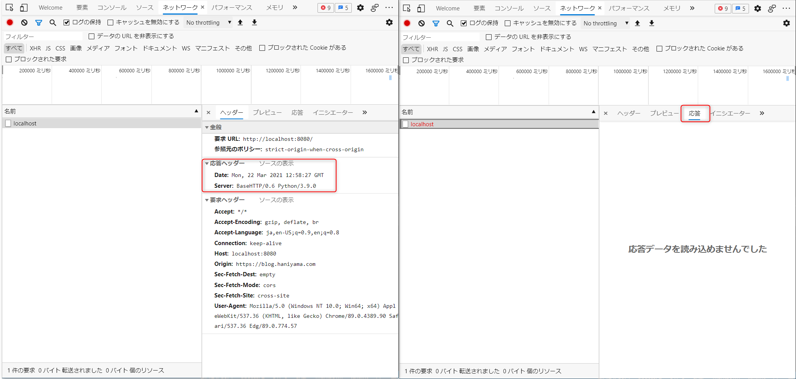

最近 CORS を改めて勉強したけど、やっぱり知識があいまいな部分があるので、一旦アウトプットとしてまとめておく。

<!-- more -->

## 参考

とりあえず MDN を読んどけばなんとなく理解できる。

- [オリジン間リソース共有 (CORS) - HTTP | MDN](https://developer.mozilla.org/ja/docs/Web/HTTP/CORS)

なんで CORS があるのって話。

- [CORS とか Preflight とかよくわかんないよな - くろのて](https://note.crohaco.net/2019/http-cors-preflight/)

なんでできたのかみたいな話を調べていくと JSONP とかいう黒魔術の話がでて楽しそうだが、キリがなさそう。

TL で CORS 完全手冊という中国語のブログが紹介されており、Google 翻訳で読んだところすごくわかりやすかった。全部で 6 章あるが、自分が理解できたのは大体 3 章まで。

- [CORS 完全手冊（一）：為什麼會發生 CORS 錯誤？ - Huli](https://blog.huli.tw/2021/02/19/cors-guide-1/)

大体理解した後、日本語のドキュメントを探したけど、あんま良さげなのはなかった。
実用上は Qiita のこの記事読んどけば大丈夫そう。

[CORSまとめ - Qiita](https://qiita.com/tomoyukilabs/items/81698edd5812ff6acb34)

- [Fetch Standard](https://fetch.spec.whatwg.org/)

仕様は気になるところ ([preflight](https://fetch.spec.whatwg.org/#cors-preflight-fetch) のロジックあたり) だけつまみ読みした感じ。多くの人はここだけ読んでおけば十分だろうと思う。

## CORS Step 0

CORS の制約は Origin が異なるときに発生する。[same site](https://html.spec.whatwg.org/multipage/origin.html#same-site) とは異なり、same origin はスキーマとポート、ドメインがすべて一致する必要がある。
<http://google.com> と <https://www.google.com> は same site だが same origin ではない。どうもスキーマが違う場合には schemelessly same site というらしいが…。

とにかく same origin ではないサイトへの XMLHttpRequest, fecth API を利用した通信が CROS でブロックされる。
F12 を押してブラウザーの DevTools を立ち上げ、コンソールに `fetch("https://google.com")` と打ってみる。

```js
fetch("https://google.com")
Promise {<pending>}
// cors.html:1 Access to fetch at 'https://google.com/' from origin 'https://blog.haniyama.com' has been blocked by CORS policy: No 'Access-Control-Allow-Origin' header is present on the requested resource. If an opaque response serves your needs, set the request's mode to 'no-cors' to fetch the resource with CORS disabled.
```

CORS ポリシーによりブロックされたと出る。リクエスト モードを no-cros にすれば opaque response を得られるとあるが、これは通信はするが JavaScript に値を返さずに、エラーも抑制されるモードで、たいていの場合は役に立たない。[opaque response でググると出てくるサイトによると](https://blog.fullstacktraining.com/what-is-an-opaque-response/) キャッシュ戦略に役立つらしいが今回は興味がないのでパス。

さて、CORS はサーバーの応答ヘッダーによりブラウザーが、通信を制御する仕様なので Google に通信を送ったって何も学べないので、適当なサーバーを立てる。

```py
from http.server import BaseHTTPRequestHandler, ThreadingHTTPServer
import logging
"""
Very simple HTTP server in python for logging requests (for python 3.7 or later)
Usage::
    ./server.py [<port>]
"""

class S(BaseHTTPRequestHandler):
    def _set_response(self, custom_headers = {}):
        self.send_response(200)
        self.end_headers()

    def do_GET(self):
        logging.info("GET request,\nPath: %s\nHeaders:\n%s\n",
                     str(self.path), str(self.headers))
        self._set_response()
        self.wfile.write("GET request for {},\n\nwith request headers: \n{}".format(
            self.path, self.headers).encode('utf-8'))

def run(server_class=ThreadingHTTPServer, handler_class=S, port=8080):
    logging.basicConfig(level=logging.INFO)
    server_address = ('', port)
    httpd = server_class(server_address, handler_class)
    logging.info("Starting httpd... port {}\n".format(str(port)))
    try:
        httpd.serve_forever()
    except KeyboardInterrupt:
        pass
    httpd.server_close()
    logging.info('Stopping httpd...\n')


if __name__ == '__main__':
    from sys import argv

    if len(argv) == 2:
        run(port=int(argv[1]))
    else:
        run()
```

python server.py みたいにしたら動く。ThreadingHTTPServer は python 3.7 じゃないと動かないので、それ以上のバージョンを。

あらためて、fetch を試して Python サーバーのログを見る。

```js
fetch("http://localhost:8080/api")
Promise {<pending>}
//Access to fetch at 'http://localhost:8080/api' from origin 'https://blog.haniyama.com' has been blocked by CORS policy: No 'Access-Control-Allow-Origin' header is present on the requested resource. If an opaque response serves your needs, set the request's mode to 'no-cors' to fetch the resource with CORS disabled.```
```

Python サーバー側のログはこんなかんじで、リクエストが到達している。つまりレスポンスも返している。

```text
INFO:root:GET request,
Path: /api
Headers:
Host: localhost:8080
Connection: keep-alive
User-Agent: Mozilla/5.0 (Windows NT 10.0; Win64; x64) AppleWebKit/537.36 (KHTML, like Gecko) Chrome/89.0.4389.90 Safari/537.36 Edg/89.0.774.57
Accept: */*
Origin: https://blog.haniyama.com
Sec-Fetch-Site: cross-site
Sec-Fetch-Mode: cors
Sec-Fetch-Dest: empty
Accept-Encoding: gzip, deflate, br
Accept-Language: ja,en-US;q=0.9,en;q=0.8
```

一方でブラウザーの DevTools では、レスポンスの内容は見えない。



Fiddler (http なので WireShark でも) などの通信トレースを取得するツールで通信をみると、確かにブラウザーがレスポンスを受け取っていることがわかる。

```http
HTTP/1.0 200 OK
Server: BaseHTTP/0.6 Python/3.9.0
Date: Mon, 22 Mar 2021 13:02:37 GMT

GET request for /api,

with request headers: 
Host: localhost:8080
Connection: keep-alive
User-Agent: Mozilla/5.0 (Windows NT 10.0; Win64; x64) AppleWebKit/537.36 (KHTML, like Gecko) Chrome/89.0.4389.90 Safari/537.36 Edg/89.0.774.57
Accept: */*
Origin: https://blog.haniyama.com
Sec-Fetch-Site: cross-site
Sec-Fetch-Mode: cors
Sec-Fetch-Dest: empty
Accept-Encoding: gzip, deflate, br
Accept-Language: ja,en-US;q=0.9,en;q=0.8
```

動かしてみればわかるが、ブラウザーはリクエストを送信し、レスポンスを受け取ったが、CORS を成功させるための条件を満たさなかったため、JavaScript へデータは渡さないことを選択した動作となっている。

CORS を判定するのは常にブラウザーであり、サーバー側でも JavaScript 側でもない。そのため、たとえば curl や Invoke-WebRequest など、ブラウザーではない API アクセスは問題なく成功する。

そして CORS を成功させるには、ブラウザーでも JavaScript でもなく、サーバー側を修正する必要がある。

※ ただし私の周りで起こる CORS の問題は、たいていサーバー側が何らかのエッジで、実際に修正ができないパターンのことが多い。

## CORS Step 1 (Access-Control-Allow-Origin)

ということでサーバーサイドのコードを修正してみる。

```py
from http.server import BaseHTTPRequestHandler, ThreadingHTTPServer
import logging
"""
Very simple HTTP server in python for logging requests (for python 3.7 or later)
Usage::
    ./server.py [<port>]
"""

class S(BaseHTTPRequestHandler):
    def _set_response(self, custom_headers = {}):
        self.send_response(200)
        # add header
        self.send_header("Access-Control-Allow-Origin", "*")
        self.end_headers()

    def do_GET(self):
        logging.info("GET request,\nPath: %s\nHeaders:\n%s\n",
                     str(self.path), str(self.headers))
        self._set_response()
        self.wfile.write("GET request for {},\n\n with request headers: \n {}".format(
            self.path, self.headers).encode('utf-8'))

def run(server_class=ThreadingHTTPServer, handler_class=S, port=8080):
    logging.basicConfig(level=logging.INFO)
    server_address = ('', port)
    httpd = server_class(server_address, handler_class)
    logging.info("Starting httpd... port {}\n".format(str(port)))
    try:
        httpd.serve_forever()
    except KeyboardInterrupt:
        pass
    httpd.server_close()
    logging.info('Stopping httpd...\n')


if __name__ == '__main__':
    from sys import argv

    if len(argv) == 2:
        run(port=int(argv[1]))
    else:
        run()
```

これで先ほどと同じ fetch リクエストを送信してみる。

```js
fetch("http://localhost:8080/api/step1")
Promise {<pending>}
```

今度はエラーは起こらない。

```js
fetch("http://localhost:8080/api/step1").then(r => r.text()).then(data => console.log(data))
```

のようにすればレスポンスの内容が見えるはず。

## CORS Step 2 (Access-Control-Allow-Headers)

無事に CORS の対応ができたので、次はデータの送信を行う API を作る。

```python
    def do_POST(self):
        logging.info("POST request,\nPath: %s\nHeaders:\n%s\n",
                     str(self.path), str(self.headers))

        content_length = int(self.headers['Content-Length'])
        post_data = self.rfile.read(content_length)
        body = json.loads(post_data)

        self._set_response()

        res = json.dumps({
            "status": "ok",
            "message": "hello {}".format(body.get("name"))
        })
        
        self.wfile.write(res.encode('utf-8'))
```

そして、POST するデータは JSON でこう送る。

```js
fetch("http://localhost:8080/api/step2", { method: "POST" , body: JSON.stringify({"name": "watahani"})}).then(r => r.text()).then(data => console.log(data))

//{"status": "ok", "message": "hello watahani"}
```

すばらしい。Access-Control-Allow-Origin のおかげでうまく通信ができている。しかしながら、ここで Content-Type を "application/json" で、Authorization ヘッダーにアクセストークンを含めて送ってほしいと要望があったため、以下のように追加するとまた謎のエラーが発生する。

```js
fetch("http://localhost:8080/api/step2", { method: "POST" , headers: {"Content-Type": "application/json", "Authorization": "xxxxx"}, body: JSON.stringify({"name": "watahani"})}).then(r => r.text()).then(data => console.log(data))

//Access to fetch at 'http://localhost:8080/api/step2' from origin 'https://blog.haniyama.com' has been blocked by CORS policy: Response to preflight request doesn't pass access control check: No 'Access-Control-Allow-Origin' header is present on the requested resource. If an opaque response serves your needs, set the request's mode to 'no-cors' to fetch the resource with CORS disabled.
```

これは preflight request がパスしなかったというエラーだ。preflight request とは、単純リクエスト (simple request) ではない通信が発生する際に発生する "お伺い" であり、OPTIONS リクエストにより本来行うリクエストを送ってよい origin からの通信なのかを判別する機能、というのが私の理解。

一方で [単純リクエストの実際の条件](https://developer.mozilla.org/ja/docs/Web/HTTP/CORS#simple_requests) は MDN に纏まっているが、API 側に副作用を与えず認証を必要としない GET, HEAD リクエスト、ブラウザーに元来含まれている form post による通信が単純リクエスト、と私は理解している。

さて、これを解決するには Access-Control-Allow-Origin を `*` ではなく、fetch 元の Origin と一致させる必要がある。

```diff
-        self.send_header("Access-Control-Allow-Origin", "*")
+        self.send_header("Access-Control-Allow-Origin", "https://blog.haniyama.com")
```

この状態でもエラーが出る。

```js
fetch("http://localhost:8080/api/step2", { method: "POST" , headers: {"Content-Type": "application/json", "Authorization": "xxxxx"}, body: JSON.stringify({"name": "watahani"})}).then(r => r.text()).then(data => console.log(data))

Promise {<pending>}

Access to fetch at 'http://localhost:8080/api/step2' from origin 'https://blog.haniyama.com' has been blocked by CORS policy: Request header field content-type is not allowed by Access-Control-Allow-Headers in preflight response.
```

カスタム ヘッダーを送信するためには、Access-Control-Allow-Headers を追加しろといっている。

プリフライト リクエストのヘッダーを見てみると `Access-Control-Request-Headers: authorization,content-type` の記載があり、API 側がこれらのヘッダーを許可するのであれば `Access-Control-Allow-Headers: authorization, content-type` を返さなければならない。

```http
Host: localhost:8080
Connection: keep-alive
Accept: */*
Access-Control-Request-Method: POST
Access-Control-Request-Headers: authorization,content-type
Origin: https://blog.haniyama.com
User-Agent: Mozilla/5.0 (Windows NT 10.0; Win64; x64) AppleWebKit/537.36 (KHTML, like Gecko) Chrome/89.0.4389.90 Safari/537.36 Edg/89.0.774.63
Sec-Fetch-Mode: cors
Sec-Fetch-Site: cross-site
Sec-Fetch-Dest: empty
Accept-Encoding: gzip, deflate, br
Accept-Language: ja,en-US;q=0.9,en;q=0.8
```

ということで、以下のコードを追加する。

```diff
        self.send_header("Access-Control-Allow-Origin", "https://blog.haniyama.com")
```

これで無事にリクエストが通るようになる。ちなみに現時点だとワイルドカードによる指定でも問題ない。

```diff
        self.send_header("Access-Control-Allow-Origin", "https://blog.haniyama.com")
-       self.send_header("Access-Control-Allow-Headers", "Authorization, Content-Type")
+       self.send_header("Access-Control-Allow-Headers", "*")
```

## CORS Step 3 (Access-Control-Allow-Headers)

さて、POST メソッドができたところで Delete メソッドを受け付ける API も構成したいとのことで、Delete 用のメソッドをサーバー側に追加した。

```python
    def do_DELETE(self):
        logging.info("DELETE request,\nPath: %s\nHeaders:\n%s\n",
                     str(self.path), str(self.headers))

        content_length = int(self.headers['Content-Length'])
        post_data = self.rfile.read(content_length)
        body = json.loads(post_data)

        self._set_response()

        res = json.dumps({
            "status": "ok",
            "message": "deleted {}".format(body.get("name"))
        })
        
        self.wfile.write(res.encode('utf-8'))
```

Step 2 でヘッダーの構成はすんでいるので、単純に DELETE リクエストを投げる。

```js
fetch("http://localhost:8080/api/step2", { method: "DELETE" , headers: {"Content-Type": "application/json", "Authorization": "xxxxx"}, body: JSON.stringify({"name": "watahani"})}).then(r => r.text()).then(data => console.log(data))

//Access to fetch at 'http://localhost:8080/api/step2' from origin 'https://blog.haniyama.com' has been blocked by CORS policy: Method DELETE is not allowed by Access-Control-Allow-Methods in preflight response.
```

なるほど、今度は Access-Control-Allow-Methods ヘッダーに DELETE が含まれないため失敗してしまった。
実は POST, GET, HEAD のリクエストは CORS-safelisted Methods のため、後に説明する credentials mode が included ではない場合は暗黙的に許可される。しかし CORS-safelisted Methods ではない場合は Access-Control-Allow-Methods の指定が必要となる。

```diff
        self.send_header("Access-Control-Allow-Origin", "https://blog.haniyama.com")
        self.send_header("Access-Control-Allow-Headers", "*")
+       self.send_header("Access-Control-Allow-Methods", "*")
```

なお、credentials mode が include の場合、より制約が厳しくなり Access-Control-Allow-Headers や Access-Control-Allow-Methods で "*" によるワイルドカード指定はできなくなるため、以下のような指定が必要になる。

```diff
        self.send_header("Access-Control-Allow-Origin", "https://blog.haniyama.com")
        self.send_header("Access-Control-Alltoiuow-Headers", "Authorization, Content-Type")
+       self.send_header("Access-Control-Allow-Methods", "POST, DELETE")
```

## CORS Step 4 (Access-Control-Allow-Credentials)

ということで次はリクエストに Cookie を含めたい場合の話。fetch の credentials オプションを "include" にすると、レスポンス ヘッダーに `Access-Control-Allow-Credentials: true` が必要になる。

```javascript
fetch("http://localhost:8080/api/step3", { method: "POST" , headers: {"Content-Type": "application/json", "Authorization": "xxxxx"}, credentials: "include", body: JSON.stringify({"name": "watahani"})}).then(r => r.text()).then(data => console.log(data))
//Access to fetch at 'http://localhost:8080/api/step3' from origin 'https://blog.haniyama.com' has been blocked by CORS policy: Response to preflight request doesn't pass access control check: The value of the 'Access-Control-Allow-Credentials' header in the response is '' which must be 'true' when the request's credentials mode is 'include'.
```

ということで、以下を追加する。

```diff
        self.send_header("Access-Control-Allow-Origin", "https://blog.haniyama.com")
        self.send_header("Access-Control-Alltoiuow-Headers", "Authorization, Content-Type")
        self.send_header("Access-Control-Allow-Methods", "POST, DELETE")
+       self.send_header("Access-Control-Allow-Credentials", "true")
```

```javascript
fetch("http://localhost:8080/api/step4", { method: "POST" , headers: {"Content-Type": "application/json", "Authorization": "xxxxx"}, credentials: "include", body: JSON.stringify({"name": "watahani"})}).then(r => r.text()).then(data => console.log(data))
```

CORS で Cookie 付けたいシチュエーションっていうのが正直よくわかってないのだけど、たぶん API 側の Set-Cookie は 3rd Party Cookie になるので拒否されると認識している。
なんで、イマイチ使い時がわからないけど `app.example.com` と `api.example.com` で Cookie 共有してて送りたいみたいな時に使うのかな？あとはトラッキング用とか。

## CORS Step 5 (Access-Control-Expose-Headers)

あまり興味がないのでサクッと。

```diff
        self.send_header("Access-Control-Allow-Origin", "https://blog.haniyama.com")
        self.send_header("Access-Control-Alltoiuow-Headers", "Authorization, Content-Type")
        self.send_header("Access-Control-Allow-Methods", "POST, DELETE")
        self.send_header("Access-Control-Allow-Credentials", "true")
+       self.send_header("Access-Control-Expose-Headers", "X-Exportable")
+       self.send_header("X-Exportable", "hogehoge")
```

すると `X-Exportable` が JavaScript で読み取り可能になる。

```javascript
fetch("http://localhost:8080/api/step5", { method: "POST" , headers: {"Content-Type": "application/json", "Authorization": "xxxxx"}, credentials: "include", body: JSON.stringify({"name": "watahani"})}).then(r => console.log(r.headers.get("X-Exportable")))
// hogehoge
```

## CORS Step 6 (Access-Control-Max-Age)

プリフライトリクエストの結果をキャッシュする秒数を定義する。

```diff
        self.send_header("Access-Control-Allow-Origin", "https://blog.haniyama.com")
        self.send_header("Access-Control-Alltoiuow-Headers", "Authorization, Content-Type")
        self.send_header("Access-Control-Allow-Methods", "POST, DELETE")
        self.send_header("Access-Control-Allow-Credentials", "true")
        self.send_header("Access-Control-Expose-Headers", "X-Exportable")
        self.send_header("X-Exportable", "hogehoge")
+       self.send_header("Access-Control-Max-Age", "10")
```

無ければ毎回プリフライトリクエストのための OPTIONS リクエストが飛んでしまうため、重要なキャッシュ戦略。今の仕事だと気にすることがないのでさらっと。

```javascript
var f = () => fetch("http://localhost:8080/api/step6", { method: "POST" , headers: {"Content-Type": "application/json", "Authorization": "xxxxx"}, credentials: "include", body: JSON.stringify({"name": "watahani"})}).then(r => console.log(r.headers.get("X-Exportable")))
var timer = setInterval(f, 1000);
// clearInterval(timer)
```

10 秒間はプリフライトリクエストがキャッシュされるので、プリフライトリクエストが飛ぶのは 10 秒に一回ぐらいになる。
Edge の DevTool だとプリフライトリクエストがすごくわかりやすいのでお勧め。


ということで、CORS について一通り手を動かして勉強してみた。
CORS はわかったけど、今度はサードパーティ Cookie の動きが良くわからんとなって、1 カ月ほど放置していたが、その辺はまた分かったら書き足すということで。

コードは Gist に上げておいたのでもし興味があれば動かしてみてください。

<script src="https://gist.github.com/watahani/6c026b6899b2897bb57e947d3b1432d5.js"></script>
