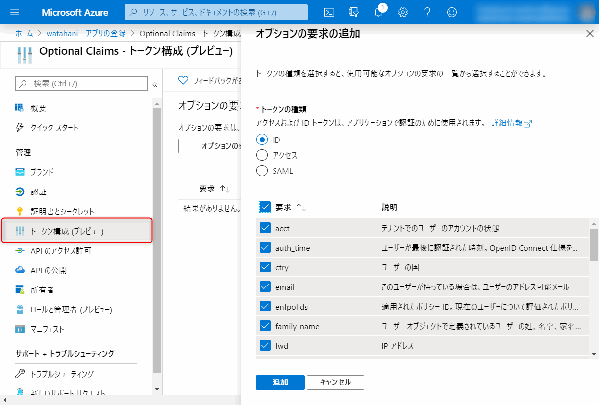
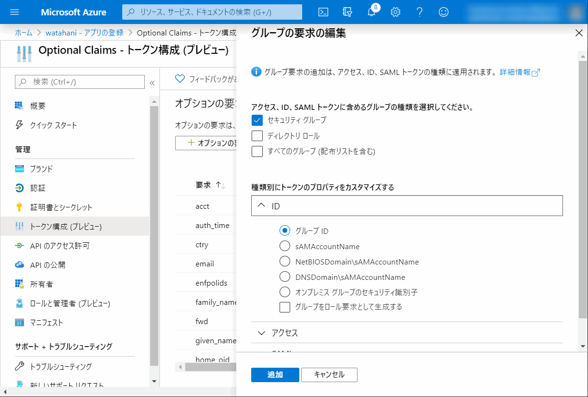
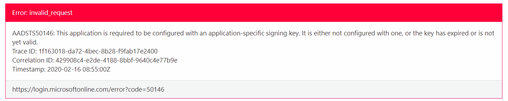
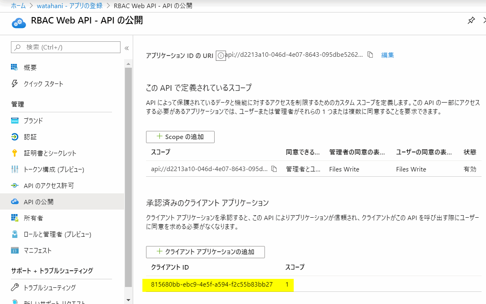
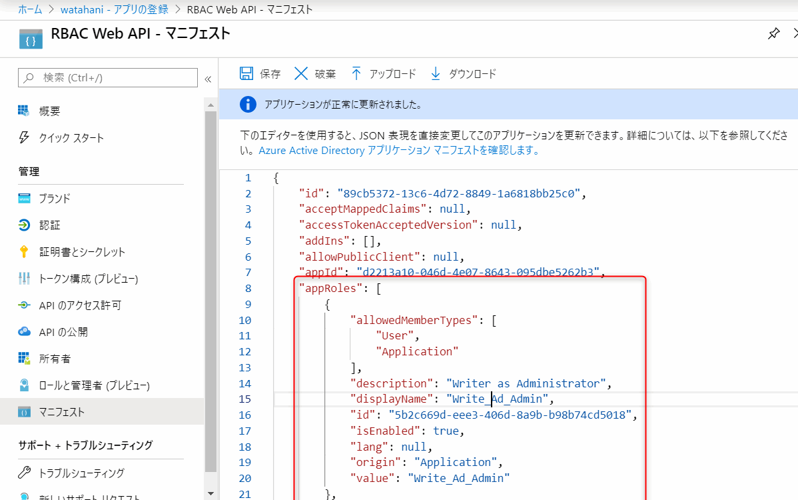
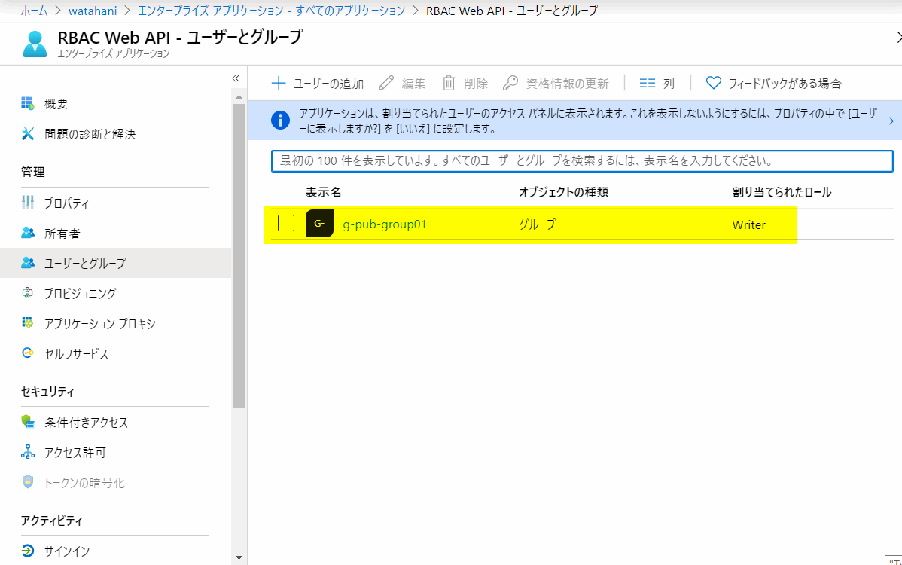

Azure AD が発行するトークンをカスタマイズする方法を少し調べたのでメモ。

## トークンのカスタマイズ

そもそも Azure AD のトークンのカスタマイズをする理由としては大きく分けると以下の 2 つだと思う。

1. 連携アプリに対して発行する **ID トークン** の属性を追加・既存の属性をカスタマイズする。
1. Azure AD に登録した Web API を利用する用に **アクセス トークン** をカスタマイズする。

前者はアプリ側で Azure AD の属性を使いたい場合に利用する。

<!-- more -->
### ID トークンのカスタマイズ

たとえば所属しているグループや、ゲストユーザーか否か、特定の Role を持っているかなどといった情報を、連携アプリに渡すために ID トークンを利用する。
MS Graph で取得できる情報もあると思うが、アプリ側で Graph を叩く必要がないのと、認証時の状態を取得できるので必要に応じて使いわければいいのかと思う。

### アクセス トークンのカスタマイズ

後者は RBAC なアクセス許可を Azure AD がもつ属性をベースに行いたいときに利用できる。
サインインのみのアプリであれば ID トークンに含めた値を使えば良いし、スコープを指定してアクセス トークンに含めることもできる。

あまりに情報を詰め込みすぎると、query で送る場合は URL クエリーの長さ制限に引っかかるのでその点は気を付けたほうが良さそう。
設定の仕方自体は ID トークン、アクセス トークン共に大きく差はないはずだけど、すべて検証したわけじゃないのでどっかに罠があるかも。

## トークン の属性を追加・既存の属性をカスタマイズする

### 属性を追加する

参考: [Azure AD アプリに省略可能な要求を提供する - Microsoft identity platform | Microsoft Docs](https://docs.microsoft.com/ja-jp/azure/active-directory/develop/active-directory-optional-claims)

トークンに属性を追加するにはアプリのマニフェストを編集する必要があったが、最近 Azure ポータル上の GUI でできるようになった。
具体的には `Azure Active Directory` > `アプリの登録` > 対象アプリの `トークン構成 (プレビュー)` から、追加のクレームを選択する。



とりあえず、全部選択して ID トークンを発行してみたが、デバイス登録しなければ取得できない属性やオンプレからの同期属性もあり、クラウド ユーザーで取得できたのはこれだけ。

```json
{
  "aud": "815680bb-ebc9-4e5f-a594-f2c55b83bb27",
  "iss": "https://login.microsoftonline.com/b9e35cac-a7b8-48dd-a102-bba18eaca524/v2.0",
  "iat": 1581832899,
  "nbf": 1581832899,
  "exp": 1581836799,
  "family_name": "example",
  "given_name": "watahani",
  "auth_time": 1581833193,//認証時刻
  "acct": 0,//アカウントの種類 ゲストの場合 1
  "ipaddr": "xxx.249.32.yyy", //IP アドレス
  "platf": "3", //プラットフォーム、Win/macOS など入るっぽい。3 は無し？
  "xms_tpl": "ja",//Tenant Preferred Language
  "tenant_ctry": "JP", //テナントデフォルトの country code
  "tenant_region_scope": "AS", //リージョン
  "sid": "f18a735d-0753-4de7-b038-fa1f84fc3751",//セッション ID
  //いつもの
  "name": "example watahani",
  "nonce": "defaultNonce",
  "oid": "992f309f-2fab-45fa-9e56-f02216d2e0a7",
  "preferred_username": "example@watahani.com",
  "sub": "TDuey17YS4iCKyTxdnT-sx5P6juRfTbiiN4FrnaYqn4",
  "tid": "b9e35cac-a7b8-48dd-a102-bba18eaca524", 
  "upn": "example@watahani.com", 
  "ver": "2.0"
}
```

簡単ですね。

### グループをクレームに含める

Azure AD で所属しているセキュリティ グループを追加することもできる。



ID トークンに出力されるグループはこんな感じ。

```json
{
    "groups": [
    "ebeac31c-d21e-40bd-8cac-06ce217b2bcc" //group の objectId
  ],
} 
```

ただし、グループは Object ID で出力されるので Group 名とか引っ張ってくるには Graph を叩く必要がある。
`グループをロール要求として生成する` を有効にすると、groups ではなく roles として出力される。

```json
{
  "roles": [
    "ebeac31c-d21e-40bd-8cac-06ce217b2bcc"
  ],
}
```

これ、グループがほんとに大量にある組織で使ったらトークンドエライことになりそうですね。

### 属性をカスタマイズする

あまり機会はないかもしれないが、既存の属性を上書きしたいこともあるかもしれない。
Azure AD のトークンを使う以上、デフォルトの属性を使うのが良いと思うが、やんごとなき理由により既存の属性を上書きするには Claim Mapping Policy を利用する。

```powershell
Install-Module AzureADPreview
Connect-AzureAD

# name 属性に UPN をセットするポリシーを作成
$policy = New-AzureADPolicy -Definition @('{"ClaimsMappingPolicy":{"Version":1,"IncludeBasicClaimSet":"true", "ClaimsSchema": [{"Source":"user","ID":"userprincipalname","JwtClaimType":"name"}]}}') -DisplayName "JwtClaimMappingUPNAsName" -Type "ClaimsMappingPolicy";

$sp = Get-AzureADServicePrincipal -Filter "DisplayName eq 'Optional Claims'";

Add-AzureADServicePrincipalPolicy -Id $sp.ObjectId -RefObjectId  $policy.Id
```

なんでもかんでもカスタマイズできるのではなく、基本要求セットと呼ばれるクレームのみ変更でき、必須クレームや、[制限付き要求セット](https://docs.microsoft.com/ja-jp/azure/active-directory/develop/active-directory-claims-mapping#table-1-json-web-token-jwt-restricted-claim-set
)は変更できない。

上記コマンドサンプルの例を考えようと思ったが、オンプレの属性を name などの属性にいれるぐらいしか使いどころが思いつかなかった。

ポリシーを割り当てた状態で、ID トークンを取得しようとすると、AADSTS50146 エラーが発生する。



>AADSTS50146: This application is required to be configured with an application-specific signing key. It is either not configured with one, or the key has expired or is not yet valid.

文字通りに読めば、アプリ独自の署名用キーをアップロードするひつようがある (し、アップロードすることで解消もできる) が、マニフェストに以下を追加することでも回避できる。

```json
  "acceptMappedClaims": true,
```


上記を設定を、ID トークンを発行すると、UPN が name 属性として出力された。

```json
{
  "name": "example@watahani.com"
}
```


## ロールをカスタマイズする

アプリ独自のロールを作成、管理することもできる。
グループを roles とすることで、セキュリティ グループや同期グループごとに権限を決定することも出来るので、そちらとの使い分けのをどのようにするのかはっきりと理解できてはいないが、手順は以下のとおり。

- [アプリ ロールを追加してトークンから取得する - Microsoft identity platform | Microsoft Docs](https://docs.microsoft.com/ja-jp/azure/active-directory/develop/howto-add-app-roles-in-azure-ad-apps)

上記の記事の通りなのだが、アプリのマニフェスト、あるいはサービス プリンシパルにロールを定義し、ユーザーに割り当てることができる。
アプリ自身のロールに加え、Web API として公開したアプリケーションに対しても権限を設定でき、RBAC による API の管理にも利用できる。

今回はアプリから、Web API を叩く想定で、新しい Web API を登録して、ロールを作成した。

### Web API の作成

適当に Web API (RBAC Web API) を作成し、スコープとして File.Write を作る。
ユーザーが Consent できるように、さっき作ったアプリを承認済みクライアントに登録する。



ロールは適当に管理者による書き込みと、一般ユーザーによる書き込みをイメージして Write_Ad_Admin と Write を設定。



```json
"appRoles": [
  {
    "allowedMemberTypes": [
      "User",
      "Application"
    ],
    "description": "Writer as Administrator",
    "displayName": "Write_Ad_Admin",
    "id": "5b2c669d-eee3-406d-8a9b-b98b74cd5018",
    "isEnabled": true,
    "lang": null,
    "origin": "Application",
    "value": "Write_Ad_Admin"
  },
  {
    "allowedMemberTypes": [
      "User"
    ],
    "description": "Writer as User",
    "displayName": "Writer",
    "id": "66482f6f-d935-4f17-bfcb-32f295d8024b",
    "isEnabled": true,
    "lang": null,
    "origin": "Application",
    "value": "Writer"
  }
],
```

### ロールの割り当て

そして、対象のアプリでユーザーを割り当てる。
エンタープライズ アプリケーションから `RBAC Web API` を選択し、ユーザーとグループからロールを割り当てる。



残念ながら、ロールを割り当てる MS Graph API は存在しないので、このあたりの制御をアプリで行う場合は特定のグループを割り当てておいて、それぞれのグループにユーザーを割り当てるなど工夫が必要そう。

> あれ、じゃあグループをそのままロールとして扱ってしまえば良いのでは…？

実際にこの API に対するアクセス トークンを取得する。

設定したロールは当然、**そのアプリに対する** ロールである。
そのためスコープとしてロールが設定されているアプリケーションを指定する必要がある。

```txt
https://login.microsoftonline.com/b9e35cac-a7b8-48dd-a102-bba18eaca524/oauth2/v2.0/authorize?
client_id=815680bb-ebc9-4e5f-a594-f2c55b83bb27
&scope=api://d2213a10-046d-4e07-8643-095dbe5262b3/Files.Write 
&redirect_uri=https%3A%2F%2Fjwt.ms
&response_type=token
```

これ、試すとき、Web API とアプリを同じものとしていたため、スコープを指定し忘れてロールが取れなくてすごく悩んだ。
MS Graph API 叩くためのトークンには、当然 Roles は含まれない。

取得したアクセス トークンにはロールが入っている。

```json
{
  "aud": "api://d2213a10-046d-4e07-8643-095dbe5262b3",
  "iss": "https://sts.windows.net/b9e35cac-a7b8-48dd-a102-bba18eaca524/",
  "iat": 1581840878,
  "nbf": 1581840878,
  "exp": 1581844778,
  "appid": "815680bb-ebc9-4e5f-a594-f2c55b83bb27",
  "name": "example watahani",
  "oid": "992f309f-2fab-45fa-9e56-f02216d2e0a7",
  "roles": [
    "Writer"
  ],
  "scp": "Files.Write",
  "upn": "example@watahani.com",
  "uti": "8lfnfIEUUES_MPqR-4okAA",
  "ver": "1.0"
  //略
}
```

アクセス トークンを受け取った API 側では、含まれているロールによってふるまいを変えることで RBAC ベースのアクセス制御が可能になる。

トークンの検証は MSAL ライブラリを利用して適当にやってください。

## 雑感

Azure AD のトークンのカスタマイズ方法を簡単に紹介した。Optional Claims は IP アドレスや言語など使えそうなクレームはあるものの、イマイチユースケースが思いつかなかった。

一方ロールについてはグループを利用する場合も、独自のロールを設定する場合にも RBAC によるアクセス制御を簡単に制御できそうだった。
どっちの方法で管理すべきかはたぶん組織規模やアプリの性質によって変わってきて来るのだろうと思う。
前述の通りロールの割り当てを MS Graph API で行う方法は今のところなく、どうせグループをロールに割り当てることになるとは思う。ただ
、グループが明確にロールと 1:1 の組織であればグループをそのままロールとして出力しても良さそうだが、普通はそう明確にグループ = ロールとは出来ないように思う。

ということで、ベストプラクティスについてはちょっと誰かが教えてくれることを期待しつつ、ロールが明確になっている会社ほど、こういった RBAC な制御を利用しやすいのかなあと、組織論的なことも少し考えた。

以前 OpenID Summit に参加したときにも感じたが、ID厨の技術を追っていくには、現実世界の問題についても深く理解する必要もありそうなので、何か手を付けれるところから学習を始めたいところ。

でも今日はポケモンHOME で 6V メタモン輸送せないかんので、このへんで。
