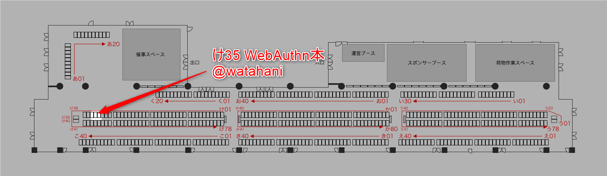
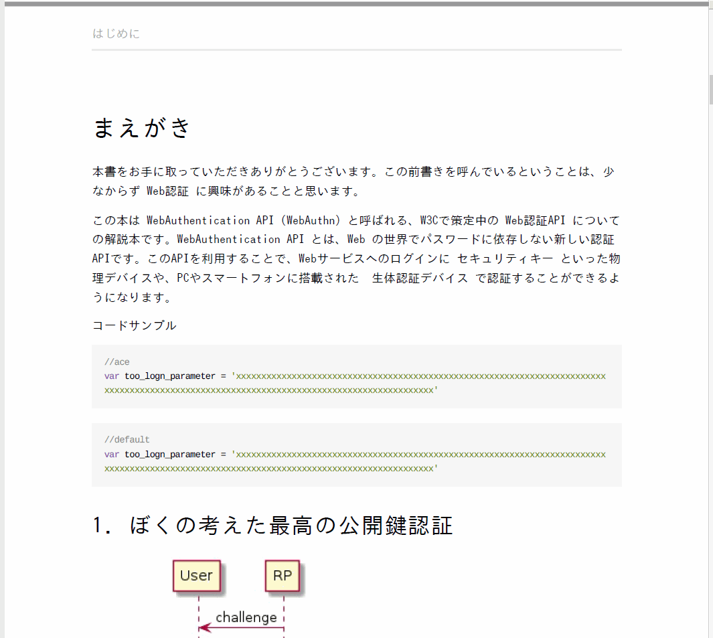

# 技術書典受かりました

「もとほんや」というサークル名（まだ一人）で、 WebAuthentication API に関する本を書く予定です。

<!--more -->



私は WebAuthentication API については、日本国内では割と詳しいほうだと思います。でも、その中で一番プログラムをかけない人だと思います。

正直、私の実力で技術書典には早すぎるかなあと思ってましたが、 Twitter で **「自分にはまだ早いとかいう人がいるけど、技術書典は同人誌会。なので、好きにやればいい。」** ってツイートをみて、背中を押されて申し込みました。

背中を押してくれたツイートは残念ながら見つからなかったので、代わりに結城先生のツイート張っときますね。

<blockquote class="twitter-tweet" data-lang="ja"><p lang="ja" dir="ltr">そして思います。文章は、そのつど書かなきゃ駄目ということを。経験を積んでから、十分学んでから、時間ができてから書くのではない。断じて違う。そのつど書く。自分の不十分さをたっぷり自覚した状態で書く。そうでなければ、いつまでたっても書けやしない。</p>&mdash; 結城浩 (@hyuki) <a href="https://twitter.com/hyuki/status/931037421768019968?ref_src=twsrc%5Etfw">2017年11月16日</a></blockquote>
<script async src="https://platform.twitter.com/widgets.js" charset="utf-8"></script>

今の私でしか書けない本を全力で書きますので、皆さんよろしければ買いに来ていただければ嬉しいです。

宣伝終わり。

## 技術書典5 技術書の作り方勉強会

行ってきました。やっぱ Re:VIEW で書く人が多いらしいですね。

LaTex の設定とか、pandocの引数とか、「やべえ、ガチなひとばっかやんけ…」と、私みたいなニワカな人たちは若干引いてましたｗ

で、 gitbook で書いてる少数派の人たちから色々知見を聞こうと思ったものの、その人らもガチすぎて Latex の設定とかの話を始めてしまってマジでやべえ人しかいねえて感じでした。

でも @vvakame さんに直接技術書を書くつらみとかを聞けて良かったです。

そのうち Re:VIEW に乗り換えるかもですが、まず中身を書かないと始まらないのでまずは gitbook pdf でお手軽に書き始めようと思います。

なんか [gitbook から Re:VIEW は乗り換えしやすいって話?](https://www.konosumi.net/entry/2018/02/11/190258) もあるんでね。

## ぼくの gitbook 環境

晒します。

docker image は <https://hub.docker.com/r/hwataru/gitbook-pdf/~/dockerfile/>

仕事でマニュアル作ろうとしたときに作ったやつです。結局 Webマニュアルでええやんってなって頓挫したんですけどね☆

```sh
mkdir gitbook
cd gitbook
docker run --rm hwataru/gitbook-pdf gitbook init
```

プラグインとかはこんな感じ `book.js` としてプロジェクトフォルダに置きます。

```js
var pkg = require('./package.json');

module.exports = {
  title: 'WebAuthn tech book',
  // Enforce use of GitBook v3
  gitbook: '3.2.3',
  
  // Use the "official" theme
  plugins: [
    "highlight",
    "-sharing",
    "hide-published-with",
    "search",
    "include-codeblock",
    "japanese-support",
    "footnote-string-to-number",
    "anchors",
    "ace",
    "uml",
    "navigator",
      "collapsible-menu",
      "image-captions"
    ],

    variables: {
      version: pkg.version
    },

    pluginsConfig: {},

    "structure": {
        "readme": "README_BOOK.md"
    },
    "styles": {
        "website": "styles/website.css",
        "pdf": "styles/pdf.css"
    },
    "pdf": {
        "fontFamily": "IPAGothic",
        //勉強会で紹介された noto font も入れてみたので好きなほうを
        //"fontFamily": "NotoSans-Bold",
        "paperSize": "b5"
    },
    "language": "ja"
};
```

あとは、 gitbook pdf コマンドで pdf 生成するだけです。

```sh
docker run --rm hwataru/gitbook-pdf gitbook install
docker run --rm hwataru/gitbook-pdf gitbook pdf
```

IPAGothic だとこんな感じのPDFが出来上がります。



>さっそく誤字しとるやんけ…（）

以上！
