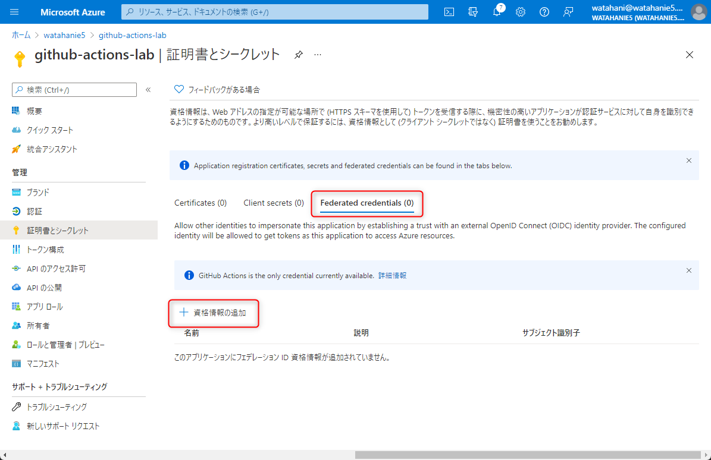
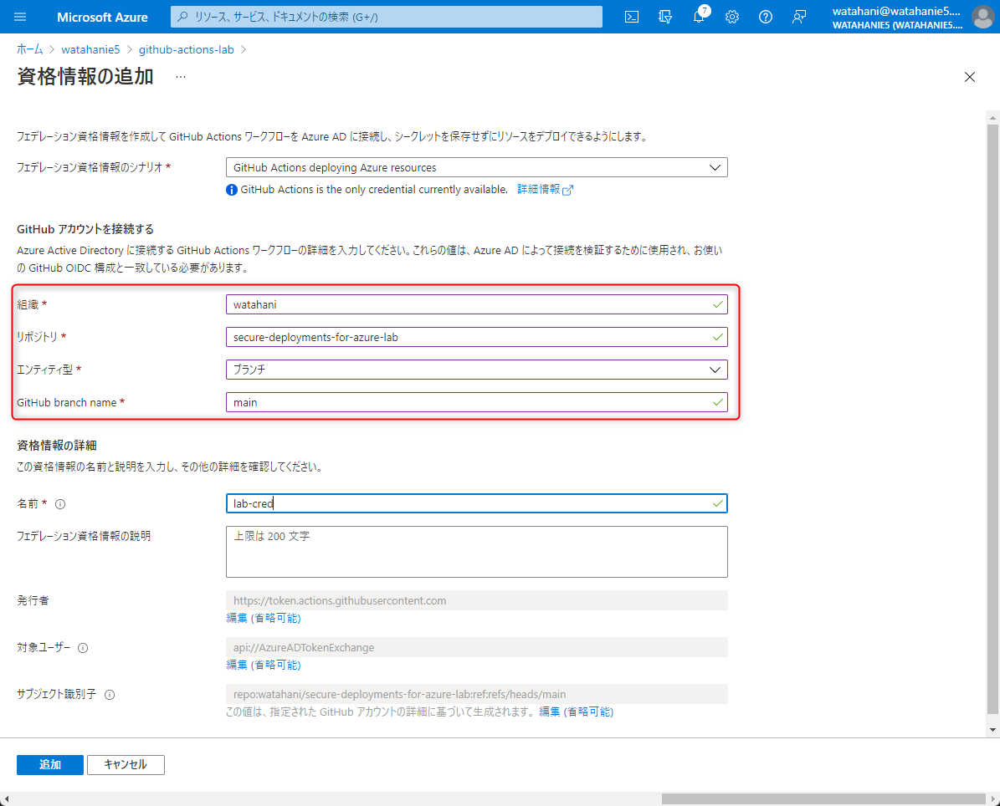
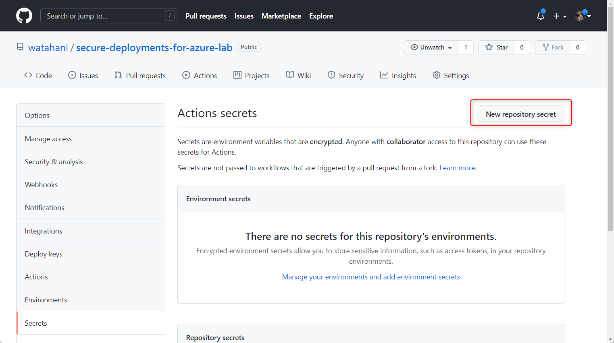
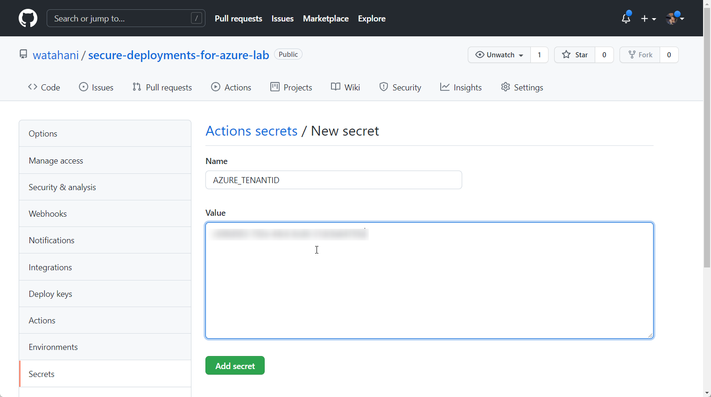
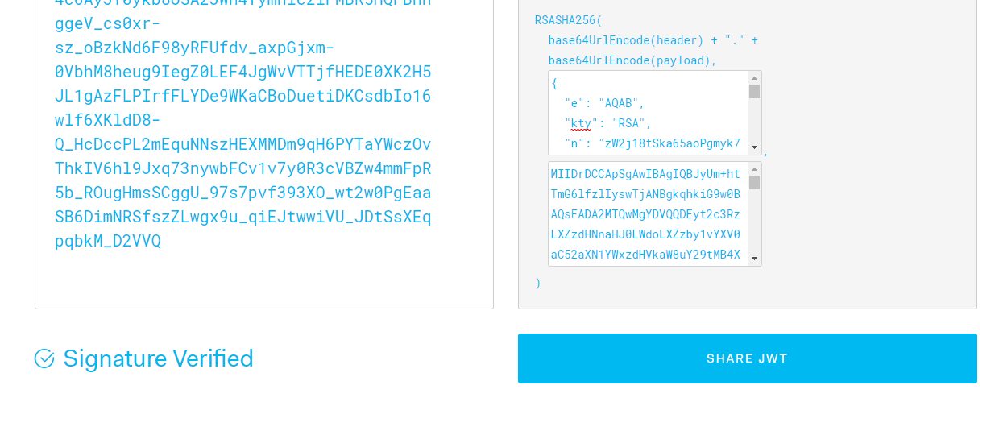
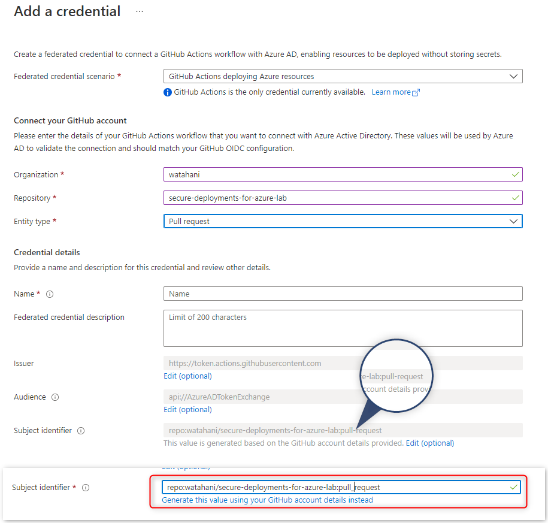

プレビューの時に AWS が対応したと話題だった GitHub ID トークンとか呼ばれてた機能が正式発表された。

- [GitHub Actions: Secure cloud deployments with OpenID Connect | GitHub Changelog](https://github.blog/changelog/2021-10-27-github-actions-secure-cloud-deployments-with-openid-connect/)

ドキュメントを見ると、Azure AD との連携手順もしっかり公開されているので早速試してみた。ついでに az cli でラッピングされているトークン取得の通信も調べてみた。

<!-- more -->

## Overview

GitHub のようなソース管理ツールは、今や CI/CD のプラットフォームとしても拡大している。いわゆる DevOps。GitHub にも多分に漏れず GitHub Actions という CI/CD のシステムがある。

このような CI/CD ツールを使うのに頭を悩ますのがクレデンシャルの管理である。GitHub Actions の場合、通常は Environment Variables としてシークレットや証明書などを格納して、GitHub Action から呼び出すことになるのだが、実際クレデンシャルをセキュアに保とうとすると有効期限を短く保だとか、ローテーションするだとかということに頭を悩ますことになる。

しかし、Secure cloud deployments with OpenID Connect (これ、正式名称なんですかね。話すとき伝えづらい。) を利用すると、GitHub 上にクレデンシャルをおかなくて済む。具体的には GitHub 側がワークフロー内だけで生成できる ID トークンを資格情報としてクラウドサービス側に送信し、署名とクレームを検証することで認証を行うことができる。

## 設定手順

手順もサンプルも [azure/login のリポジトリ](https://github.com/marketplace/actions/azure-login) にあった。

説明するよりもやってみたほうが早いのでまずは Azure AD 側からセットアップする。手順は以下の通り。1, 2 はいつもの手順なので省略。

1. アプリの登録
1. RBAC の割り当て
1. Federated Credentials に GitHub の情報をアプリに登録
1. GitHub Actions から呼び出し

### Federated Credentials に GitHub の情報をアプリに登録

アプリの登録で登録後、通常シークレット等を発行するための `証明書とシークレット` ブレードで `Federated Credentials` を選択し、資格情報の追加を選択する。



色々入力項目があるが、organizations (個人リポジトリならユーザー名) と リポジトリ名を入力する。



Entity Type (エンティティ型) というのは後で説明するが、GitHub 側の特定ブランチやタグがついてる時だけ認証できる、みたいな設定ができる。ここでは `ブランチ` を選択し `main` ブランチを対象のブランチに設定する。

ポイントとしては、この時点でサブジェクト識別子 (sub) が `repo:watahani/secure-deployments-for-azure-lab:ref:refs/heads/main` のようになっていること。これが実際に GitHub の ID トークンに含めるべき `sub` クレームになる。逆に言うと、ここで設定した `sub` が含まれていない場合、認証に失敗する。ちなみに AAD 側で受け入れ可能な audience は編集できるが az cli を使っている限り上述のパラメーターをいじることはなさそう。

### GitHub Actions 側の設定

GitHub Actions 側の設定は [azure/login のリポジトリ](https://github.com/marketplace/actions/azure-login) にサンプルがあるのでその通りに記載する。現状 az cli のベータバージョンが必要なのでインストールタスクが追加されているが、これがなくなれば `azure/login` を呼び出すだけで az login ができるようになるはず。(Installing CLI-beta for OpenID Connect の job が不要になるという意味)

```yml
name: Run Azure Login with OpenID Connect

# main ブランチでだけ動くように修正
on:
  push:
    branches:
      - main

permissions:
      id-token: write
      
jobs: 
  build-and-deploy:
    runs-on: ubuntu-latest
    steps:
        
    - name: Installing CLI-beta for OpenID Connect
      run: |
        cd ../..
        CWD="$(pwd)"
        python3 -m venv oidc-venv
        . oidc-venv/bin/activate
        echo "activated environment"
        python3 -m pip install -q --upgrade pip
        echo "started installing cli beta"
        pip install -q --extra-index-url https://azcliprod.blob.core.windows.net/beta/simple/ azure-cli
        echo "***************installed cli beta*******************"
        echo "$CWD/oidc-venv/bin" >> $GITHUB_PATH
        
    - name: 'Az CLI login'
      uses: azure/login@v1.4.0
      with:
        client-id: ${{ secrets.AZURE_CLIENTID }}
        tenant-id: ${{ secrets.AZURE_TENANTID }}
        subscription-id: ${{ secrets.AZURE_SUBSCRIPTIONID }}

    - name: 'Run az commands'
      run: |
        az account show
        az group list
        pwd 

```

サンプルのままだと、push したらタスクが動いてしまうので、ちゃんと main ブランチだけで動くようにした方が良いだろう。今回はブランチ名を指定して federated credentials を作成したので、別ブランチで Action が動くとトークン取得に失敗してまう。

環境変数は、とりあえずリポジトリ全体の Secrets にでも突っ込んでおく。Environment を設定するなら Environment Secrets に入れればいいだろう。




保存して push すると GitHub Actions が動いて、割り当てたリソースグループの情報が見えた。

```json
// az group list

{
  "environmentName": "AzureCloud",
  "homeTenantId": "***",
  "id": "***",
  "isDefault": true,
  "managedByTenants": [],
  "name": "My Subscription Name",
  "state": "Enabled",
  "tenantId": "***",
  "user": {
    "name": "***",
    "type": "servicePrincipal"
  }
}
[
  {
    "id": "/subscriptions/***/resourceGroups/gh-actions-branch",
    "location": "eastus",
    "managedBy": null,
    "name": "gh-actions-branch",
    "properties": {
      "provisioningState": "Succeeded"
    },
    "tags": {},
    "type": "Microsoft.Resources/resourceGroups"
  }
]
```

### GitHub ID トークンの中身

このままだと面白くないので、az cli のソースをみてトークンの取り方を調べてみようと思ったのだがソースがどこにあるかよくわからなかったので手探りで curl コマンドを叩くことにした。とはいえ ID トークンの取得はすでに先人たちが試してくれているので、その通りに記載する。

ACTIONS_ID_TOKEN_REQUEST_URL へはクエリパラメータとして aud を渡すことで、任意の Audience を ID トークンに埋め込めるようだった。

```sh
federated_token=`curl -H "Authorization: bearer $ACTIONS_ID_TOKEN_REQUEST_TOKEN" "$ACTIONS_ID_TOKEN_REQUEST_URL&audience=api://AzureADTokenExchange" | jq -r '.value'`
```

実際に取得したトークンがこんな感じ。

<script src="https://gist.github.com/watahani/cad18acba1bc2ad655ee275558b1d2e4.js"></script>

まずは、署名を検証するために openid-configuration を見に行く。

<https://token.actions.githubusercontent.com/.well-known/openid-configuration>

```json
{
  "issuer": "https://token.actions.githubusercontent.com",
  "jwks_uri": "https://token.actions.githubusercontent.com/.well-known/jwks",
  "subject_types_supported": [
    "public",
    "pairwise"
  ],
  "response_types_supported": [
    "id_token"
  ],
  "claims_supported": [
    "sub",
    "aud",
    "exp",
    "iat",
    "iss",
    "jti",
    "nbf",
    "ref",
    "repository",
    "repository_owner",
    "run_id",
    "run_number",
    "run_attempt",
    "actor",
    "workflow",
    "head_ref",
    "base_ref",
    "event_name",
    "ref_type",
    "environment",
    "job_workflow_ref"
  ],
  "id_token_signing_alg_values_supported": [
    "RS256"
  ],
  "scopes_supported": [
    "openid"
  ]
}
```

`jkws_uri` から  `kid`: `DA6DD449E0E809599CECDFB3BDB6A2D7D0C2503A` の証明書を取ってきて [jwt.io](https://jwt.io) に入れるとちゃんと検証できた。



#### クレームの中身

Azure AD では多分 `sub` と `iss` ぐらいしか見てないが、色々情報が入っている。前述の通り aud はカスタマイズできるし、Azure AD 側でも変更できるので、それぞれが一致していれば認証は出来そう。(あんまやる意味ないけど)
ちなみに `environment` だけは Environment を作って動かさないと入ってこなかった。有効期限は 900 秒、ワークフローの中で何回発行できるか、などは試してない。

#### sub の中身

`sub` としては以下の 4 パターンがあるようで、それぞれのパターンで以下のような形式だった。

|エンティティ型|trigger|sub|
|---|---|---|
|ブランチ (Branch)|push|repo:{organization_name}/{repository_name}:{branch_name}|
|タグ (Tag)|push/tags|repo:{organization_name}/{repository_name}:ref:refs/tags/{tag_name}|
|環境 (Environment)|push/environment|repo:{organization_name}/{repository_name}:environment:{environment_name}||
|Pull Request|pull_request|repo:{organization_name}/{repository_name}:pull_request||

いちおうそれぞれ動かしてみた、[サンプル](https://github.com/watahani/secure-deployments-for-azure-lab/tree/main/.github/workflows) もおいておく。GitHub Actions の書き方あまり知らなくて、めちゃくちゃ試行錯誤したのでコミットログが汚い。

ちなみに Azure AD のアプリの登録から pull_request の sub を設定しようとすると、ポータルの問題で repo:{organization_name}/{repository_name}:pull`-`request の形式になってしまう。(`_` が `-` になってる)

このせいで Pull Request ベースの Action が失敗しまくったのだがトークンの中身みても、しばらく何で失敗しているか分からなった。こういう間違いホントに気づけないから困るｗ

sub の値を直接編集すれば正しく動くので Pull Request のトリガーを設定したいときは、以下の通り設定しよう。速攻ポータルから Feedback しておいた。



気になって [Graph API のリファレンス](https://docs.microsoft.com/en-us/graph/api/application-post-federatedidentitycredentials?view=graph-rest-beta&tabs=http) を漁ったところ sub を生で指定するようなので、多分ポータル側の問題のように見える。

### Azure AD との認証フロー

Azure AD への認証フローは、Client Credentials の client_assertion に入れれば良いんでしょ？と思って入れたら実際動いた。

あとで公式ドキュメントが見つかって ([Workload identity federation - Microsoft identity platform | Microsoft Docs](https://docs.microsoft.com/en-us/azure/active-directory/develop/workload-identity-federation)) 見たら答えが書いてあったので、悩む必要はなかったが…。

なので、[Client Credentials Grant](https://docs.microsoft.com/ja-jp/azure/active-directory/develop/v2-oauth2-client-creds-grant-flow) でトークンを取るだけ。試しに management.azure.com の API をたたいて動くことを確認する。

```sh
azure_token=`curl -X POST https://login.microsoftonline.com/${AZURE_TENANTID}/oauth2/v2.0/token \
      -F client_id=${AZURE_CLIENTID} \
      -F grant_type=client_credentials \
      -F scope=https://management.azure.com/.default \
      -F client_assertion_type=urn:ietf:params:oauth:client-assertion-type:jwt-bearer \
      -F client_assertion=${federated_token} | jq -r '.access_token'`
curl -H "Authorization: Bearer $azure_token" https://management.azure.com/subscriptions/$AZURE_SUBSCRIPTIONID/resourcegroups?api-version=2021-04-01
```

全体のコードはこんな感じになる。

<script src="https://gist.github.com/watahani/e831a19a4653a459847070b60909e02b.js"></script>

アプリに必要な権限さえ与えておけば scope を呼び出す API ごとに設定することで Microsoft Graph や独自の API に対するトークン何かも取れると思う。個人のテスト テナントだったら GitHub Actions で定期ジョブとか組めそうで非常に良い。とはいえ、クレデンシャルが漏れないからといって安全というわけではないので、きちんと使うには GitHub Actions を勉強しましょう。

### 所感

AWS の IAM が GitHub OIDC に対応したとき Twitter ですごく盛り上がっていたが、あまり何のことか分かっておらず、今回触ってはじめて理解した。何で今まで無かったんだというレベルで良い。

GitHub Actions についてもこの前作ってみて、おおよその作り方も分かっているので、GitHub OIDC 使いつつ、検証用テナントの設定保存したりいじったりする GitHub Actions でも書いてみようかなー。

### 蛇足な疑問

Microsoft Graph API で [federated Credentials 作成](<https://docs.microsoft.com/en-us/graph/api/application-post-federatedidentitycredentials?view=graph-rest-beta&tabs=http>) のリファレンス見ると Azure AD から発行したトークンを、Client Credentials の assertion として使うようなサンプルが書いてある。


```http
POST https://graph.microsoft.com/beta/applications/bcd7c908-1c4d-4d48-93ee-ff38349a75c8/federatedIdentityCredentials/
Content-Type: application/json

{
    "name": "testing02",
    "issuer": "https://login.microsoftonline.com/3d1e2be9-a10a-4a0c-8380-7ce190f98ed9/v2.0",
    "subject": "a7d388c3-5e3f-4959-ac7d-786b3383006a",
    "audiences": [
        "api://AzureADTokenExchange"
    ]
}
```

`openid-configuration` が読めて `sub` と `aud` さえあってればいいので、ユーザーの ID トークン使ってアプリ権限のアクセス トークンとる、とかも動きはしそう。使いどころは分からないけど。

その他に、気になる点としては、Trigger が複数条件あったときに何が優先されるかというのがドキュメントを読んでも良くわからず。例えば、以下のようなワークフローがあったときに、id_token の sub には何が入るのか。

```yml
on: [push, pull_request]
  branches:
    - dev
  tags:
    - v1.0.0-beta

jobs: 
  development-build:
    runs-on: ubuntu-latest
    environment: development
    steps:        
```

GitHub Actions はあまり触ってないのでどんなワークフローを組むのが一般的なのかは分からないが、環境によっては発行される id_token の `sub` を気にしないといけないかもしれない。GitHub Actions 詳しい人教えてください。

### 参考サイト

- [Workload identity federation - Microsoft identity platform | Microsoft Docs](https://docs.microsoft.com/en-us/azure/active-directory/develop/workload-identity-federation)
- [About security hardening with OpenID Connect - GitHub Docs](https://docs.github.com/en/actions/deployment/security-hardening-your-deployments/about-security-hardening-with-openid-connect)
- [GitHub Actions のIDトークンを使ってAWSリソースにアクセスする](https://zenn.dev/mryhryki/articles/2021-09-19-access-aws-by-github-actions)
