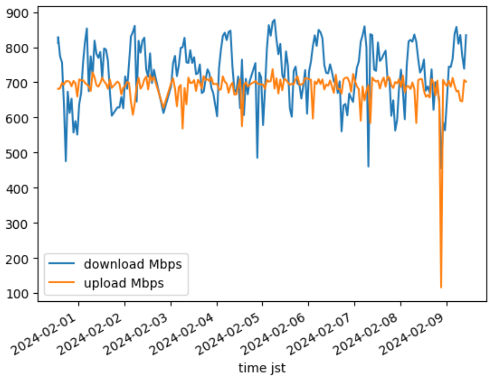

以前買ったミニ PC を自宅サーバーにしようとしていたのだが、まったく時間が無くて放置していた。育休中に少し時間が取れたので、とりあえず Ubuntu をインストールして Nextcloud を動かしてみた。docker を使って構成したが結構ハマったので、その辺のメモ。

<!-- more -->

## ネットワーク構成について

IIJMio ひかりを使っているので、普段は DS-Lite IPv4 over IPv6 での通信をしている。ネットワークは詳しくないが、DS-Lite では複数のユーザーが同一の IPv4 アドレスを共有することになるので、ポートフォワードができない。

当初は IPv4 での外部アクセスと DS-Lite の両立を目指したが実際に PPPoE 接続を試したところ、日中や夕方の混雑隊でも DS-Lite と遜色がないことが分かった。ということで、PPPoE で普通にルーターで NAT する。

ネットワークが遅いと感じたらその時に勉強します。一般のご家庭なので…。

速度測定は [speedtest-cli](https://www.speedtest.net/ja/apps/cli) で行った。

```bash
sudo apt-get install curl
curl -s https://packagecloud.io/install/repositories/ookla/speedtest-cli/script.deb.sh | sudo bash
sudo apt-get install speedtest
```

cron で定期的に測定するようにしたのだが、sppedtest コマンドだけでは日付が出ないので、3日ぐらい無駄にした。あらかじめ適当にヘッダーを追加しておくこと。

```cron
24  *   *   *   *   now=\"$(date +"\%Y-\%m-\%d \%H:\%M:\%S")\",; /usr/bin/speedtest -f csv -s 48463 | sed "s/^/$now/" >> /home/user/speedtest.csv
```

jupyter notebook で pandas で読み込んでグラフ化。こういうのは Copilot Chat に聞けば勝手にやってくれるので嬉しい。

```python
import pandas as pd
import matplotlib.pyplot as plt

# Load the CSV file
data = pd.read_csv('speedtest.csv')

data['download Mbps'] = data['download'] / 125000
data['upload Mbps'] = data['upload'] / 125000
# Assuming 'time' is the column with time information
data['time jst'] = pd.to_datetime(data['datetime utc']).dt.tz_localize('UTC').dt.tz_convert('Asia/Tokyo')

# Extract hour from time
data['hour'] = data['time jst'].dt.hour

# Set 'time jst' as the index of the DataFrame
data.set_index('time jst', inplace=True)

# Plot 'download Mbps' and 'upload Mbps' over time
data[['download Mbps', 'upload Mbps']].plot()

# Show the plot
plt.show()
# Group by hour and calculate mean download speed
average_speed_by_hour = data.groupby('hour')['download Mbps'].mean()

# Plot the average download speed by hour
average_speed_by_hour.plot()
plt.show()
```



遅いときでも上下 500Mbps ぐらい出ているので、特に問題はなさそうだ。

## Ubuntu 22.04 のセットアップでインストールされる Docker が古い

Ubuntu 22.04 の初期セットアップ中に色々とパッケージのインストールができるのだが、パッケージマネージャーに snap が採用されている。snap で Docker をインストールすると、最新バージョンではない古いバージョンがインストールされてしまう。

あまり問題になることはないと思うが、私の環境では以下のバグを踏んでしまい docker compose exec が使えなくなってしまった。

[\[BUG\] docker-compose http: invalid Host header · Issue #11154 · docker/compose](https://github.com/docker/compose/issues/11154)

`sudo snap refresh docker --channel=latest/edge` でバージョンを更新できるらしいが、その情報を見つける前に snap の docker をアンインストールして、公式のインストール手順を参考にインストールし直してしまった。

```bash
sudo aa-remove-unknown
snap list 
sudo snap remove docker

# 再起動後 Docker 公式のインストール手順を実施
```

## Nextcloud を Docker で動かす

ググれば色々記事があるが、[Nextcloud All-in-One](https://github.com/nextcloud/all-in-one) (Nextcloud AIO) を利用するか snap でホストに直接インストールするのが一番楽そうだった。特に AIO 版は機能モリモリで便利なのだが、AIO 自体が docker コンテナを複数立ち上げるようなオーケストレーションツールのような感じで、重厚過ぎるので今回はパス。
そもそも、フロントに nginx-proxy を置いて検証アプリを色々動かしたかったため、自分で docker-compose.yml を書くことにした。

### ngix-proxy

[nginx-proxy](https://github.com/nginx-proxy/nginx-proxy) は docker.sock をマウントして、起動中のコンテナを監視して自動でリバースプロキシの設定を行ってくれる。nginxproxy/acme-companion は nginx-proxy が設定したリバースプロキシの設定を元に Let's Encrypt の証明書を自動で取得してくれる
あらかじめ `docker network create proxy-network --subnet 172.18.0.0/16` でネットワークを作成しておく。サブネットは Nextcloud の Trusted Proxy のために定義する。

```yml
version: '3'

services:
  nginx-proxy:
    image: nginxproxy/nginx-proxy
    container_name: nginx-proxy
    ports:
      - "80:80"
      - "443:443"
    volumes:
      - /var/run/docker.sock:/tmp/docker.sock:ro
      - ./certs:/etc/nginx/certs:rw
      - ./vhost.d:/etc/nginx/vhost.d
      - ./html:/usr/share/nginx/html
      - ./custom-nginx.conf:/etc/nginx/conf.d/custom-nginx.conf:ro
    networks:
      proxy-network:
        ipv4_address: 172.18.0.2
    labels:
      - com.github.nginx-proxy.nginx-proxy.keepalive=auto

  letsencrypt:
    image: nginxproxy/acme-companion
    container_name: nginx-acme    
    depends_on:
      - nginx-proxy
    environment:
      - DEFAULT_EMAIL=${MAILADDRESS}
      - NGINX_PROXY_CONTAINER=nginx-proxy
    volumes:
      - /var/run/docker.sock:/var/run/docker.sock:ro
      - ./certs:/etc/nginx/certs:rw
      - ./vhost.d:/etc/nginx/vhost.d
      - ./html:/usr/share/nginx/html
    networks:
      - proxy-network

  ddclient:
    image: lscr.io/linuxserver/ddclient:latest
    container_name: ddclient
    environment:
      - PUID=1000
      - PGID=1000
      - TZ=Etc/UTC
    volumes:
      - ./ddclient_conf:/config
    restart: unless-stopped

networks:
  proxy-network:
    external: true
    driver: bridge
    ipam:
      config:
        - subnet: 172.18.0.0/16
```

ウチの IP は動的アドレスなので、ddclient で DNS を更新する。CloudFlare の場合はこんな感じ。CloudFlare の API トークンは DNS Read, Write の権限で十分だった。
なお、あらかじめ DNS レコードがないと動作しないので、手動で作成しておくこと。

```conf
# Even though we use -foreground, daemon= is still needed.
# It's value here is ignored, but it's needed. The value used is set in
# ddclient.in in the dockerfile.
daemon=0
verbose=no
ssl=yes
use=web, web=he   # checkip.dns.he.net
protocol=cloudflare
login=token
password='yourtoken'
zone=example.com
dns1.example.com, dns2.example.com
```

`/etc/nginx/vhost.d` にホスト名のファイルを置くことで、各ホストごとに追加設定ができる。例えば example.com 向けの設定を追加したければ `/etc/nginx/vhost.d/example.com` のファイルを追加する。Nextcloud のホスト名でタイムアウトや Body 上限の変更などをしておく。

```ini
send_timeout 300;
keepalive_timeout 300;
proxy_read_timeout 300;
proxy_connect_timeout 300;
proxy_send_timeout 300;
client_max_body_size 1G;
```

### Nextcloud 本体

ngix-proxy を使っていて nginx 側はいじりたくなかったので、apache 版を [公式のサンプル](https://github.com/nextcloud/docker/blob/master/.examples/docker-compose/insecure/mariadb/apache/docker-compose.yml) をもとに作成した。
nginx-proxy の vhost.d/ に頑張って設定ファイルを書けば nextcloud:fpm 版を良い感じに使えそうだったけど、php にも nginx の設定も詳しくないので、とりあえず apache 版で。

出来上がったのがこれ。

```yml
version: '3'

services:
  nextcloud:
    build: ./customimages/nextcloud
    container_name: nextcloud
    volumes:
      - nextcloud_data:/var/www/html
      # - ./config:/var/www/html/config # for debug
      - ./log/:/var/log/nextcloud/
      - ./skeleton/:/var/skeleton/
      - /mnt/hdd01/:/mnt/hdd01/
    env_file:
      - ./.env
      - ./env/db.env
      - ./env/nextcloud.env
    secrets:
      - nextcloud_admin_password
      - nextcloud_admin_user
      - mysql_password
      - mysql_user
      - mysql_database
      - smtp_password
    networks:
      - proxy-network
      - nextcloud-network
    depends_on:
      - db
      - redis
      - elasticsearch

  nextcloud-cron:
    build: ./customimages/nextcloud
    container_name: nextcloud-cron
    restart: unless-stopped
    env_file:
      - ./.env
      - ./env/db.env
      - ./env/nextcloud.env
    volumes:
      - nextcloud_data:/var/www/html
      # - ./config:/var/www/html/config # for debug
      - ./log/:/var/log/nextcloud/
      - ./skeleton/:/var/skeleton/
      - /mnt/hdd01/:/mnt/hdd01/
      # if customize cron file
      # https://help.nextcloud.com/t/docker-setup-cron/78547/5
      # https://github.com/nextcloud/docker/blob/ccdf46609ff8419ffd7c5ce4e51a117e378b72b6/Dockerfile-debian.template#L15
      # - ./mycronfile:/var/spool/cron/crontabs/www-data
    secrets:
      - nextcloud_admin_password
      - nextcloud_admin_user
      - mysql_password
      - mysql_user
      - mysql_database
      - smtp_password
    networks:
      - nextcloud-network
    entrypoint: /cron.sh
    depends_on:
      - nextcloud

  db:
    image: mariadb
    container_name: nextcloud-db
    volumes:
      - db_data:/var/lib/mysql
    env_file:
      - ./.env
      - ./env/db.env
    secrets:
      - mysql_database
      - mysql_password
      - mysql_user
      - mysql_root_password
    networks:
      - nextcloud-network

  redis:
    image: redis:6
    container_name: nextcloud_redis
    restart: always
    command: ["--databases", "1"]
    healthcheck:
      test: ["CMD", "redis-cli", "ping"]
      interval: 10s
      timeout: 5s
      retries: 5
    volumes:
      - redis_data:/data
    networks:
      - nextcloud-network

  elasticsearch:
    build: ./customimages/elasticsearch
    container_name: elasticsearch
    restart: always
    environment:
      - discovery.type=single-node
      - bootstrap.memory_lock=true
      - "ES_JAVA_OPTS=-Xms512m -Xmx512m"
      - xpack.security.enabled=false
    volumes:
      - elasticsearch_data:/usr/share/elasticsearch/data
    networks:
      - nextcloud-network

secrets:
  nextcloud_admin_password:
    file: ./secrets/nextcloud_admin_password
  nextcloud_admin_user:
    file: ./secrets/nextcloud_admin_user
  mysql_password:
    file: ./secrets/mysql_password
  mysql_user:
    file: ./secrets/mysql_user
  mysql_database:
    file: ./secrets/mysql_database
  mysql_root_password:
    file: ./secrets/mysql_root_password
  smtp_password:
    file: ./secrets/smtp_password

volumes:
  nextcloud_data:
  db_data:
  redis_data:
  elasticsearch_data:

networks:
  proxy-network:
    external: true
    driver: bridge
    ipam:
      config:
        - subnet: 172.18.0.0/16
  nextcloud-network:
    driver: bridge
  
```

### ポイントメモ

Nextcloud 本体は nginx-proxy と同一のネットワークにおいて、それ以外のコンテナ nextcloud-network を作成してそこに配置した。

#### 環境変数

.env ファイルなどの中身はこんな感じ。

```ini
#for nginx-proxy
VIRTUAL_HOST=${YOUR_DOMAIN}
LETSENCRYPT_HOST=${YOUR_DOMAIN}
LETSENCRYPT_EMAIL=${MAIL_ADDRESS}
# trust nginx proxy
TRUSTED_PROXIES=172.18.0.2/32
OVERWRITEHOST=${YOUR_DOMAIN}
OVERWRITEPROTOCOL=https
#admin password
NEXTCLOUD_ADMIN_PASSWORD_FILE=/run/secrets/nextcloud_admin_password
NEXTCLOUD_ADMIN_USER_FILE=/run/secrets/nextcloud_admin_user
NEXTCLOUD_TRUSTED_DOMAINS=${YOUR_DOMAIN}

# redis settings
REDIS_HOST=nextcloud_redis

# smtp settings
SMTP_HOST=smtp.sendgrid.net
SMTP_NAME=apikey
SMTP_PASSWORD_FILE=/run/secrets/smtp_password
MAIL_FROM_ADDRESS=noreply
SMTP_SECURE=tls
SMTP_AUTHTYPE=LOGIN
MAIL_DOMAIN=${MAIL_DOMAIN}
# other settings
PHP_UPLOAD_LIMIT=10G
NC_default_phone_region=JP
NC_logtype=file
NC_logfile=/var/log/nextcloud/nextcloud.log
NC_loglevel=0
NC_default_language=ja
NC_default_locale=ja_JP
NC_default_timezone=Asia/Tokyo
NC_skeletondirectory=/var/skeleton/
NC_maintenance_window_start=16
```

NC_ プレフィックスがつく環境変数は config.php の設定を上書きする。環境変数含め config.php に直接書き込むのではなく、値を無視して環境変数が上書きされるので注意。なので設定が間違っていた場合、コンテナ内の confing.php を直接書き換えても反映されない。これにハマって 2, 3 時間無駄にした。上記設定をすれば最低限管理画面で警告が出なくなるはず。

ちなみに、Nextcloud の環境変数は変数名の末尾に _FILE とつけることで、docker の secrets で管理できる。Nextcloud や拡張機能のの脆弱性などで環境変数が漏れた時に備えて、パスワード系は secrets で管理することにした。

#### SendGrid

メールの配信は SendGrid を使っている。SMTP_NAME は apikey, SMTP_PASSWORD には SendGrid の API キーを設定する。

- 参考: [SMTPメールの送信方法 | Twilio](https://docs.sendgrid.com/ja/for-developers/sending-email/getting-started-smtp)

#### skelton ディレクトリ

新規作成したユーザーに対してデフォルトで配置されるファイルを指定できる。既定だとサンプルの画像などが入っているので NC_skeletondirectory=/var/skeleton/ で指定して、docker-compose.yml でマウントしておく。使い方の PDF でもつくってツッコんでおく

#### ログ

apache 版の docker イメージは apache のログしか stdout に出力しないので docker compose logs などで Nextcloud 側のログが確認できない。またファイル出力されていなければ、Web の管理コンソールでログが見えなくて不便なのでファイルに出力するよう修正。出力先の /var/log/nextcloud/ フォルダーはカスタムイメージ内で作成して www-data にオーナーを変更しておく。 安定稼働までは NC_loglevel でログレベルを 0 (DEBUG) にしてある。しばらくしたら 3 (ERROR) に戻す。

#### バックアップ

バックアップは雑に docker volume を tar で固めて、外部ストレージ & Azure Blob に保存している。リストアは出来ることを確認したけど、雑は雑。

```sh
# maintenance mode on
# https://doc.owncloud.com/server/next/admin_manual/maintenance/enable_maintenance.html
cd /home/watahani/docker_apps/nextcloud
docker compose exec -u www-data nextcloud php occ maintenance:mode --on

date=`date '+%Y-%m-%d'`

VOLUMES=("nextcloud_db_data" "nextcloud_nextcloud_data" "nextcloud_redis_data" "elasticsearch_data")
for VOLUME_NAME in ${VOLUMES[@]}; do
    echo back up $VOLUME_NAME start
    BACKUP_DESTINATION=/mnt/exthdd/owncloud_backup/$VOLUME_NAME.tar.gz
    sudo tar -czf "$BACKUP_DESTINATION" -C "/var/lib/docker/volumes/$VOLUME_NAME" _data
    echo upload $VOLUME_NAME start
    azcopy copy $BACKUP_DESTINATION "https://example.blob.core.windows.net/backup/$VOLUME_NAME-$date.tar.gz"
    echo back up $VOLUME_NAME finish!
done

docker compose exec -u www-data nextcloud php occ maintenance:mode --off
```

azcopy login が廃止予定になるらしく、サービス プリンシパルでの認証の場合、あらかじめ環境変数に AZCOPY_SPA_APPLICATION_ID, AZCOPY_SPA_CLIENT_SECRET, AZCOPY_TENANT_ID, AZCOPY_AUTO_LOGIN_TYPE=SPN を設定しておくこと。

```sh
INFO: 'azcopy login' command will be deprecated starting release 10.22. Use auto-login instead. Visit https://learn.microsoft.com/en-us/azure/storage/common/storage-use-azcopy-authorize-azure-active-directory#authorize-without-a-secret-store  to know more.
```

インタラクティブな認証は azure-cli でログインしておいてその認証情報を使いまわす実装に移行していくようだ。

- 参考: [パーミッションを保持したままDockerのボリュームをバックアップ・復元する](https://zenn.dev/ciffelia/articles/docker-volume-backup-restore)

最悪アップロードした写真データが無事なら良いのでまあこれでヨシ。

#### カスタムアプリ

この辺を入れた

- memories
- fulltextsearch
- fulltextsearch_elasticsearch
- previewgenerator

コマンドで入れるなら `docker compose exec -u www-data nextcloud php occ app:install memories` のようにする。

構築していた当時、https://apps.nextcloud.com/ が異常に重く、アプリのインストールがタイムアウトで出来なかった。

```json
{"reqId":"CIl2uB04J5qvKBuCFJOe","level":2,"time":"2024-02-03T13:31:32+00:00","remoteAddr":"","user":"--","app":"appstoreFetcher","method":"","url":"--","message":"Could not connect to appstore: cURL error 28: Operation timed out after 60000 milliseconds with 2514944 out of 6055936 bytes received (see https://curl.haxx.se/libcurl/c/libcurl-errors.html) for https://apps.nextcloud.com/api/v1/apps.json","userAgent":"--","version":"28.0.2.5","data":{"app":"appstoreFetcher"}}
```

幸い何度か試せば通信で切るときがあったので、一時的にオリジナルの json ファイルを Blob において対処した。具体的には https://apps.nextcloud.com/api/v1/apps.json と https://apps.nextcloud.com/api/v1/categories.json をダウンロードして、適当なサイト、同じパスで公開する。

その後、config.php の appstoreurl に、https://<適当なサイト>/api/v1 を設定する。

```sh
docker compose exec -u www-data nextcloud php occ --no-warnings config:system:set appstoreurl --value="https://<適当なサイト>/api/v1"
```

元のサイトが復旧したら元に戻す

```sh
docker compose exec -u www-data nextcloud php occ --no-warnings config:system:delete appstoreurl
```

#### Elastic Search

Elastic Search は日本語検索のために kuromoji_tokenizer を使うように設定しておく。そのために Dockerfile についてもカスタマイズしている。

```dockerfile
# Probably from here https://github.com/elastic/elasticsearch/blob/main/distribution/docker/src/docker/Dockerfile
FROM elasticsearch:8.12.0

USER root

# hadolint ignore=DL3008
RUN set -ex; \
    \
    export DEBIAN_FRONTEND=noninteractive; \
    apt-get update; \
    apt-get install -y --no-install-recommends \
        tzdata \
    ; \
    rm -rf /var/lib/apt/lists/*; \
    elasticsearch-plugin install --batch ingest-attachment;\
    elasticsearch-plugin install --batch analysis-kuromoji;\
    elasticsearch-plugin install --batch analysis-icu
    
USER 1000:0

HEALTHCHECK CMD nc -z localhost 9200 || exit 1
LABEL com.centurylinklabs.watchtower.enable="false"
```

fulltextsearch を入れたら、Web の管理コンソールから http://elasticsearch:9200 と、トークナイザーに kuromoji_tokenizer を指定する。
その後、以下のコマンドでインデックスの初期作成をしておく

```sh
docker compose exec -u www-data nextcloud php occ fulltextsearch:reset
docker compose exec -u www-data nextcloud php occ fulltextsearch:index
```

インデックスの定期作成については、[Ubuntu22.04 DockerでNextcloud | ろっひー](https://rohhie.net/ubuntu22-04-implementing-nextcloud-with-docker/) を参考に /var/www/html/occ fulltextsearch:live --service コマンドを起動スクリプトから呼びだすよう Dockerfile をカスタマイズした。
ファイルが多く処理に時間がかかったり、バッチ処理をしたいのであれば後述の cron に fulltextsearch:index をジョブとして追加すれば良いだろう。

#### memories と previewgenerator

memories を入れることにより Google Photo のように日付ごとに写真を表示したり、人物や場所ごとに写真を表示したりできるようになる。画像認識は別途プラグインが必要なので、今回は試していない。
また、memories のプレビュー生成には ffmpeg が必要なので、Dockerfile に ffmpeg を追加した。

memories のドキュメントによると Nextcloud 既定では 2048px のプレビュー画像を生成するらしいので、少し小さく。

```sh
docker compose exec -u www-data nextcloud php occ config:system:set preview_max_x --value="1024"
docker compose exec -u www-data nextcloud php occ config:system:set preview_max_y --value="1024"
```

previewgenerator も初期作成をしておく

```sh
docker compose exec -it -u www-data nextcloud php occ config:app:set --value="64 256 1024" previewgenerator squareSizes
docker compose exec -it -u www-data nextcloud php occ config:app:set --value="64 256 1024" previewgenerator widthSizes
docker compose exec -it -u www-data nextcloud php occ config:app:set --value="64 256 1024" previewgenerator heightSizes
```

出来たら初回のプレビュー生成を行う

```sh
nohup docker compose exec -u www-data nextcloud php occ preview:generate-all&
```

終わったら以下コマンドを nextcloud-cron に追加して定期的に差分生成するよう構成する。

```sh
php /var/www/nextcloud/occ preview:pre-generate
```

#### cron

Nextcloud の cron ジョブは、nextcloud-cron として別コンテナで起動している。

参考: [Docker setup & cron - Reiner_Nippes の #5 - 📦 Appliances (Docker, Snappy, VM, NCP, AIO) - Nextcloud community](https://help.nextcloud.com/t/docker-setup-cron/78547/5)

既定では [php -f /var/www/html/cron.php](https://github.com/nextcloud/docker/blob/ccdf46609ff8419ffd7c5ce4e51a117e378b72b6/Dockerfile-debian.template#L15) が 5 分ごとに実行される。上書きしたければ `/var/spool/cron/crontabs/www-data` をマウントするなどしてカスタマイズする。

memories や previewgenerator を適当に定期実行するように設定する。この時 cron ファイルの所有者が root でなければ失敗するので注意。

- 参考: [dockerでBusyBox crondが動かない – numa blog](https://keep-memory.com/docker-busybox-crond)

```sh
docker compose cp nextcloud-cron:/var/spool/cron/crontabs/www-data ./mycronfile
echo '30 18 * * * php /var/www/html/occ preview:pre-generate' >> ./mycronfile
echo '5 * * * * php /var/www/html/occ memories:index' >> ./mycronfile
sudo chown root:root ./mycronfile
```

コンテナにマウント

```yaml
  nextcloud-cron:
    build: ./customimages/nextcloud
    container_name: nextcloud-cron
    restart: unless-stopped
    env_file:
      - ./.env
      - ./env/db.env
      - ./env/nextcloud.env
    volumes:
      - nextcloud_data:/var/www/html
      # - ./config:/var/www/html/config # for debug
      - ./log/:/var/log/nextcloud/
      - ./skeleton/:/var/skeleton/
      - /mnt/hdd01/:/mnt/hdd01/
      # if customize cron file
      # https://help.nextcloud.com/t/docker-setup-cron/78547/5
      # https://github.com/nextcloud/docker/blob/ccdf46609ff8419ffd7c5ce4e51a117e378b72b6/Dockerfile-debian.template#L15
      - ./mycronfile:/var/spool/cron/crontabs/www-data
```

#### Google Taskout からの移行

今回は Google Photo からの移行なので、[Google Takeout](https://takeout.google.com/settings/takeout) からファイルをエクスポートして、Nextcloud に取り込む。保存したパスを外部ストレージとしてマウントしても良いのだが、今後アップロードするスマホのカメラ画像と同様の扱いにしたかったので、Nextcloud に直接取り込む。

memories がメタデータを読み込んでくれるらしいので、ファイルを Nextcloud に転送後に以下を実行する。

```sh
# ファイルを直接 docker volume に転送
sudo mv ./Takeout /var/lib/docker/volumes/{volume_name}/_data/data/{username}/
# インデックスを作成
docker compose exec -u www-data nextcloud php occ files:scan --path="{username}/files/Takeout"
# Google Takeout のメタデータを読み込む
docker compose exec -u www-data nextcloud sh -c 'yes | php occ memories:migrate-google-takeout'
```

が、手元の環境ではうまく動かないファイルがあったので、[TheLastGimbus/GooglePhotosTakeoutHelper: Script that organizes the Google Takeout archive into one big chronological folder](https://github.com/TheLastGimbus/GooglePhotosTakeoutHelper) を使ってメタデータを書き込んだ。

guess-from-name オプションはファイル名などから日付を推測してくれるらしい。実際に memories で取り込めなかったデータなどが、フォルダ名の日付を元に取り込まれたので助かった。アルバムは既定では元ファイルは日付フォルダに入れてアルバム用にシンボリックリンクを張る設定らしいので、nothing にしておく。

```sh
wget https://github.com/TheLastGimbus/GooglePhotosTakeoutHelper/releases/download/v3.4.3/gpth-linux
chmod +x gpth-linux
./gpth-linux -i ./Takeout/ -o ./output --divide-to-dates --guess-from-name --albums nothing
```

メタデータの変換後、念のためバックアップ後にフォルダーを直接 Docker Volume の中に移動。

```sh
sudo mv ./output/ALL_PHOTOS  /var/lib/docker/volumes/{volume_name}/_data/data/{username}/
docker compose exec nextcloud chown -R www-data:www-data /var/lib/docker/volumes/{volume_name}/_data/data/{username}/Takeout
```

インデックス作る

```sh
docker compose exec -u www-data nextcloud php occ files:scan --path="{username}/files/Takeout"
```

雑だけど動いたのでヨシッ！そもそもメタデータがうまく取り込めない古いファイルは、家の HDD にオリジナルがあるのでどこかのタイミングでそれに差し替えよう。

## 最後に

Docker で Nextcloud を動かすメモ。フォーラムも公式ドキュメントもかなり充実しているものの、docker で動かすにはそれなりに苦労した。バージョンアップや監視についてはまだ出来ていないので、単に Nextcloud だけが目的であれば snap で入れるのが一番楽だろう。

最後に認証の話をしておくと Nextcloud 自体は Passkey に対応しているようで、個人設定から Android デバイスや Windows Hello を追加できた。
ただモバイル アプリではログイン時に Chrome などが起動するのではなく、hwsecurity.dev という会社が提供している SDK が組み込まれた独自ブラウザーが起動して、Security Key しか使えない UX になっていた。そのため 2FA を有効にしたうえでモバイルアプリを利用する場合、PC でアプリパスワードを発行するか、セキュリティ キーや OTP など別の認証要素を登録しておく必要があるので注意。
