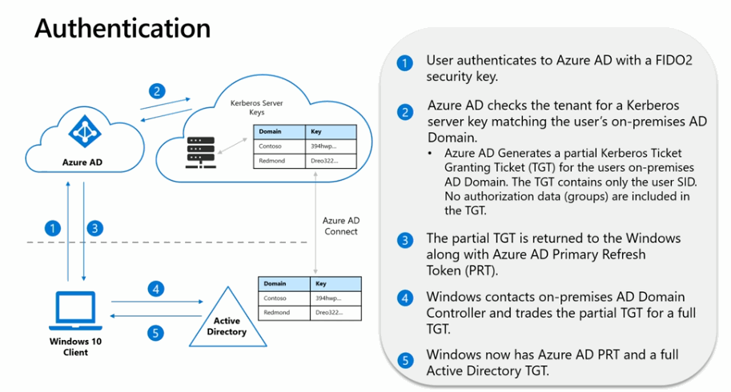
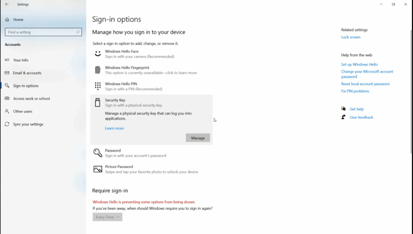
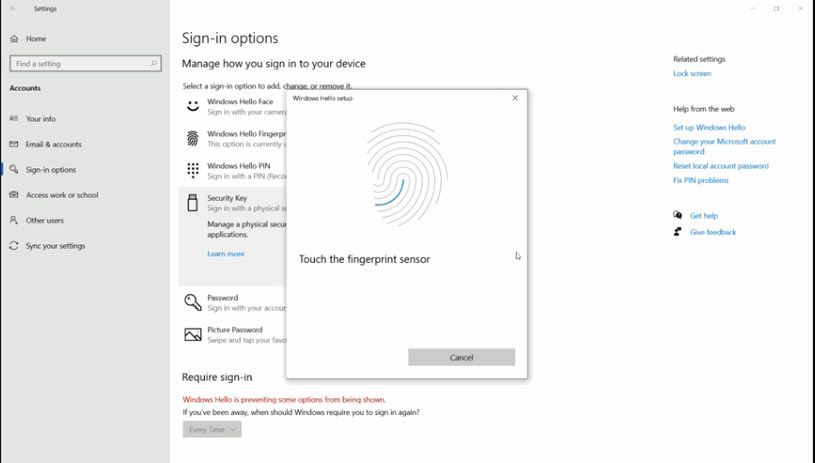
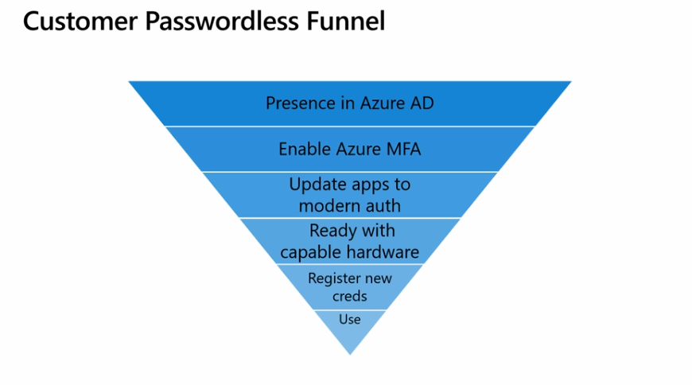
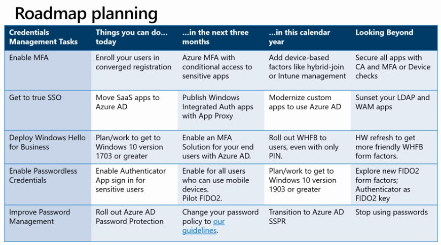
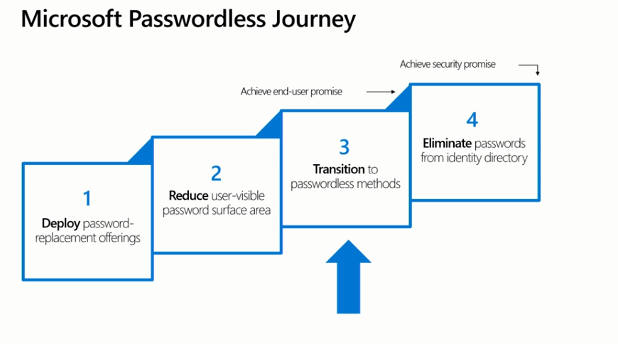
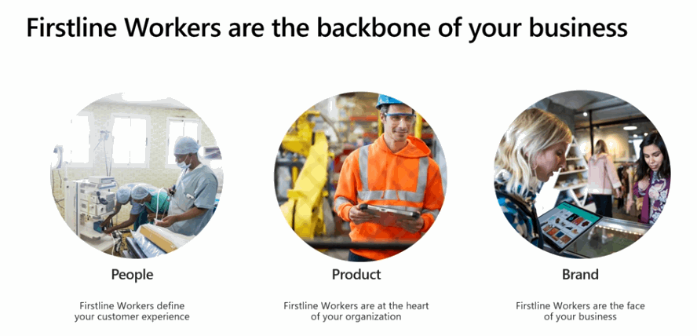
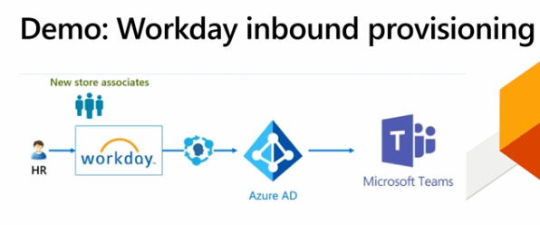
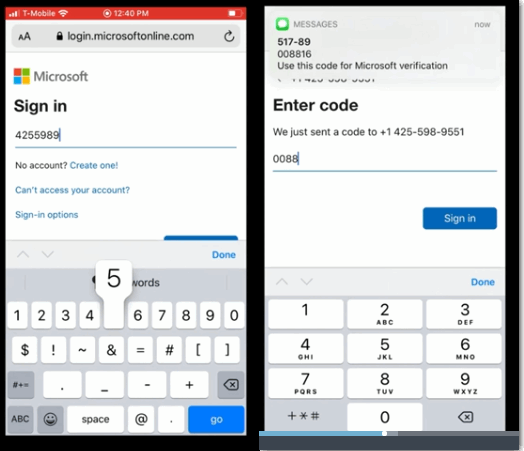

Microsoft Ignite 2019 が今年も開催されてましたね。

今年もセキュリティキーに関してアップデートがあったけど、ポケモン剣盾で時間とられて、余裕ないので雑にメモ。

孵化あまり、だれか交換しましょう。

<!-- more -->

去年はセキュリティキーでのサインイン含む、WebAuthn, パスワードレス系のセッションを聞いてテンション上げてましたねー。もう一年か、早いもんだ。

## BRK2130 Azure Active Directory: New features and roadmap

<https://myignite.techcommunity.microsoft.com/sessions/81713?source=sessions>

Azure AD の新機能のお話。

- SaaS アプリとの SCIM によるプロビジョニング
  - Salesforce, Facebook 等へは SCIM で接続済み
  - なんか見てると、3rd Party の ID 管理システムから Azure AD への同期もできそうな雰囲気
  - SaaS => AAD も SCIM なのかな…？
- オンプレとの同期ツール、Azure AD Cloud Provisioning
  - (ググラビリティ低くない？)
  - 軽量エージェントインストールするだけで設定はクラウド
  - 三井住友? の 200 フォレストあるテナントで試してた？ (英語聞き取れず)
  - MIM とか知らないっす。
- First Worker 向け機能
  - 製造・小売り等の従業員向けっぽい
  - プロビジョニングと **電話番号でのサインイン!**
- B2B ダイレクト フェデレーション (プレビュー))
  - Google, Okta, Ping Fed や、他社の AD FS から直接ゲストユーザーがサインインできる
  - ドキュメントは[このへん](https://docs.microsoft.com/ja-jp/azure/active-directory/b2b/direct-federation)
- アクセスパネルのワークスペースによるグルーピング機能
  - なんで今までなかったんや…
- Entitlement Management と外部ツールによる? 権限申請・承認フローのデモ
- Azure AD の Availability のはなし
- ハイブリッド環境への FIDO2 Security Key によるサインイン
  - Hybrid Azure AD Joined 環境でセキュリティキーでのサインインできる
  - FY20Q1  Public Preview の予定…らしい
- 条件付きアクセスのレポート オンリーモード
  - 条件付きアクセスの設定テストのために、サインインログに出すだけでブロックしないモード

盛りだくさんだけど、気になったのは First Worker 向けの電話番号でのサインインと、Hybrid Azure AD 環境での FIDO2 セキュリティキー。

あと SCIM 触ったことないので、どっかで触っておきたい。

## Eliminate your weakest link with passwordless authentication
<https://myignite.techcommunity.microsoft.com/sessions/81716?source=sessions>

Hybrid 環境での FIDO2 セキュリティキーのデプロイ。2020年の始めにパブリック プレビューの予定。

Azure AD Connect の最新版 + Win10 の Insider Build + ドメコンへのパッチが必要らしい。

フローはこんな感じ

- (0) Azure AD Connect で Kerberos Server keys をクラウドにもっていく
- WebAuthn で認証
- AAD がユーザーネームだけ入った一時的な TGT チケットを同期した秘密鍵で生成して取得
- PRT と一緒に Windows 10 が受け取る
- オンプレの AD に 一時的な TGT チケットを提示
- オンプレ AD が完全な TGT チケットを返却

これ、AD につながらないときはどんな動きするんだろう。普通に PRT 落ちてきてるから、Azure AD に対しては認証できそう。

あとは Kerberos Server keys を組織の外に同期するって、どの程度のインパクトなのかよくわからん。

そして動かんくなったときのデバッグつらそうｗ

あとは、Windows と CTAP2 の統合。

指紋や PIN の設定を Windows の設定から行えるようになったとのこと。デモでは失敗してたけど。

Biometrics 系の API って標準化されてるんかな。この辺最近追ってないのでわからん。

### まとめ

パスワードレスへ移行するための道筋的なのはこっち

- THR3076 Get the most out of passwordless authentication and avoid pitfalls
  <https://myignite.techcommunity.microsoft.com/sessions/81735?source=sessions>

デバイスのアップデートサイクルに合わせて TPM 使えるマシンにしろとか、MSAL 使った OIDC の認証に切り替えろ見たいな話しをしていたと思う。(ちゃんと聞いてない)

## BRK2261 Empower firstline worker productivity from day one

<https://myignite.techcommunity.microsoft.com/sessions/81630?source=sessions>

AAD 新機能のセッションみてちょっと気になったので。

FirstLine Worker って言葉を知らなかったんだけど、小売店や製造業の、店舗従業員や作業員といった意味らしい。

そういった人たちにも、Teams やら Shift (Staff Hub の後継) を使ってもらって、仕事効率高めようという話。

MS シフト管理ツールまで持ってるんか…。Staff Hub とか聞いたことなかったわ。

は、置いといて、プロビジョニングして使い始めてもらうっていう文脈で、管理者が設定した電話番号にワンタイム パスコード送ってサインインができるという機能。
Y!っぽいあれですね。

HR システムからユーザーをプロビジョニングして、Teams のチャネルに自動招待。あと電話番号も登録。

ユーザーは自分の電話番号でサインインするだけ。

複数の組織に所属してたらどうなるんだろうとか、気になるところはあるけど、パスワード リセットのヘルプセンターの管理するよりずっといいんじゃないでしょうか。

今日はヒバニーの孵化作業があるので、ここまで。