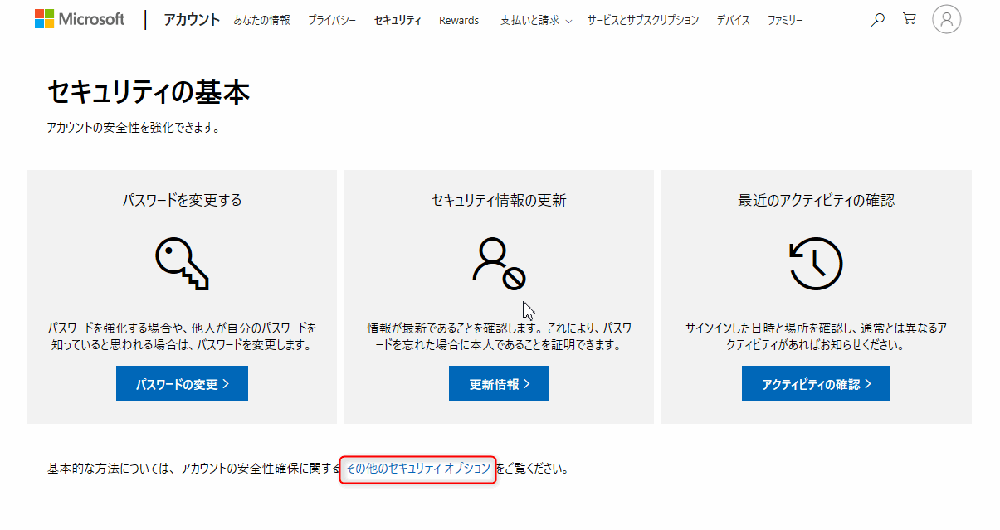
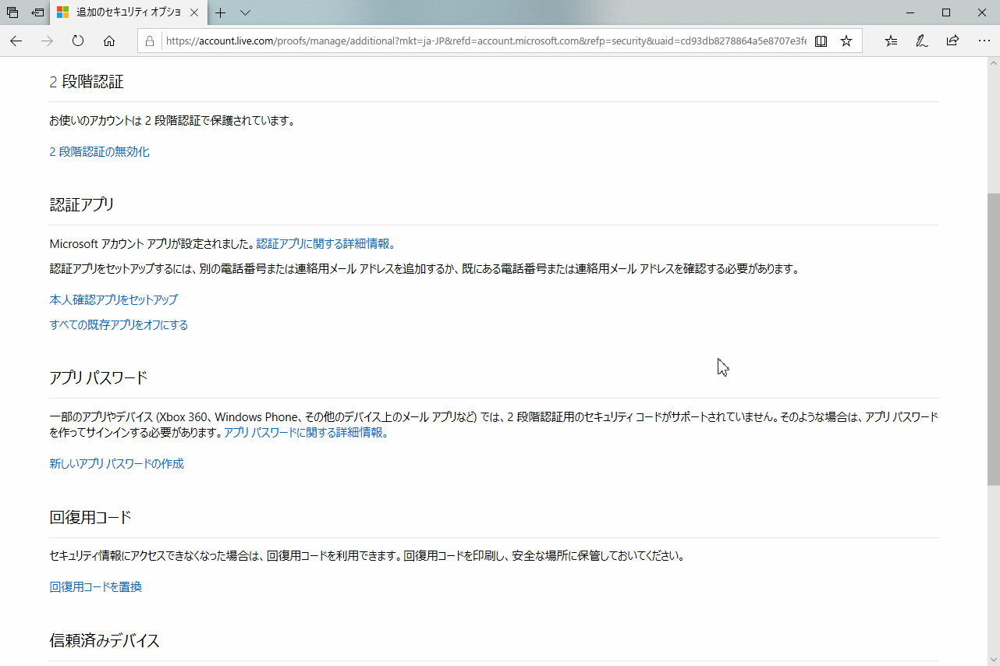
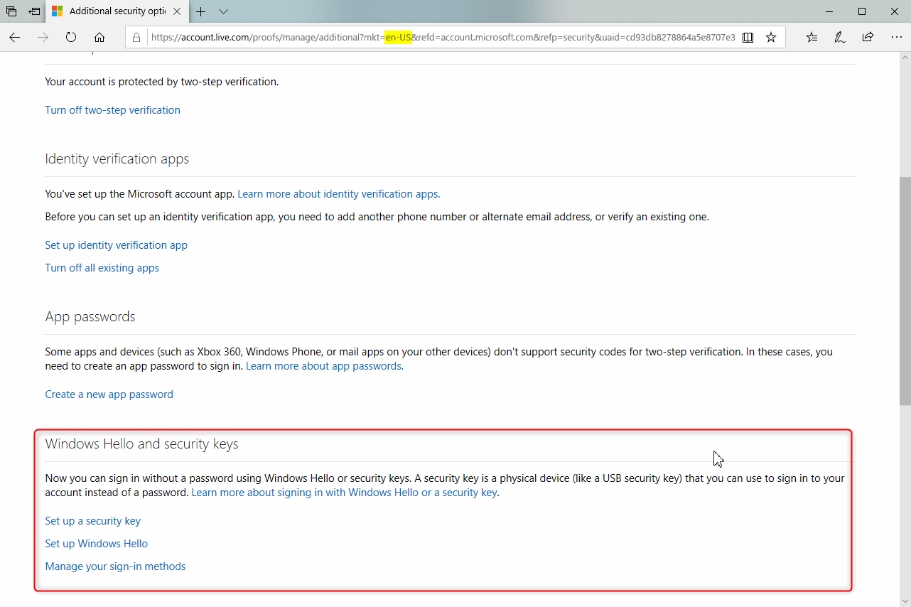
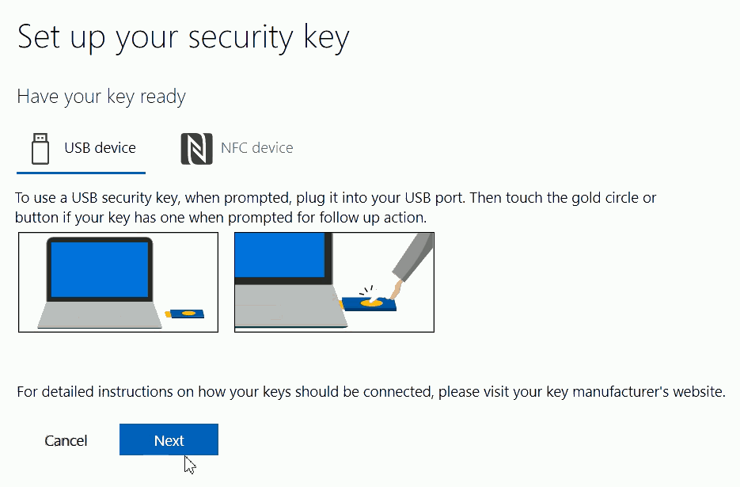
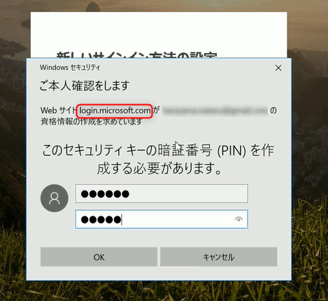
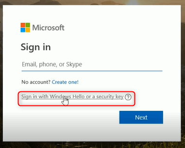
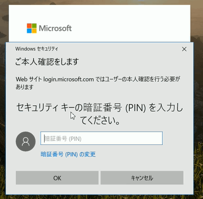

- [Password-less Login with the YubiKey 5 Comes to Microsoft Accounts | Yubico](https://www.yubico.com/2018/11/password-less-login-with-the-yubikey-5-comes-to-microsoft-accounts/)

**来たか！**

ということで、MSA(Microsoft Account) で FIDO2/WebAuthn 対応の YubiKey 5 or Security Key by Yubico でログイン可能になったらしいので早速試してみた。

<!-- more -->

MSA って何やねんって思ったけど、要はAzure ADじゃない、個人アカウントってことらしい。タブンネ。

## アカウントページにアクセス

まずはお手元に Windows10 versions1809 と Edge 、YubiKey 5 シリーズか Security Key by Yubico(2って刻印があるやつ） を用意。

<iframe style="width:120px;height:240px;" marginwidth="0" marginheight="0" scrolling="no" frameborder="0" src="//rcm-fe.amazon-adsystem.com/e/cm?lt1=_blank&bc1=000000&IS2=1&bg1=FFFFFF&fc1=000000&lc1=0000FF&t=82p-22&o=9&p=8&l=as4&m=amazon&f=ifr&ref=as_ss_li_til&asins=B07BYSB7FK&linkId=8a19153a421eb5ce6735b868823cdfbe"></iframe>

1809… うっ、アタマが…

次に [MS のサポートページ](https://support.microsoft.com/en-us/help/4463210/windows-10-sign-in-microsoft-account-windows-hello-security-key) に従って登録してみる。Microsoft Account でログインしてから

アカウントの[追加のセキュリティオプションページ](https://account.live.com/proofs/manage/additional)にアクセスして、

が、無い！

日本サポートはまだなのか…。

しかし大体こういうときは**言語を英語にすればええんやで**と、私のゴーストが囁くのでおもむろに URL のパラメーター `mkt=ja-JP` を `mkt=en-US` に差し替える。

https://account.live.com/proofs/manage/additional?mkt=en-US

登録できそうやね。

## 登録

早速登録してみる。

USBもしくはNFCに対応しているらしい（BLEは未対応）

キーを挿入すると、PIN を設定しろと表示される。User Verification は必須らしい。
ちなみに `rp.id` は `login.microsoft.com` なのかな？

PIN を設定して YubiKey に2回タッチすると登録完了。

## ログイン

この状態でログアウトするとログイン画面に見慣れない表示が…

ログイン完了！

## 雑感

まだ MSA のみ対応なのと、Edge のみなので使い始める人は少ないだろうけど確かに登録＆ログインできた。
Yahoo!アカウントの  FIDO2 対応の時もそうだが、自分が関わってるコミュニティの新機能発表は、すごく興奮する。

と同時に、何か自分もビジネスにかかわらないとなーと漠然とした焦りを感じる。

でも、とりあえず今日は速報ってことで

いじょう。