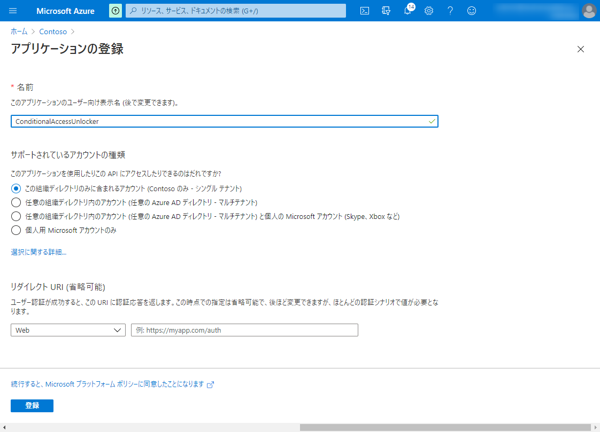
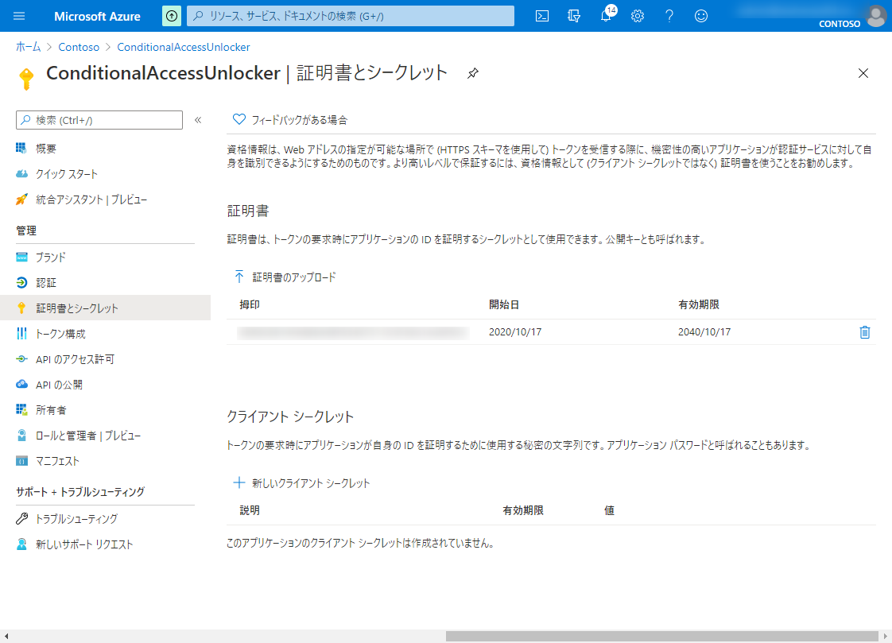
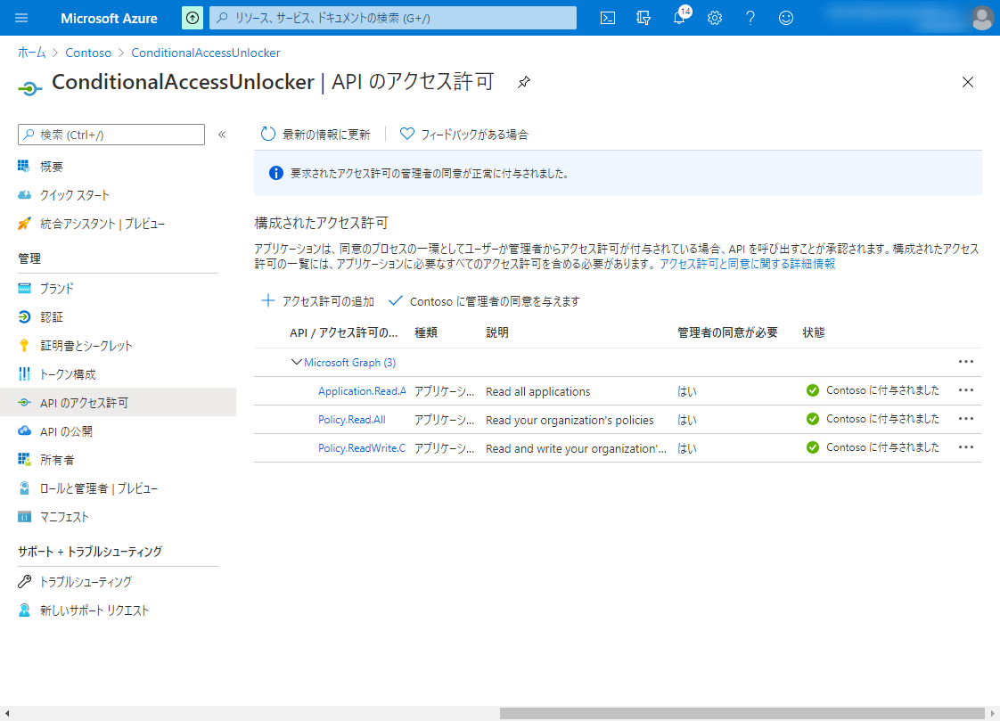
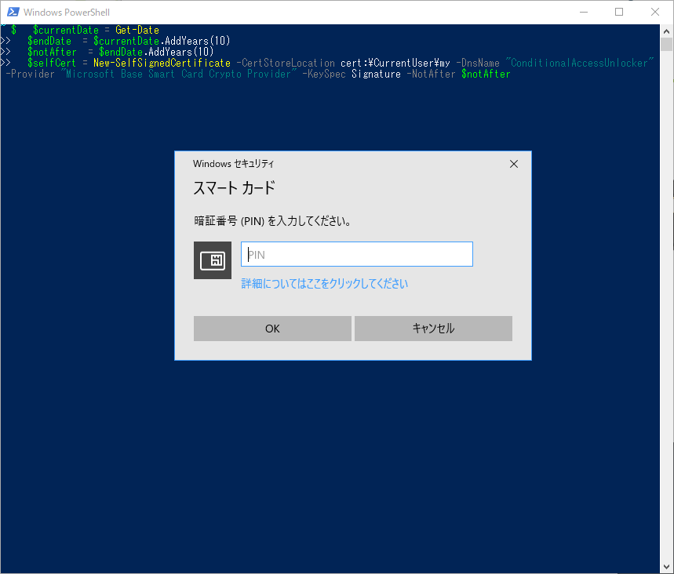
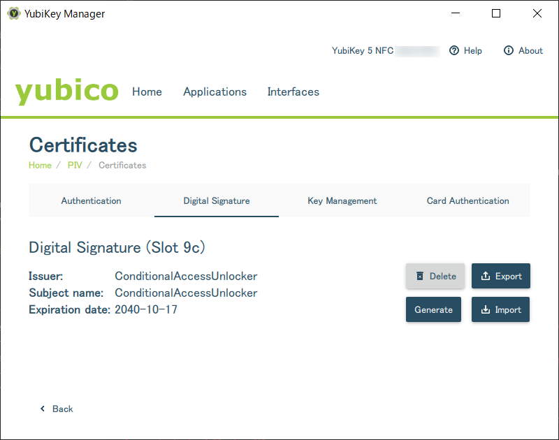
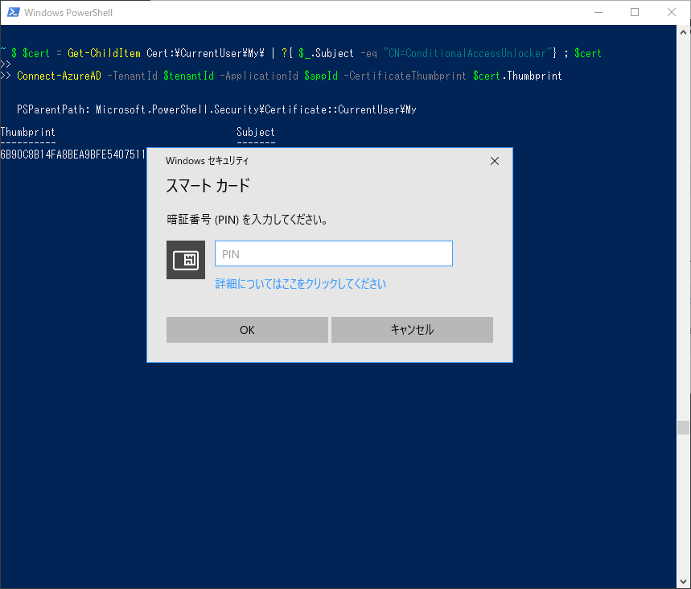
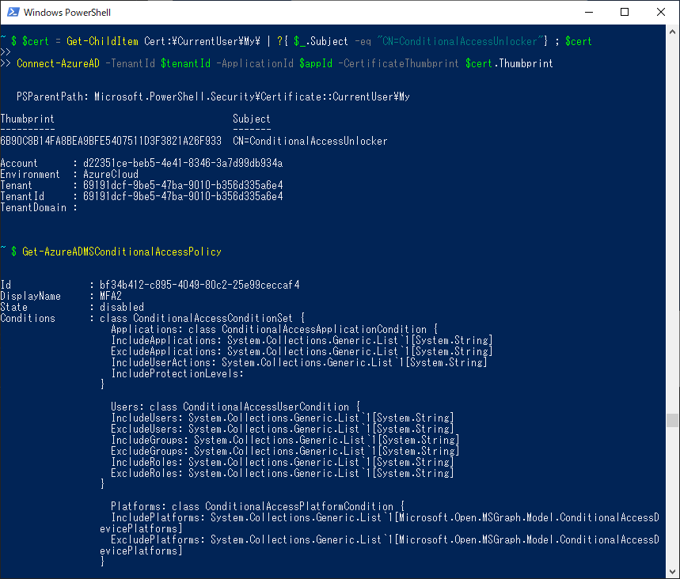
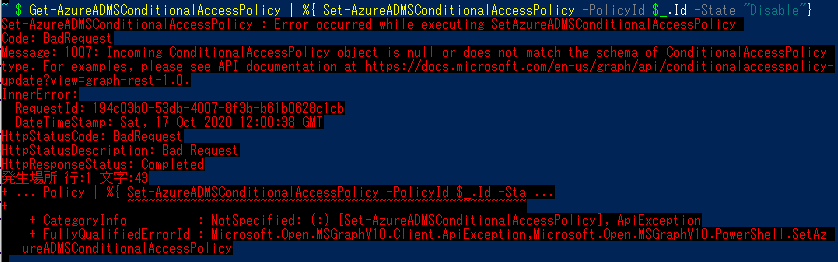

YubiKey 5 シリーズで Azure AD のサービス プリンシパルの証明書認証を試したのでメモ。

<!-- more -->

## 元ネタ

土曜の昼におきたら EMS 勉強会なるもの TL で盛り上がっているので見ていたら、条件付きアクセスで管理者がロックアウトされて困ったという話があり、こういうのあればいいなーと思ったので作ってみる。

<blockquote class="twitter-tweet"><p lang="ja" dir="ltr">条件付きアクセス Microsoft Graph API で叩けるようになったし、緊急解除ボタンとか作るの楽しそう。<a href="https://twitter.com/hashtag/jpemsug?src=hash&amp;ref_src=twsrc%5Etfw">#jpemsug</a> <a href="https://t.co/WvVDsaLkLu">pic.twitter.com/WvVDsaLkLu</a></p>&mdash; 82@はに (@watahani) <a href="https://twitter.com/watahani/status/1317353605867790336?ref_src=twsrc%5Etfw">October 17, 2020</a></blockquote> <script async src="https://platform.twitter.com/widgets.js" charset="utf-8"></script>

緊急解除ボタンを作る。


## 問題点

Microsoft Graph API で [条件付きアクセスが操作](https://docs.microsoft.com/ja-jp/graph/api/resources/conditionalaccesspolicy?view=graph-rest-1.0) できるようになったので、 緊急解除ボタンを作ること自体は簡単なのですが誰でも押せてしまうと困りますね。

うーん、資格情報を安全に保管できる素敵なデバイスはないかなぁ～？

証明書を保存できて、手ごろで丈夫なデバイス無いかな～？
.
.
.
.

はい、ありました。

<iframe style="width:120px;height:240px;" marginwidth="0" marginheight="0" scrolling="no" frameborder="0" src="//rcm-fe.amazon-adsystem.com/e/cm?lt1=_blank&bc1=000000&IS2=1&bg1=FFFFFF&fc1=000000&lc1=0000FF&t=82p-22&language=ja_JP&o=9&p=8&l=as4&m=amazon&f=ifr&ref=as_ss_li_til&asins=B07HBD71HL&linkId=f2bf005f94ac048773128cc9c094d7fb"></iframe>

> 宣伝したので指紋認証のできる YubiKey ください🤤🤤

## YubiKey に保存した証明書で、証明書認証がしたい

YubiKey4, YubiKey5 シリーズは、Windows 上でスマートカードとして働く。Windows 10 の場合、minidriver も初めから入っているので、Service Principal の認証もできるんじゃない？と思ってやってみたら簡単にできたので、メモ。

## Azure AD に条件付きアクセス解除用のサービスプリンシパル (アプリ) を作る

まずは、条件付きアクセス解除用のサービス プリンシパルを作る。サービスプリンシパルについては[以前 Qiita で書いたので](https://qiita.com/watahani/items/1f3f533097b7a15d6698)さっくりと。

### アプリの作成

`Azure Active Directory` > `アプリの登録` > `新しいアプリ`



全てデフォルトで登録。

### 証明書のアップロード

`証明書とシークレット` を選択し、先ほどエクスポートした証明書、 `ConditionalAccessUnlocker.cer` をアップロードする。



### API のアクセス許可

サービス プリンシパルで条件付きアクセスを操作するには、アプリケーション権限の `Policy.Read.All`, `Policy.ReadWrite.ConditionalAccess`, `Application.Read.All` が必要。

`アクセス許可の追加` から Microsoft Graph API を選び、「アプリケーション権限」で、上記 3 つの権限を追加する。その後、「<テナント名>にアクセス許可を追加します」をクリックし、Admin Consent を実施する。



## YubiKey のセットアップ

その後、おもむろに YubiKey 5 を PC に刺して、以下のコマンドを実行する。

```powershell
$currentDate = Get-Date
$notAfter  = $currentDate.AddYears(10)
$selfCert = New-SelfSignedCertificate -CertStoreLocation cert:\CurrentUser\my -Subject "CN=d22351ce-beb5-4e41-8346-3a7d99db934,OU=ConditionalAccessUnlocker"  -Provider "Microsoft Base Smart Card Crypto Provider" -KeySpec Signature -NotAfter $notAfter
```



> 証明書の作法はあまり分からないけど、AppId を Subject に入れとけば便利そう。
> スクリーンショットはテスト中のなので、DNS で設定してる。

PIN を要求されるので、YubiKey 5 の PIN を入れる。Azure AD などで FIDO2 で使っている場合は共通なので、それを入れる。初めて使う場合は好きな PIN を入れる。

上記コマンドで YubiKey 上に自己証明書が保存される。YubiKey Manager で見るとこんな感じで 9a スロットに証明書が保存されているのが分かる。




`certutil` でも確認できる。

```powershell
certutil -scinfo
```

削除するコマンドもメモっておく。

```powershell
 certutil -delkey -csp "Microsoft Base Smart Card Crypto Provider" "te-4d4c1e9d-2c00-4995-9396-4014ef5a281d" #キーコンテナ名は -scinfo で出てきたやつ
```

以下のコマンドで証明書を出力する。

```powershell
$cerfile = ".\ConditionalAccessUnlocker.cer"
Export-Certificate -Cert $cert -FilePath $cerfile
```

> Note:
>  この辺動かないときは、もしかするとこの辺のレジストリが設定されているかもしれない。
> <https://docs.microsoft.com/en-us/previous-versions/windows/it-pro/windows-server-2008-r2-and-2008/ff404287(v=ws.10)>

## Azure AD PowerShell Module で条件付きアクセスを操作

### PowerShell Module のインストール

Azure AD PowerShell Module v2 の Version `2.0.2.106` 以上をインストールする。

```powershell
Install-Module -Name AzureAD -Force
```

### 作成したサービス プリンシパルの権限でサインイン

さっき作成した証明書を読み込んで、作成したサービス プリンシパルの権限でサインインする。

```powershell
$cert = Get-ChildItem Cert:\CurrentUser\My\ | ?{ $_.Subject -like "*OU=ConditionalAccessUnlocker*"} ; $cert
$appId = $cert.Subject.Split(",")[0].Split("=")[1]

Connect-AzureAD -TenantId $tenantId -ApplicationId $appId -CertificateThumbprint $cert.Thumbprint
```



PIN を聞かれるので、YubiKey の PIN を入力する。



サインインできるので、後はポリシーを操作するコマンドをポチポチ叩いて解除すれば…



**あれ… うまく動かない…。** 😅

## まとめ

削除は上手く動いたので、緊急時は Remove-AzureADMSConditionalAccessPolicy でブロックされてるポリシーを削除するなりしてください。

```powershell
 Get-AzureADMSConditionalAccessPolicy | %{ Remove-AzureADMSConditionalAccessPolicy -PolicyId $_.Id}
```

これで、緊急時に YubiKey があれば条件付きアクセスを削除してテナントに入れるようになったので、安心して条件付きアクセスの実験が出来ますね。

## 参考

- [azure-ad-conditional-access-apis/01-configure/powershell at main · Azure-Samples/azure-ad-conditional-access-apis](https://github.com/Azure-Samples/azure-ad-conditional-access-apis/tree/main/01-configure/powershell)
- [Use query parameters to customize responses - Microsoft Graph | Microsoft Docs](https://docs.microsoft.com/en-us/graph/api/resources/conditionalaccesspolicy?view=graph-rest-1.0)
- [Deleting a Certificate and Keys using Certutil – Taglio PIVKey](https://pivkey.zendesk.com/hc/en-us/articles/204519855-Deleting-a-Certificate-and-Keys-using-Certutil)