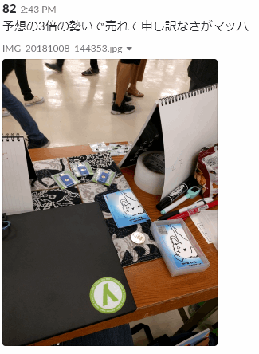

## #idcon

さて、私が初めて運営させていただいた #idcon からはや1週間。
FIDO と WebAuthn のテックイベントを開催するのに紆余曲折あったのだが、それはまた。

<!-- more -->

懇親会も盛り上がり、集合写真もとって大満足である。

Tシャツもお揃いなのだ。

<blockquote class="twitter-tweet" data-lang="ja">
<a href="https://twitter.com/hashtag/idcon?src=hash&amp;ref_src=twsrc%5Etfw">#idcon</a> <a href="https://twitter.com/hashtag/fidcon?src=hash&amp;ref_src=twsrc%5Etfw">#fidcon</a> Thank you for joining today&#39;s meet-up. <a href="https://t.co/a0Gy8MrRfH">pic.twitter.com/a0Gy8MrRfH</a>
&mdash; GOLGO13(Duke Togo) (@Duke_GOLGO) <a href="https://twitter.com/Duke_GOLGO/status/1047852021691244545?ref_src=twsrc%5Etfw">2018年10月4日</a></blockquote>

色んな人に知り合えたり、知らなかったを知れて、本当に良かった。

終わって思ったことは思ったより運営って大変なんだなってこと。

## 技術書典 5

さて、大変だった #idcon のイベントが 10月4日 である。

10月8日は何の日か…。そう、技術書典の日である。

実は7月19日、技術書典の申し込み締め切りの日、夜中の 11:50 頃だったと思う。何をとちくるったか、サークル参加の申し込みをしていたのだ。WebAuthn 第1回もくもく会の少し前のできごとである。そして幸か不幸か、受かってしまっていたのである。

しかし 8月はまだ、WebAuthn 自体あまり理解できておらず、下調べで終了。
9月はカナダ旅行に行き（本当はこの旅行前に第一稿を書き上げる予定だった）、
10月頭はイベントで頭がいっぱい、社内的にもゴタゴタしていてまったく書けていなかった。

しかし出さないわけにはいかない。#idcon で、こんなスライドで発表してしまったのだ。

<iframe src="//www.slideshare.net/slideshow/embed_code/key/4bWPPyZXeOJAW9?startSlide=5" width="595" height="485" frameborder="0" marginwidth="0" marginheight="0" scrolling="no" style="border:1px solid #CCC; border-width:1px; margin-bottom:5px; max-width: 100%;" allowfullscreen> </iframe> 
 <strong> <a href="//www.slideshare.net/HaniyamaWataru/idcon24-fido2-yubikey" title="Idcon25 FIDO2 の概要と YubiKey の実装" target="_blank">Idcon25 FIDO2 の概要と YubiKey の実装</a> </strong> from <strong><a href="//www.slideshare.net/HaniyamaWataru" target="_blank">Haniyama Wataru</a></strong> 

*買ってね、じゃねーよ*

それからは毎日死ぬ気で書いた。いや、嘘だ。絶望して一日中 [Youtube で魚をさばく動画](https://www.youtube.com/channel/UCaak9sggUeIBPOd8iK_BXcQ)を見ていた日もあった。前日の夜中まで書いていた。いや前日の夜中だけで書き上げた。
（*※ 実際には #idcon の発表用にいろいろと下調べしたことが役に立っているので、執筆期間としてはもっと長いです*）

ともかく突貫工事で技術書を仕上げ、当日、こんな中身のない本を買いに来るやつがいるのか…とドキドキしながら待っていたら

まじか。

結果1冊 500円の電子書籍が 86冊売れ、黒字で終了した。

感謝しかない。

>　セリヌンティウスは、すべてを察した様子で首肯うなずき、刑場一ぱいに鳴り響くほど音高くメロスの右頬を殴った。殴ってから優しく微笑ほほえみ、  
>「メロス、私を殴れ。同じくらい音高く私の頬を殴れ。私はこの一日の間、たった一度だけ、ちらと丸儲けだと思った。 **#idcon で宣伝すれば、売れるやんと。** 君が私を殴ってくれなければ、私は次回も同じことを繰り返す。」  

>　メロスは腕に唸うなりをつけてセリヌンティウスの頬を殴った。  

>「ありがとう、友よ。」二人同時に言い、ひしと抱き合い、それから嬉し泣きにおいおい声を放って泣いた。  

>　群衆の中からも、歔欷きょきの声が聞えた。暴君ディオニスは、群衆の背後から二人の様を、まじまじと見つめていたが、やがて静かに二人に近づき、顔をあからめて、こう言った。

>「おまえらの望みは叶かなったぞ。おまえらは、わしの心に勝ったのだ。おまえらは、技術書典でつながったのだ。twitterとは、決して空虚な妄想ではなかった。どうか、わしをも仲間に入れてくれまいか。どうか、わしの願いを聞き入れて、次回の技術書典6で新刊をださまいか。」  

>　どっと群衆の間に、拍手が起った。

>**「万歳、技術書典万歳。」**

> 技術書典が終了したのだ。

色々と申し訳ない気持ちは、残っているのだが、私はこう思うことにした。

今回は出したことに意味があったのだ。

内容は、もちろん大事だが、動いたことによって人がつながり、つながったことでより大きなことができるようになるのだ。
技術書典に本をだして本当に良かった。

>ありがたいことに、次回出すならお手伝いしますよという方が何名かいらっしゃったので、次回も WebAuthn 本出す予定です。
>
>もっと充実した内容を目指しますので、次回もよろしくお願いします。
>売上金で焼き肉食いにいくぞー
><blockquote class="twitter-tweet" data-lang="ja">
とりま肉食いに行きましょう
&mdash; 82 (@watahani) <a href="https://twitter.com/watahani/status/1049234453623500800?ref_src=twsrc%5Etfw">2018年10月8日</a></blockquote>

私がこの3か月ほど、イベントに参加したり、そしてイベントを運営することになる中で学んだことは、　**動くと人がついてくる** ってことだ。
もちろん、うまくいったのは助けてくれる人たちがいたからだとしても。

## 終わりに

最後はクソポエムで締めよう。

初めはクソでもいい。その道を通って苦労してきた人はわかってるから助けてくれる。まずは行動しよう。仲間はきっと見つかるから。

----
THE END
----
