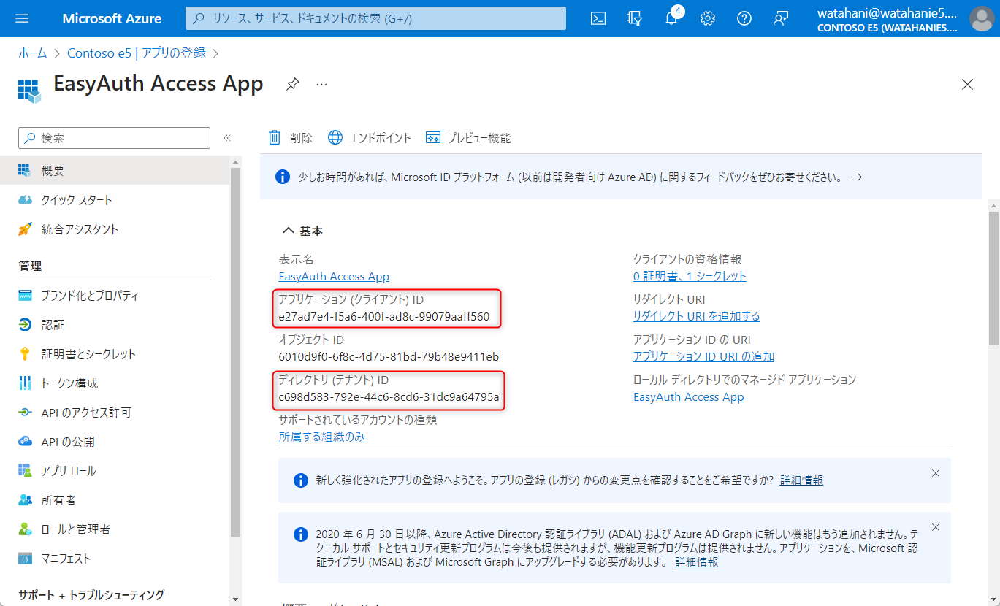
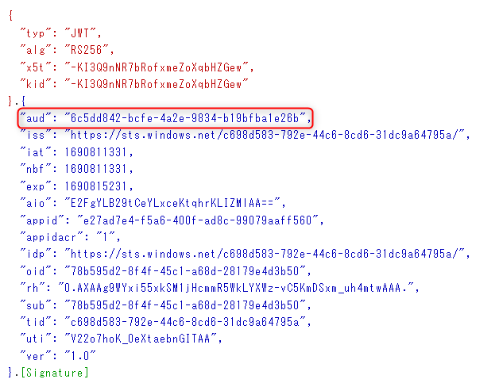
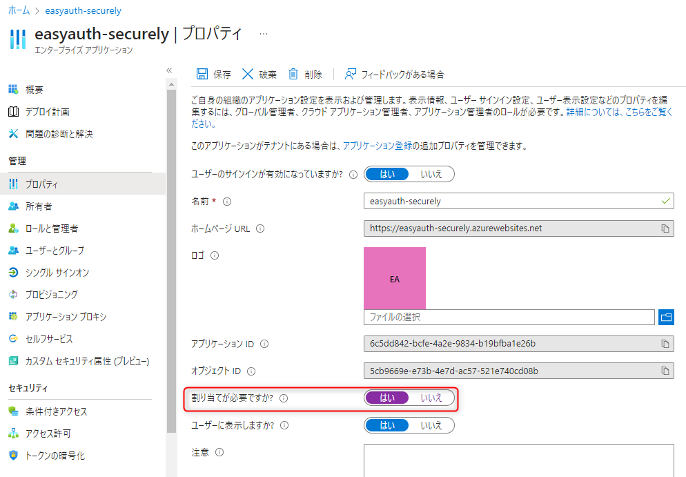
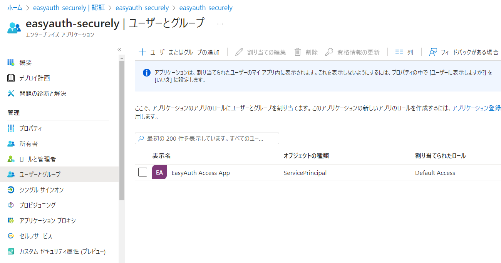
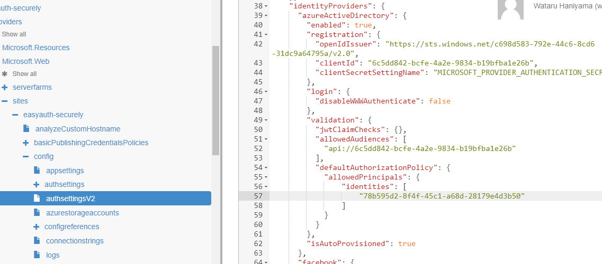

Azure の App Service や Functions などの Web サービスには、Azure AD と連携して認証を行う機能があります。App Service 認証と呼ばれる機能で、旧称？の EasyAuth の方が馴染みがあるかもしれない。
最短ではほぼワンクリックでアプリに認証機能を追加できるため、とても便利だ。しかし、そのまま使うとセキュリティ上の問題が発生する可能性がある。

ということで EasyAuth の機能が Azure AD から見てどのような機能なのか、どのようなセキュリティ上の懸念があるのか、どのように対策するのかをまとめてみた。

<!-- more -->

## TL;DR

既定ではテナントすべてのユーザーやアプリがアクセスできてしまうので、以下のいずれかの設定を実施することをお勧めする

- App Service 認証用に作成されたアプリの "ユーザーの割り当てを有効化" してアクセス可能なユーザーを制限する
- App Service 認証の組み込み認可ポリシーを使ってアクセス可能なユーザーを制限する
- App Service にデプロイしたアプリ側でトークンのクレームをチェックするビジネス ロジックを追加する

## App Service 認証とは

EasyAuth の基本についてはここでは記載しないが、ざっくり以下の機能を持っている

1. OIDC/OAuth のクライアントとしての機能 (OP へのリダイレクトや、認可コードの取得と引き換え、トークンストアなど)
1. OIDC/OAuth の RP としての機能 (アクセス トークンの検証、**簡易的な**認可ポリシーの作成)

ほとんどの場合は 1 のクライアントとしての機能を利用するために有効化すると思うが、API としての機能を利用する場合は 2 の RP としての機能も利用することになる。
つまり、別のクライアントで取得したアクセス トークンを EasyAuth で保護された App Service に送信し、EasyAuth が検証してアクセスを許可するということができる。

ここで注意が必要なのは EasyAuth は既定では aud の検証と署名検証しか行わないことだ。そして Azure AD では API 側で制限されていない限り、基本的にアプリは自由に特定の aud に対するトークンを取得できるので、テナントに登録されたすべてのアプリが EasyAuth が有効なアプリにアクセスができる。

## 試してみる

ということで、簡単なコードで試してみる。まずは App Service なり Functions なりを作って EasyAuth を有効化する。
作成したらクライアント ID をメモっておく


作成したら、これとは別に `アプリの登録` から適当なアプリを登録して、シークレットを作成する。


作成した方のクライアント ID とテナント ID もメモっておく



メモったクライアント ID とテナント ID、作成したシークレットを使って、おもむろにアクセス トークンを取得する。

```posershell
$clientId = "e27ad7e4-f5a6-400f-ad8c-99079aaff560"
$clientSecret = "************"
$tenantId= 'c698d583-792e-44c6-8cd6-31dc9a64795a'
$scope = '6c5dd842-bcfe-4a2e-9834-b19bfba1e26b/.default'
$tokenEndpoint = "https://login.microsoftonline.com/$tenantId/oauth2/v2.0/token"
$postParams = @{
    client_id = $clientId;
    client_secret = $clientSecret;
    grant_type = 'client_credentials';
    scope = $scope
}

$authResult = Invoke-RestMethod -UseBasicParsing -Uri $tokenEndpoint -Method POST -ContentType "application/x-www-form-urlencoded" -Body $postParams
```

取得したアクセス トークンを EasyAuth で保護されたアプリに送信してみる。

```posershell
$headers = @{ Authorization = "Bearer $($authResult.access_token)" }
$res = Invoke-WebRequest -UseBasicParsing -Uri "https://easyauth-securely.azurewebsites.net/" -Headers $headers
$res.StatusCode # => 200
```

ということで、何の権限も持たないアプリが EasyAuth で保護されたアプリにアクセスが出来た。これは直感に反する動作に思える。

## なぜ権限がないのにも関わらずアクセスが出来たのか

シンプルに EasyAuth は既定では aud の検証と署名検証しか行わないからだ。つまり、アクセス トークンの aud が EasyAuth で保護されたアプリのものであって、署名の検証ができればアクセスが許可される。
先ほど取得したアクセス トークンの内容を <https://jwt.ms> で見てみると、以下のような内容が確認できる



Azure AD ではリソース側で制限がなされていない限り、アプリは特定リソースに対するアクセス トークンを発行可能である。
たとえば Microsoft Graph API に対するアクセス トークンは、テナントに登録されたすべてのアプリで取得可能である。先ほどのトークン取得コードの scope パラメーターを `<appid>/.default` の部分をテナントに登録された好きなアプリの ID に差し替えてみると、そのアプリに対するアクセス トークンが取得できることが確認できる。

ではテナントに登録されたアプリは、どの API に対しても自由にアクセスが可能かというとそうではなく、API 側で通常は roles クレームをチェックし、必要なアクセス許可を持ったアプリかを判別する。
具体的には API のアクセス許可からアプリに対して必要なアクセス許可を付与することで、アクセス トークンに roles クレームを追加することが出来、アプリ側で検証に利用が出来る。

たとえば、Microsoft Graph API をアプリ権限で呼び出そうとすると、API のアクセス許可から権限を追加し、管理者の同意を付与する必要があるが、あれは roles クレームを追加するための作業といえる。

ただ、先ほども説明した通り、EasyAuth は既定では roles クレームの検証は行わない。つまり、アプリは特定の API に対するアクセス許可を持たなくても、その API に対するアクセス トークンを取得でき、EasyAuth で保護されたアプリにアクセスすることが出来る。

## アクセスを制限するには

EasyAuth はあくまで簡易的な認証の仕組みであり、既定ではトークンの aud と署名を検証するのみなので、アクセスを制限するには以下のいずれかを行う必要がある。

- App Service 認証用に作成されたアプリの "ユーザーの割り当てを有効" にしてアクセス可能なユーザーを制限する
- App Service 認証の組み込み認可ポリシーを使ってアクセス可能なユーザーを制限する
- App Service にデプロイしたアプリ側でトークンのクレームをチェックするビジネス ロジックを追加する

実施が簡単な順に並べたが、それぞれでの方法には一長一短がある。また複雑な要件を満たすには EasyAuth を利用するにしても、ビジネス ロジックを書く必要がある。

### App Service 認証用に作成されたアプリの "ユーザーの割り当てを有効" にしてアクセス可能なユーザーを制限する

あなたが Azure AD の管理者であり、Azure AD に対する管理権限を持つ場合には最も手っ取り早い方法は [ユーザーの割り当てを有効化](https://learn.microsoft.com/ja-jp/azure/active-directory/develop/howto-restrict-your-app-to-a-set-of-users) することだ。
既定では EasyAuth により作成されたアプリは `ユーザーの割り当てが有効ですか?` が `いいえ` になっているので、これを `はい` に変更する。




作業は `アプリの登録` ではなく `エンタープライズ アプリケーション` から行う必要があるので注意。

この設定を実施後、再度先ほどのトークン取得コードを実行してみると、今度は 401 エラーが返ってくることが確認できる。

```powershell
$authResult = Invoke-RestMethod -UseBasicParsing -Uri $tokenEndpoint -Method POST -ContentType "application/x-www-form-urlencoded" -Body $postParams
# Invoke-RestMethod: {"error":"invalid_grant","error_description":"AADSTS501051: Application 'e27ad7e4-f5a6-400f-ad8c-99079aaff560'(EasyAuth Access App) is not assigned to a role for the application '6c5dd842-bcfe-4a2e-9834-b19bfba1e26b'(easyauth-securely).\r\nTrace ID: 31f83ef7-4e6e-4e4d-9ce7-4d3d04191c00\r\nCorrelation ID: a0ceee27-3cfb-4574-bf22-22289e6452f3\r\nTimestamp: 2023-07-31 14:23:05Z","error_codes":[501051],"timestamp":"2023-07-31 14:23:05Z","trace_id":"31f83ef7-4e6e-4e4d-9ce7-4d3d04191c00","correlation_id":"a0ceee27-3cfb-4574-bf22-22289e6452f3","error_uri":"https://login.microsoftonline.com/error?code=501051"}
``````

アクセスを許可するにはユーザーと割り当てに対してロールの割り当てを実施する。ユーザーはそのまま割り当てればよいが、アプリケーションは GUI で直接割り当てができないので、アプリケーションが所属するグループを作って、そのグループに対してロールの割り当てを行う (要 Azure AD Premium ライセンス) か、ライセンスがないのであれば Graph API 経由で割り当てを実施する。

```powershell
Connect-MgGraph -Scopes "Application.ReadWrite.All, AppRoleAssignment.ReadWrite.All"
$easyAuthApp = Get-MgServicePrincipal -Filter "appId eq '6c5dd842-bcfe-4a2e-9834-b19bfba1e26b'"; 
$clientApp = Get-MgServicePrincipal -Filter "appId eq 'e27ad7e4-f5a6-400f-ad8c-99079aaff560'"; 
$defaultRoleId = ([guid]::Empty).Guid
New-MgServicePrincipalAppRoleAssignedTo -ServicePrincipalId $easyAuthApp.Id -AppRoleId $defaultRoleId -ResourceId $easyAuthApp.Id -PrincipalId $clientApp.Id
```

上記のように権限を割り当てると、ユーザーとグループにクライアント アプリのサービス プリンシパルが追加され、アクセスが許可されるようになる。



ユーザーも同様に制御ができるが、`ユーザーの割り当てが有効ですか?` を `はい` に設定した時点で一般ユーザーが EasyAuth の認可処理に同意が出来なくなり、実質管理者同意が必要になるのでで注意。
詳しくは [「管理者の承認が必要」のメッセージが表示された場合の対処法 | Japan Azure Identity Support Blog](https://jpazureid.github.io/blog/azure-active-directory/azure-ad-consent-framework/#%E2%91%A2%E5%AF%BE%E8%B1%A1%E3%81%AE%E3%82%A2%E3%83%97%E3%83%AA%E3%81%A7%E3%83%A6%E3%83%BC%E3%82%B6%E3%83%BC%E3%81%AE%E5%89%B2%E3%82%8A%E5%BD%93%E3%81%A6%E3%81%8C%E5%BF%85%E8%A6%81%E3%81%A8%E8%A8%AD%E5%AE%9A%E3%81%95%E3%82%8C%E3%81%A6%E3%81%84%E3%82%8B) を参照のこと。

上記手順は手順自体はまあ簡単だが、Azure AD 側の管理権限がもろもろ必要になるのでアプリ開発者だと管理者に依頼することになるだろう。

### App Service 認証の組み込み認可ポリシーを使ってアクセス可能なユーザーを制限する

最近できた EasyAuth の新機能だが、本当に必要最低限のことしかできないがとりあえず動く。
簡単に設定方法を書いておく。詳細は [組み込み認可ポリシーを使用する](https://learn.microsoft.com/ja-jp/azure/app-service/configure-authentication-provider-aad?tabs=workforce-tenant#use-a-built-in-authorization-policy) のドキュメントを参照。
ARM API を叩くのでよくわからん人は https://resoures.azure.com で設定すれば良い。

App Service のリソースを探して、config/authsettingsV2 を開く。上部の Edit を押してから `identityProviders` > `azureActiveDirectory` > `validation` を編集する。


  
指定する ID は アプリケーション ID ではなくサービス プリンシパルの ObjectId であることに注意。つまりエンタープライズ アプリケーション ブレードから確認できるオブジェクト ID。ユーザーの場合は普通にオブジェクト ID を指定する。

この設定を実施すると `allowedPrincipals` > `identities` で設定したプリンシパルのみがアプリにアクセス可能となる。もう少し正確に言うとアクセス トークンの oid クレームが `allowedPrincipals` > `identities` で設定したプリンシパルのいずれかの ObjectId と一致する場合にアクセスが許可される。

ちなみに `jwtClaimChecks` とかいうそれっぽい名前空間が定義されているが今のところ使い方は不明。
この設定は、サブスクリプションの管理権限があればいいのでアプリ管理者が大抵できると思われるが、まあ機能不足感は否めない。せめて scp や roles クレームの検証ぐらいしてくれたらいいのだが…。

### App Service にデプロイしたアプリ側でトークンのクレームをチェックするビジネス ロジックを追加する

より複雑な要件を満たすためには、Azure AD や EasyAuth の機能だけでは不足なので、独自のコードを書く必要がある。
やりたいことによって実装難易度は異なるが EasyAuth 組み込みの機能レベルを実現するだけなら、リクエスト ヘッダーの `X-MS-CLIENT-PRINCIPAL-ID` をチェックすればよい。ここに ID トークン/アクセス トークンのオブジェクト ID が含まれるので、アクセス許可する ID のリストをアプリ側で持っておいて、合致するかをチェックすれば OK だ。

ただ、上記だけであれば前述の 2 つの方法を使ったほうが良いので、ビジネス ロジックを書く場合は追加のクレームを構成しチェックすることになるだろう。

例えば、[groups クレームを追加](https://learn.microsoft.com/ja-jp/azure/active-directory/develop/optional-claims#configure-groups-optional-claims) して検証すれば、特定のグループに所属するユーザーにのみ権限を付与したり、[アプリ ロール](https://learn.microsoft.com/ja-jp/azure/active-directory/develop/howto-add-app-roles-in-apps) は、アプリ独自の権限を Azure AD 上で定義し、特定のユーザーやサービス プリンシパルに付与して App Service 上のアプリ内の権限を AAD で管理するといったことができる。

その他のクレームをチェックするには [X-MS-CLIENT-PRINCIPAL](https://learn.microsoft.com/ja-jp/azure/app-service/configure-authentication-user-identities#decoding-the-client-principal-header) をチェックするか、素直にアクセス トークン or ID トークンをデコードして値を取り出して検証する。あと .NET なら ClaimsPrincipal に特定のクレームは勝手に入るので、それをチェックするでも良い。

この辺の詳細は前提の知識とか含め記事にすると面倒なので、今回は割愛。

ということで、EasyAuth はあくまで Easy な Auth なので、既定では結構だれでもアクセスが可能な状態で、ちょっと思ってたのと違う！ってなることがあるので注意しましょうという話。