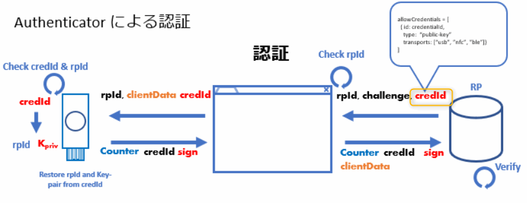
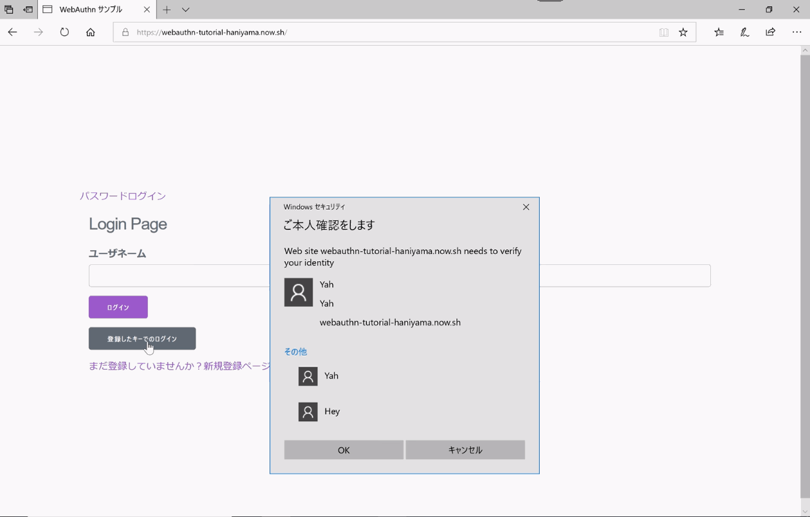

以前、「Edge が WebAuthN をサポートしたらしいので色々試してみた(Insider Preview)」という記事を書いた。

<!-- more -->


- これ: [Edge が WebAuthN をサポートしたらしいので色々試してみた(Insider Preview)](/2018/06/17/edge-support-webauthn/)

ありがたいことに、結構な方に見ていただいて、あの記事参考になったよと直接言っていただいたり、fidcon で話すことになったり。

ただ、あの記事は当時私が良く分かっていなかった ResidentKey に関する適当な記述があり、そこで引っ掛かってしまっている方もいるようなので、今更感はあるけど、改めて ResidentKey の話をしようと思う。

## Resident

私は英語が苦手なので、Resident って何やねんと思ってるのだが、辞書的には

> 研究社 新英和中辞典での「resident」の意味
> resident
> 形容詞
>
> 1居住する，在住の.
>
> 2 a 駐在の，住み込みの.
>   b 専属の.
>   c 叙述的用法の形容詞 〔前+(代)名〕〔…に〕居住して 〔at，in〕.
>
> 3【動物, 動物学】〈鳥など〉季節的に移動しない (⇔migratory).
>
> 4 叙述的用法の形容詞 〔+in+(代)名〕〈性質・権利など〉〔…に〕内在して，固有で.

ということで、内在しており「移動しない」といった意味がありそう。

実際にWebAuthn の文脈でも "ResidentKey" には  Authenticator に内在し移動しない **Credential** を保存できるものを指すので、間違ってはいなさそう。
では、保存される **Credential** って何なの？っていうのは、WebAuthn のスペックだと、

>... public key credential source whose credential private key is stored in the authenticator, client or client device. Such client-side storage requires a resident credential capable authenticator and has the property that the authenticator is able to select the credential private key given only an RP ID, possibly with user assistance (e.g., by providing the user a pick list of credentials scoped to the RP ID). 
>...
> https://w3c.github.io/webauthn/#resident-credential

ということで、保存される **Credential** は **public key credential source** らしい。
**public key credential source** を保存した結果、**RP ID** のみを与えられた場合に、rp に関連する Credential をユーザが選択可能になる、と。

で **[public key credential source](https://w3c.github.io/webauthn/#public-key-credential-source
)** ってのは

- public key credential source
    - type: public-key.
    - CredentialId.
    - privateKey
    - rpId
    - userHandle
    - otherUI (user.name, displayName, rp.name ..etc)


のことらしい。

このあたりは、以前 #fidcon で少し話した通り。

もともとの U2F ベースの認証だと、認証の際に「どのキーペアか」を示す **CredentialId** を指定してやらないといけないので、事前にユーザーの特定、一般的には ID/Password の認証が必要となってくる。ここではユーザーの特定さえできればよいので、社内システムとか CredentialId が他の利用者に漏れてもいいようなシステムなら、ID 入力(Credential の特定）だけで、全社員分の CredentialId を返すとかでもいいっちゃいいのかもしれないけどふつうは困るので ID/Password 認証とのセットが必要になるだろう。

まあ、とにかく **CredentialId** が認証の際に必要だったわけ。



それだとパスワードレス認証にならないので WebAuthn では ResidentKey といって、**CredentialId** をキーに保存しておける仕組みを作った。実際には user や rp の情報も一緒に保存するので、RP の情報や、ユーザ情報も保存される。

そのおかげて、 RP だけ与えられた際に、RPの情報や保存されたユーザ情報で、ユーザはどの Credential を利用しようとしているかが理解できる。



## User Verification

で、ここからが前の記事で勘違いしていた部分。

保存しておいた Credential がタッチで簡単に取り出せては困るので、U2F の際にはなかった User Verification (UV) 本人確認の仕組みがキーに備わっている。

ただし、これは optional であって必須ではない。

つまり、User Verification なしでもパスワードレス認証をすることは可能ということ。
なんとなく表にまとめるとこんな具合だと思う。

|ResidentKey|User Verificaiton|platform|例|
|:---:|:---:|:---:|:---|
|〇|〇|internal|スマホ・PCの生体 or PIN|
|×|〇|internal|ID/Pass + スマホ・PCの生体 or PIN|
|〇|〇|external|YubiKeyなどの外部デバイス(生体 or PIN)|
|〇|×|external|YubiKeyなどの外部デバイス(タッチのみ)|
|×|〇|external|ID/Pass + YubiKeyなどの外部デバイス(生体 or PIN)|
|×|×|external|ID/Pass + YubiKeyなどの外部デバイス(タッチのみ)|

分かりにくいｗ

以前の記事では、YubiKeyなどの外部デバイスでタッチのみの認証ができなさそうと書いてたけれども ResidentKey のオプションを指定していないだけだった。

だからと言って、タッチだけでログインできるっていうユースケースどんだけあんねんって話ではある。NFC のタッチだけでログインできるっていうのは PIN の入力や、YubiKey にタッチができないような現場での認証には使えるかもしれないけど。

## User Verification の罠

User Verification には少し罠があって、何かというと、上記例から外した

|ResidentKey|User Verificaiton|platform|例|
|---|---|---|---|
|×|×|〇|ID/Pass + スマホ・PCの生体 or PIN|

だが、スマホや PC で UV がない認証がないけど、これってどうなるの？

手元の Windows 10 RS5 で

```js
"authenticatorSelection":{
    "authenticatorAttachment":"platform",
    "userVerification":"discouraged",
    "requireResidentKey":false
}
```

で試してみたけど、PIN や 指紋の入力が必須だった。

>手元に RS5 以降の Edge がある人は、以下をコピペしてコンソールに張り付けてみよう。色々試してみると面白いかも。
>
```js
navigator.credentials.create({
    "publicKey": {
        "rp":{"test"},
            "user":{"displayName":"test",
            "name":"test@example.com",
            "id":new Uint32Array(16)
        },
        "challenge":new Uint32Array(32),
        "pubKeyCredParams":[
            {"type":"public-key","alg":-7},{"type":"public-key","alg":-257}
        ],
        "excludeCredentials":[],
        "authenticatorSelection":{
            "authenticatorAttachment":"platform","userVerification":"discouraged",
            "requireResidentKey":false}
        }
    })
```

## UVをいったん使うと…

> User Presence だけの認証は確かにできる。ただし。

これはどういう話かというと、

User Presence だけの認証ができるのは Authenticator が一度も UV オプションを設定していなかった場合（あるいは対応していない場合）のみで、platform の Authenticator は、基本 UV が必須なので、オプションがオフでも UV のアクションが必須になる。

というのも、 userVerification のオプションは "required", "preffered', "discourage" で、つまり "必須", "あれば", "なくてもいい" で、"なしで" のオプションがない。

これは外部 Authenticator も一緒で、たとえば一旦 PIN を設定した YubiKey は、 User Verification オプションをオフにしても PIN の入力が求められることになる。

つまり、サービスA でタッチだけでログインしていたとして(discourage)、他のサービスBで UV が必須(required)だったとする。そこで、サービスB に登録するために新しく PIN を設定すると、サービスA でも PIN が必要になるということ。

そんなんどこに書いてあんねんってのは、CTAP2 の仕様に書いてあったように思うけど、探しても見つからない。

最近 Silent Auth の話も進んでるから意図的に削られたのか、単に見つけられないだけなのか、前見たってのが勘違いなのか…。

どなたかこのあたり詳しい人教えてほしい。

ともかく、こんな話なので、タップでログインしていたユーザーが何かのはずみで PIN を設定してしまうと、PIN ログインが必須になってしまい、二度と解除できなくなってしまう。

うーん、それってどうなん？
そもそも物理キー買う層は User Verification 使うぐらいセキュリティ意識高いから平気って話なのか。それだったらタップだけ(User Presense) な認証は禁止にすりゃいいのに。Key側の設定でオンオフできればいいんだけど。とか。

個人的にすごく気になってるので、今後もこのあたりの議論を追っていかなきゃなー。

いじょ。
